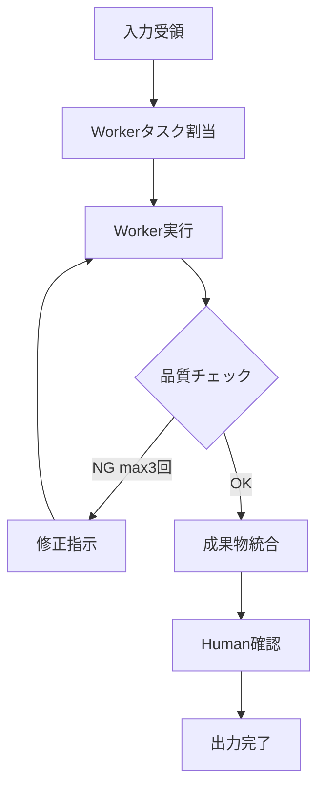

# Agent共通仕様

## Leader/Worker構造
- **Leader**: タスク統括、Worker管理、品質チェック、Human確認要求
- **Worker**: 専門タスク実行、成果物生成

## 共通処理ループ

## 共通行動指針
1. 各Workerにタスクを割り当て
2. Workerの成果物を品質チェック（最大3回リトライ）
3. 問題があればHuman確認を要求
4. 最終的な成果物を統合・出力

## 共通禁止事項
- 検証なしで成果物を採用しない
- ブロッカーを放置しない
- Human確認をスキップしない
