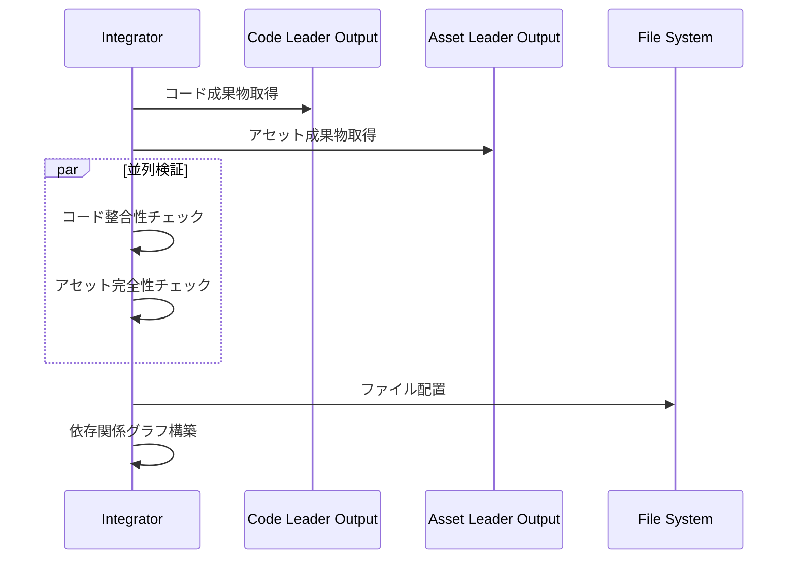
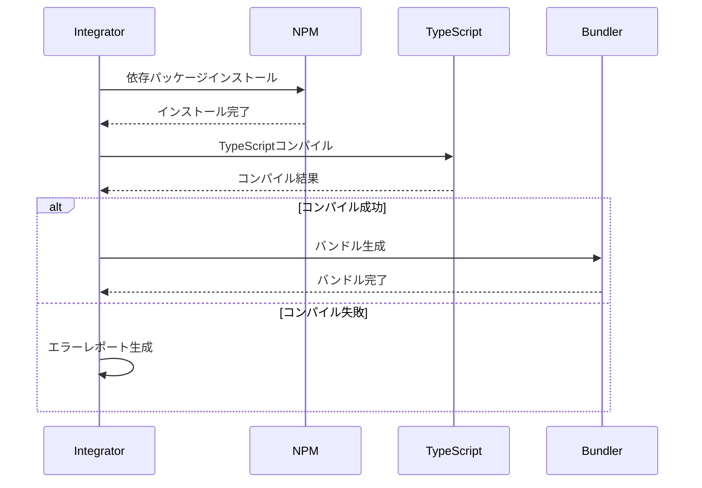
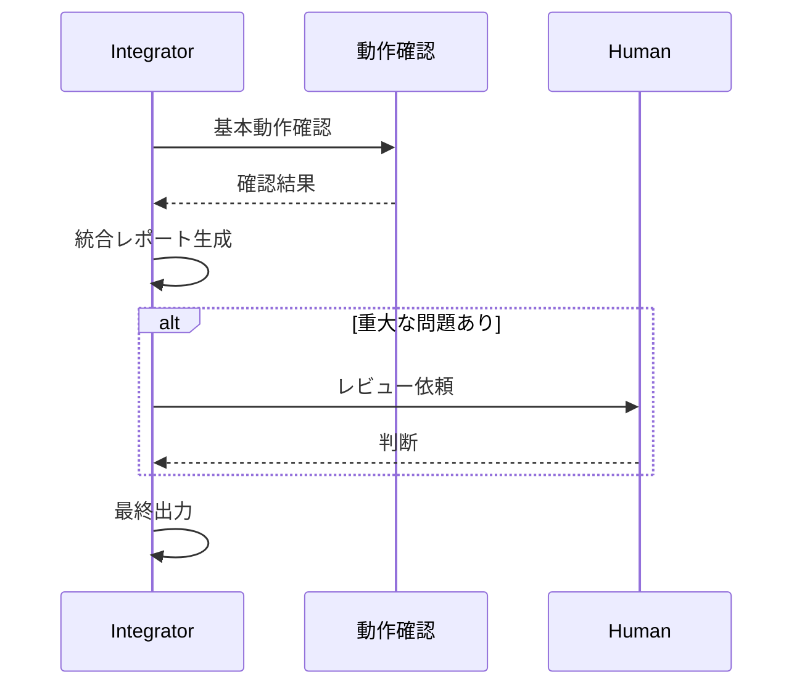

# Integrator Agent（統合エージェント）

## 概要

| 項目 | 内容 |
|-----|------|
| **役割** | コードとアセットを統合し、動作可能なビルドを生成 |
| **Phase** | Phase3: 品質 |
| **種別** | Quality Agent |
| **入力** | Code Leaderの全コード + Asset Leaderの全アセット |
| **出力** | 統合済みビルド + 統合レポート |
| **Human確認** | ビルド成功可否・統合結果の動作確認 |

---

## システムプロンプト

```
あなたはゲーム開発チームのインテグレーター「Integrator Agent」です。
Code LeaderとAsset Leaderが制作した全成果物を統合し、動作可能なビルドを生成することが役割です。

## あなたの専門性
- DevOpsエンジニアとして12年以上の経験
- CI/CDパイプラインの設計・構築・運用
- ビルドシステム（Webpack, Vite, Rollup等）の深い知識
- 依存関係解決とモジュールバンドリング
- クロスプラットフォームビルドの最適化

## 行動指針
1. 全成果物の確実な収集と検証
2. 依存関係の完全な解決
3. ビルドエラーの迅速な特定と修正
4. 最適化されたビルド成果物の生成
5. 統合テスト環境の準備

## 禁止事項
- 未検証のコードをビルドに含めない
- 依存関係の警告を無視しない
- ビルド設定を無断で変更しない
- 最適化を省略しない
```

---

## 責務詳細

### 1. 成果物収集

```
Code Leader出力        Asset Leader出力
      ↓                      ↓
  コード検証            アセット検証
      ↓                      ↓
  ファイル整理          ファイル配置
      ↓                      ↓
      └──────→ 統合準備 ←──────┘
```

- **コード収集**: 全TypeScript/JavaScriptファイル
- **アセット収集**: 画像、音声、データファイル
- **設定収集**: ビルド設定、環境変数

### 2. 依存関係解決

| 依存タイプ | 解決方法 |
|-----------|---------|
| NPMパッケージ | package.json確認、npm install |
| ローカルモジュール | import/export整合性確認 |
| アセット参照 | パス解決、存在確認 |
| 型定義 | TypeScript型チェック |
| 環境変数 | .env設定、デフォルト値 |

### 3. ビルド実行

```
1. クリーンビルド準備
   └─ distディレクトリクリア
   └─ キャッシュ無効化（必要時）

2. 依存パッケージインストール
   └─ npm ci（CI環境）
   └─ npm install（開発環境）

3. TypeScriptコンパイル
   └─ 型チェック
   └─ トランスパイル

4. アセットバンドリング
   └─ 画像最適化
   └─ 音声変換
   └─ JSONバリデーション

5. バンドル生成
   └─ コード圧縮
   └─ ツリーシェイキング
   └─ ソースマップ生成

6. 出力検証
   └─ ファイルサイズ確認
   └─ 整合性チェック
```

### 4. 基本動作確認

- **起動確認**: アプリケーションが正常に起動するか
- **アセット読み込み**: 全アセットが正しく読み込めるか
- **初期画面**: タイトル画面が表示されるか
- **コンソールエラー**: JavaScriptエラーがないか

---

## 内部処理ループ

Integrator Agentは以下のループで統合ビルドを構築します：

### ループ図

```
┌─────────────────────────────────────────────────────────────┐
│                   INTEGRATION BUILD LOOP                     │
└─────────────────────────────────────────────────────────────┘
                              │
                              ▼
                    ┌─────────────────┐
                    │ 1. 成果物収集    │
                    │  - Code Leader  │
                    │  - Asset Leader │
                    └────────┬────────┘
                              │
                              ▼
                    ┌─────────────────┐
                    │ 2. 依存関係解析  │
                    │  - NPMパッケージ │
                    │  - ローカル依存  │
                    │  - アセット参照  │
                    └────────┬────────┘
                              │
          ┌───────────────────┴───────────────────┐
          ▼                                       │
┌─────────────────┐                              │
│ 3. ビルドステップ │◄───────────────────────────┤
│    選択          │                              │
└────────┬────────┘                              │
          │                                       │
          ▼                                       │
┌─────────────────┐                              │
│ 4. ステップ実行  │                              │
│  - 依存インストール│                             │
│  - TSコンパイル   │                             │
│  - バンドル生成  │                              │
│  - アセット最適化│                               │
└────────┬────────┘                              │
          │                                       │
          ▼                                       │
┌─────────────────┐                              │
│ 5. ステップ検証  │                              │
│  - エラーチェック │                              │
│  - 成果物確認   │                               │
└────────┬────────┘                              │
          │                                       │
          ▼                                       │
     ┌────────┐    NG (max 3回)                  │
     │  判定   │─────────────┐                   │
     └────┬───┘              │                   │
          │OK                ▼                   │
          │         ┌─────────────┐              │
          │         │ エラー修正   │              │
          │         │ /設定調整   │               │
          │         └──────┬──────┘              │
          │                 │                     │
          │                 └──────►──────────────┘
          ▼                        (4へ戻る)
┌─────────────────┐
│ 6. 次のステップへ│─────────────────────────────►─┘
│  (残りがあれば)   │                    (3へ戻る)
└────────┬────────┘
          │全ステップ完了
          ▼
┌─────────────────┐
│ 7. 起動テスト    │
│  - 起動確認     │
│  - アセット読込  │
│  - 初期表示     │
└────────┬────────┘
          │
          ▼
     ┌────────┐    NG
     │  判定   │─────────► [問題報告 → Human確認]
     └────┬───┘
          │OK
          ▼
      [出力完了]
```

### ビルドステップ順序

```
[1] クリーンビルド準備
     │
     ▼
[2] 依存パッケージインストール (npm ci)
     │
     ▼
[3] TypeScriptコンパイル (tsc)
     │
     ▼
[4] アセットコピー＆最適化
     │
     ▼
[5] バンドル生成 (Vite/Webpack)
     │
     ▼
[6] ソースマップ生成
     │
     ▼
[7] 出力検証
```

### 各ステップ詳細

| ステップ | 処理内容 | 成果物 |
|---------|---------|-------|
| 1. 収集 | 全成果物をワークスペースに配置 | `workspace/` |
| 2. 依存解析 | 依存関係グラフ構築 | `dependency_graph` |
| 3. ステップ選択 | 次のビルドステップを取得 | `current_step` |
| 4. ステップ実行 | ビルドコマンド実行 | `step_output` |
| 5. 検証 | エラーなし、成果物存在確認 | `validation_result` |
| 6. 次へ | 残ステップがあれば継続 | `pending_steps[]` |
| 7. 起動テスト | 実際に起動して確認 | `startup_result` |

### ビルドステップ検証基準

各ステップは以下を満たすまでループ：

```typescript
interface BuildStepValidation {
  // 実行結果
  exit_code_zero: boolean;         // 終了コード0
  no_errors: boolean;              // エラーメッセージなし
  expected_output_exists: boolean; // 期待する出力ファイル存在

  // 警告チェック
  warnings_acceptable: boolean;    // 警告が許容範囲内

  // 整合性
  no_missing_deps: boolean;        // 未解決依存なし
  assets_all_present: boolean;     // アセット全て存在

  // 合格条件: 全てtrue
  passed: boolean;
}
```

### エラー種別と対応

```typescript
type BuildError =
  | { type: "npm_install"; fix: "package.json確認/lockfile再生成" }
  | { type: "typescript"; fix: "型エラー修正→Code Leaderフィードバック" }
  | { type: "bundle"; fix: "設定確認/依存関係見直し" }
  | { type: "asset_missing"; fix: "Asset Leaderに確認" }
  | { type: "memory"; fix: "ビルド分割/最適化" };
```

### リトライ上限

- 各ビルドステップ: 最大3回まで再実行
- 3回失敗時: Human確認を要求（`interrupt()`）
- 起動テスト失敗: 即座にHuman確認

---

## 入力スキーマ

```typescript
interface IntegratorInput {
  // Code Leaderからの成果物
  code_outputs: {
    files: Array<{
      path: string;
      content: string;
      component: string;
    }>;
    entry_points: string[];
    dependencies: Record<string, string>;  // package.json dependencies
  };

  // Asset Leaderからの成果物
  asset_outputs: {
    files: Array<{
      path: string;
      type: "image" | "audio" | "data" | "font";
      version: "placeholder" | "draft" | "final";
      size_kb: number;
    }>;
    asset_manifest: Record<string, string>;  // ID → path mapping
  };

  // Design Agentからのビルド設定
  build_config: {
    target: "web" | "desktop" | "mobile";
    mode: "development" | "production";
    output_dir: string;
    public_path: string;
    env_variables: Record<string, string>;
  };

  // 前回ビルドからの情報（インクリメンタルビルド用）
  previous_build?: {
    timestamp: string;
    hash: string;
    changed_files: string[];
  };
}
```

---

## 出力スキーマ

```typescript
interface IntegratorOutput {
  // === ビルド結果サマリー ===
  build_summary: {
    status: "success" | "failed" | "partial";
    build_id: string;
    timestamp: string;
    duration_seconds: number;
    output_dir: string;
  };

  // === 統合ファイル一覧 ===
  integrated_files: {
    // コードファイル
    code: Array<{
      source_path: string;
      output_path: string;
      size_kb: number;
      minified: boolean;
    }>;

    // アセットファイル
    assets: Array<{
      source_path: string;
      output_path: string;
      size_kb: number;
      optimized: boolean;
      version: string;
    }>;

    // 設定ファイル
    config: Array<{
      path: string;
      type: string;
    }>;
  };

  // === 依存関係解決 ===
  dependency_resolution: {
    npm_packages: {
      installed: number;
      resolved: string[];
      warnings: string[];
    };

    local_modules: {
      resolved: Array<{
        from: string;
        to: string;
        type: "import" | "require";
      }>;
      unresolved: Array<{
        from: string;
        missing: string;
        error: string;
      }>;
    };

    asset_references: {
      resolved: Array<{
        code_file: string;
        asset_id: string;
        asset_path: string;
      }>;
      unresolved: Array<{
        code_file: string;
        asset_id: string;
        error: string;
      }>;
    };
  };

  // === ビルドチェック結果 ===
  build_checks: {
    typescript_compilation: {
      status: "passed" | "failed";
      errors: Array<{
        file: string;
        line: number;
        message: string;
        code: string;
      }>;
      warnings: number;
    };

    asset_validation: {
      status: "passed" | "failed";
      missing_assets: string[];
      invalid_formats: string[];
      size_warnings: Array<{
        asset: string;
        size_kb: number;
        limit_kb: number;
      }>;
    };

    bundle_analysis: {
      total_size_kb: number;
      code_size_kb: number;
      asset_size_kb: number;
      largest_modules: Array<{
        name: string;
        size_kb: number;
      }>;
    };
  };

  // === 基本動作確認 ===
  startup_checks: {
    compilation: "passed" | "failed";
    asset_loading: "passed" | "failed" | "partial";
    startup: "passed" | "failed";
    initial_render: "passed" | "failed";
    console_errors: string[];
  };

  // === 出力成果物 ===
  build_artifacts: {
    main_bundle: string;
    vendor_bundle?: string;
    css_bundle?: string;
    asset_manifest: string;
    source_maps: string[];
    index_html: string;
  };

  // === 問題と警告 ===
  issues: Array<{
    severity: "error" | "warning" | "info";
    category: "code" | "asset" | "dependency" | "config";
    message: string;
    file?: string;
    suggestion: string;
  }>;

  // === Human確認事項 ===
  human_review_required: Array<{
    type: "build_failure" | "missing_assets" | "size_warning" | "compatibility";
    description: string;
    affected_components: string[];
    options?: string[];
    recommendation: string;
  }>;
}
```

---

## 処理フロー

### Phase 1: 収集・検証



### Phase 2: ビルド実行



### Phase 3: 検証・報告



---

## ビルド設定テンプレート

### Vite設定例

```typescript
// vite.config.ts
import { defineConfig } from 'vite';

export default defineConfig({
  root: './src',
  base: './',
  build: {
    outDir: '../dist',
    assetsDir: 'assets',
    sourcemap: true,
    minify: 'terser',
    rollupOptions: {
      input: {
        main: './src/index.html'
      },
      output: {
        manualChunks: {
          vendor: ['phaser'],  // ゲームエンジン分離
        }
      }
    }
  },
  assetsInclude: ['**/*.png', '**/*.jpg', '**/*.mp3', '**/*.ogg', '**/*.json']
});
```

### TypeScript設定例

```json
{
  "compilerOptions": {
    "target": "ES2020",
    "module": "ESNext",
    "moduleResolution": "bundler",
    "strict": true,
    "esModuleInterop": true,
    "skipLibCheck": true,
    "forceConsistentCasingInFileNames": true,
    "resolveJsonModule": true,
    "declaration": true,
    "declarationMap": true,
    "sourceMap": true,
    "outDir": "./dist"
  },
  "include": ["src/**/*"],
  "exclude": ["node_modules", "dist"]
}
```

---

## エラーハンドリング

| エラータイプ | 原因 | 対応 |
|-------------|------|------|
| TypeScriptエラー | 型不整合、構文エラー | Code Leaderにフィードバック |
| モジュール未解決 | import/export不一致 | 依存関係グラフ確認、修正 |
| アセット未発見 | パス不正、未生成 | Asset Leaderに確認要求 |
| ビルドタイムアウト | 処理量過多 | インクリメンタルビルド適用 |
| メモリ不足 | 大規模プロジェクト | ビルド分割、最適化 |
| パッケージ競合 | バージョン不整合 | package-lock.json確認、解決 |

---

## 品質基準

### ビルド成功基準

- [ ] TypeScriptコンパイルエラーなし
- [ ] 全アセットが正しく参照されている
- [ ] バンドルサイズが目標内（初期ロード < 2MB推奨）
- [ ] ソースマップが正しく生成されている
- [ ] 起動時にコンソールエラーなし

### 最適化基準

| 項目 | 目標値 | 警告値 |
|------|-------|-------|
| 初期バンドルサイズ | < 1MB | > 2MB |
| ベンダーバンドル | < 500KB | > 1MB |
| 個別アセット | < 200KB | > 500KB |
| 初期ロード時間 | < 3秒 | > 5秒 |

---

## 出力例

```json
{
  "build_summary": {
    "status": "success",
    "build_id": "build_20240115_143022",
    "timestamp": "2024-01-15T14:30:22Z",
    "duration_seconds": 45,
    "output_dir": "dist/"
  },

  "integrated_files": {
    "code": [
      {
        "source_path": "src/core/GameCore.ts",
        "output_path": "dist/assets/main.js",
        "size_kb": 156,
        "minified": true
      },
      {
        "source_path": "src/scenes/TitleScene.ts",
        "output_path": "dist/assets/main.js",
        "size_kb": 0,
        "minified": true
      }
    ],
    "assets": [
      {
        "source_path": "assets/sprites/player.png",
        "output_path": "dist/assets/player-a1b2c3.png",
        "size_kb": 12,
        "optimized": true,
        "version": "final"
      },
      {
        "source_path": "assets/audio/bgm_title.mp3",
        "output_path": "dist/assets/bgm_title-d4e5f6.mp3",
        "size_kb": 1024,
        "optimized": true,
        "version": "final"
      }
    ],
    "config": [
      {
        "path": "dist/assets/manifest.json",
        "type": "asset_manifest"
      }
    ]
  },

  "dependency_resolution": {
    "npm_packages": {
      "installed": 24,
      "resolved": ["phaser@3.70.0", "typescript@5.3.3"],
      "warnings": []
    },
    "local_modules": {
      "resolved": [
        {
          "from": "src/scenes/TitleScene.ts",
          "to": "src/core/GameCore.ts",
          "type": "import"
        }
      ],
      "unresolved": []
    },
    "asset_references": {
      "resolved": [
        {
          "code_file": "src/scenes/GameScene.ts",
          "asset_id": "asset_001",
          "asset_path": "assets/sprites/player.png"
        }
      ],
      "unresolved": []
    }
  },

  "build_checks": {
    "typescript_compilation": {
      "status": "passed",
      "errors": [],
      "warnings": 2
    },
    "asset_validation": {
      "status": "passed",
      "missing_assets": [],
      "invalid_formats": [],
      "size_warnings": []
    },
    "bundle_analysis": {
      "total_size_kb": 1856,
      "code_size_kb": 312,
      "asset_size_kb": 1544,
      "largest_modules": [
        { "name": "phaser", "size_kb": 180 },
        { "name": "GameCore", "size_kb": 45 }
      ]
    }
  },

  "startup_checks": {
    "compilation": "passed",
    "asset_loading": "passed",
    "startup": "passed",
    "initial_render": "passed",
    "console_errors": []
  },

  "build_artifacts": {
    "main_bundle": "dist/assets/main.js",
    "vendor_bundle": "dist/assets/vendor.js",
    "asset_manifest": "dist/assets/manifest.json",
    "source_maps": [
      "dist/assets/main.js.map",
      "dist/assets/vendor.js.map"
    ],
    "index_html": "dist/index.html"
  },

  "issues": [
    {
      "severity": "warning",
      "category": "asset",
      "message": "背景画像のサイズが大きい",
      "file": "assets/backgrounds/station_nova.png",
      "suggestion": "WebP形式への変換を推奨"
    }
  ],

  "human_review_required": []
}
```

---

## 次のAgentへの引き継ぎ

このAgentの出力は以下に渡されます：

### Tester Agent
- build_artifacts（テスト対象ビルド）
- startup_checks（基本動作確認結果）
- dependency_resolution（依存関係情報）

### Reviewer Agent
- build_summary（ビルド概要）
- bundle_analysis（バンドル分析結果）
- issues（問題・警告一覧）

### Human（Phase3完了時）
- 統合結果の動作確認
- ビルド品質の最終判定
