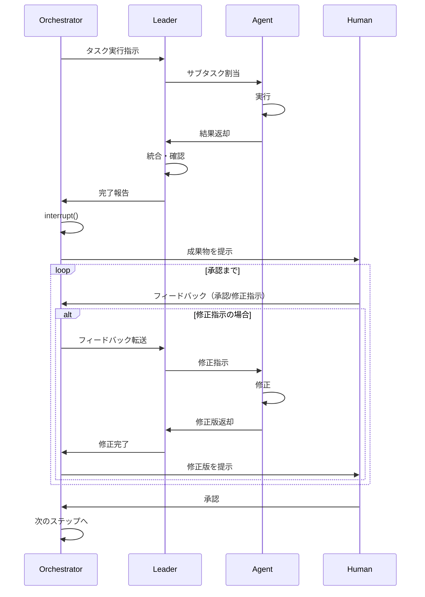
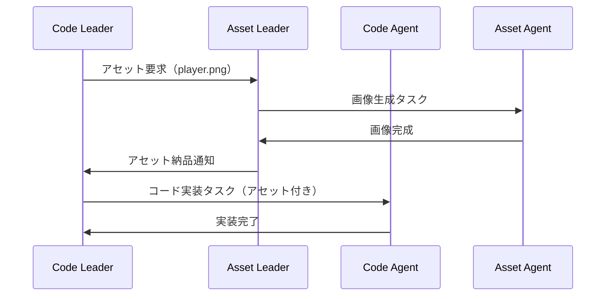
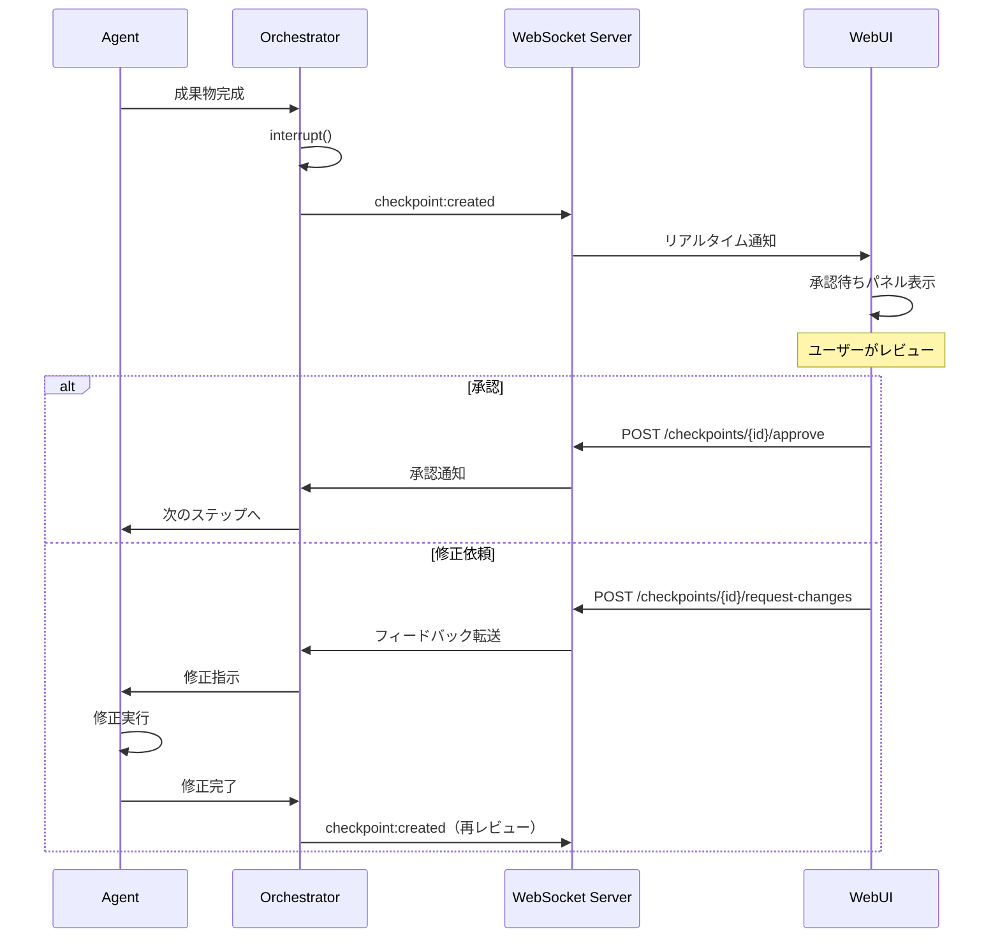

# LangGraph ゲーム開発システム - Agentシステム設計

## 用語定義

| 用語 | 定義 |
|------|------|
| **Agent** | LangGraph上の1ノード。単一タスクを実行するLLMベースの処理単位 |
| **Leader** | 配下のAgentを統括し、タスク分配・進捗管理を行う上位Agent |
| **Orchestrator** | 全体を統括し、フェーズ間の遷移・Human連携を管理する最上位Agent |
| **Checkpoint** | Human承認を待つ中断ポイント。`interrupt()`で実装 |
| **State** | グラフ全体で共有されるデータ。各Agentが読み書き |
| **イテレーション** | 1つの機能単位を企画→実装→テストまで完結させるサイクル |

---

## システム概要

```
[Orchestrator]
      |
      v

Phase1: 企画
[Concept] -> [Design] -> [Scenario] -> [Character] -> [World] -> [TaskSplit]
    ↓↑          ↓↑          ↓↑            ↓↑           ↓↑           ↓↑
[～～～～～～～～～～ 人間による承認とフィードバック ～～～～～～～～～～]
                                                                     |
                                                                     v
                                                              Phase1 完了
                                                                     |
                                                                     v

Phase2: 開発
[CodeLeader] -> [AssetLeader] -> [CodeAgents] -> [AssetAgents] -> [Integrator]
     ↓↑              ↓↑              ↓↑              ↓↑              ↓↑
[～～～～～～～～～～ 人間による承認とフィードバック ～～～～～～～～～～]
                                                                     |
                                                                     v
                                                              Phase2 完了
                                                                     |
                                                                     v

Phase3: 品質
[Test] -> [Review]
  ↓↑         ↓↑
[～～ 人間による承認とフィードバック ～～]
               |
               v
         Phase3 完了
               |
       +-------+-------+
       |               |
       v               v
  [Release]     [Phase2へ戻る]
   (承認)          (修正)
```

Human介入は全13箇所。各ポイントで「承認」「修正指示」「却下」を選択可。

---

## Agent一覧

詳細なAgent設計は [agent/](./agent/) 配下を参照。

### Phase1: 企画（6 Agent）

| Agent | 役割 |
|-------|------|
| Concept | ゲームコンセプトを生成 |
| Design | 技術設計文書を作成 |
| Scenario | ストーリー・シナリオを作成 |
| Character | キャラクター設定を作成 |
| World | 世界観設定を作成 |
| TaskSplit | 実装タスクに分解 |

### Phase2: 開発（2 Leader + 複数Agent）

| Agent | 種別 |
|-------|------|
| CodeLeader | コード実装を統括するLeader |
| AssetLeader | アセット生成を統括するLeader |
| CodeAgents | GameLoop, State, UI等（動的に生成） |
| AssetAgents | Image, Audio等（動的に生成） |

### Phase3: 品質（3 Agent）

| Agent | 役割 |
|-------|------|
| Integrator | コード・アセットを統合 |
| Tester | テストを実行 |
| Reviewer | 最終レビュー |

### Agent設計ドキュメント

| ドキュメント | 内容 |
|-------------|------|
| [01_AGENT_HIERARCHY.md](./agent/01_AGENT_HIERARCHY.md) | Agent階層構造 |
| [02_SESSION_CONTINUITY.md](./agent/02_SESSION_CONTINUITY.md) | セッション継続性 |
| [03_DYNAMIC_SCALING.md](./agent/03_DYNAMIC_SCALING.md) | 動的スケーリング |
| [04_VERSION_CONTROL.md](./agent/04_VERSION_CONTROL.md) | バージョン管理 |
| [05_SINGLE_TASK_PRINCIPLE.md](./agent/05_SINGLE_TASK_PRINCIPLE.md) | 単一タスク原則 |
| [06_LLM_COST_STRATEGY.md](./agent/06_LLM_COST_STRATEGY.md) | LLMコスト戦略 |
| [07_PARALLEL_EXECUTION.md](./agent/07_PARALLEL_EXECUTION.md) | 並列実行 |
| [08_CONTINUOUS_LEARNING.md](./agent/08_CONTINUOUS_LEARNING.md) | 継続学習 |
| [09_CONTEXT_COMPRESSION.md](./agent/09_CONTEXT_COMPRESSION.md) | コンテキスト圧縮 |
| [10_SYSTEM_PROMPT.md](./agent/10_SYSTEM_PROMPT.md) | システムプロンプト |
| [11_LOG_SYSTEM.md](./agent/11_LOG_SYSTEM.md) | ログシステム |
| [12_SELF_IMPROVEMENT.md](./agent/12_SELF_IMPROVEMENT.md) | 自己改善 |
| [13_WORKSPACE_ISOLATION.md](./agent/13_WORKSPACE_ISOLATION.md) | ワークスペース分離 |
| [14_AGENT_POOL_CONTROL.md](./agent/14_AGENT_POOL_CONTROL.md) | Agentプール制御 |
| [15_MECHANICAL_TASK_STRATEGY.md](./agent/15_MECHANICAL_TASK_STRATEGY.md) | 機械的タスク戦略 |
| [16_MCP_AND_SKILLS.md](./agent/16_MCP_AND_SKILLS.md) | MCPとスキル |

---

## Orchestrator

### 責務

1. **状態管理**
   - 現在のフェーズ（企画/開発/品質）
   - 現在のイテレーション番号
   - 完了タスク、保留タスク

2. **ルーティング**
   - フェーズ1・3: 順次実行
   - フェーズ2: Leader経由で並列実行
   - Humanフィードバックに応じた条件分岐

3. **イテレーション管理**
   - イテレーション目標の設定
   - イテレーション完了判定
   - 次イテレーションへの遷移

4. **Human連携**
   - 各承認ポイントで`interrupt()`
   - 状態を永続化（数ヶ月後でも再開可能）
   - フィードバックを適切なAgentにルーティング

5. **エラー処理**
   - LLM呼び出し失敗時のリトライ
   - 繰り返し失敗時のHumanエスカレーション
   - 必要に応じてチェックポイントへロールバック

---

## Human連携フロー



---

## 状態スキーマ

```python
from typing import TypedDict, Literal, Optional

class Task(TypedDict):
    id: str
    name: str
    status: Literal["pending", "in_progress", "completed", "blocked"]
    assigned_to: Optional[str]
    depends_on: list[str]
    required_assets: list[str]

class Iteration(TypedDict):
    number: int
    goal: str
    code_tasks: list[Task]
    asset_tasks: list[Task]
    status: Literal["planning", "development", "quality", "completed"]

class GameDevState(TypedDict):
    # スキーマバージョン
    _schema_version: str

    # 現在位置
    current_phase: Literal["planning", "development", "quality"]
    current_iteration: int

    # 企画出力
    concept: Optional[dict]
    design: Optional[dict]
    scenario: Optional[dict]
    characters: Optional[list[dict]]
    world: Optional[dict]

    # イテレーション管理
    iterations: list[Iteration]

    # 開発出力
    code_outputs: dict[str, str]      # task_id -> code
    asset_outputs: dict[str, str]     # task_id -> asset_path

    # 依存関係
    asset_code_dependencies: list[dict]

    # 品質出力
    test_results: Optional[dict]
    review_comments: Optional[list[str]]

    # Human連携
    pending_approval: Optional[str]
    human_feedback: Optional[str]

    # メタデータ
    error_log: list[str]
```

---

## Asset-Code間の依存関係

### 依存関係の状態管理

```python
class AssetCodeDependency(TypedDict):
    code_task_id: str
    required_assets: list[str]
    status: Literal["waiting", "ready", "integrated"]

# 例
dependencies = [
    {
        "code_task_id": "code_002",  # PlayerController
        "required_assets": ["asset_001"],  # player.png
        "status": "waiting"  # アセット待ち
    },
    {
        "code_task_id": "code_005",  # AudioManager
        "required_assets": ["asset_004", "asset_005"],  # BGM, SE
        "status": "ready"  # アセット揃った
    }
]
```

### 開発フロー



---

## WebUI連携

本システムはWebUIを通じて操作・監視される。WebUIはNieR:Automata風のデザインを採用。

### 関連ドキュメント

| ドキュメント | 内容 |
|-------------|------|
| [WEBUI_DESIGN.md](./WEBUI_DESIGN.md) | UIデザインシステム（カラー、タイポグラフィ、コンポーネント） |
| [WEBUI_ARCHITECTURE.md](./WEBUI_ARCHITECTURE.md) | 技術アーキテクチャ（API、WebSocket、DB） |

### WebUI主要機能

```
┌─────────────────────────────────────────────────────────────────┐
│                     WebUI 機能概要                              │
├─────────────────────────────────────────────────────────────────┤
│                                                                 │
│  1. プロジェクト管理                                            │
│     - 新規プロジェクト作成（ゲームコンセプト入力）              │
│     - プロジェクト一覧・検索                                    │
│     - 実行開始/一時停止/再開/キャンセル                         │
│                                                                 │
│  2. リアルタイム監視                                            │
│     - Agent実行状況の可視化                                     │
│     - 進捗インジケータ（Phase/Agent単位）                       │
│     - ログのライブストリーミング                                │
│                                                                 │
│  3. Human Checkpoint                                            │
│     - 承認待ち一覧の表示                                        │
│     - 成果物のプレビュー                                        │
│     - 承認/修正依頼/却下のアクション                            │
│     - フィードバックコメント入力                                │
│                                                                 │
│  4. 成果物確認                                                  │
│     - 各Agent出力の閲覧                                         │
│     - コード/アセットのダウンロード                             │
│     - ビルド成果物の取得                                        │
│                                                                 │
└─────────────────────────────────────────────────────────────────┘
```

### Agent ↔ WebUI 通信

```
┌──────────────┐     State Update      ┌──────────────┐
│              │ ───────────────────► │              │
│   LangGraph  │                       │   WebSocket  │
│   Agent      │                       │   Server     │
│              │ ◄─────────────────── │              │
└──────────────┘    Human Feedback     └──────┬───────┘
                                              │
                                              │ Real-time Events
                                              │
                                              ▼
                                       ┌──────────────┐
                                       │   Browser    │
                                       │   (WebUI)    │
                                       └──────────────┘
```

### WebSocket Events

| Event | Direction | 説明 |
|-------|-----------|------|
| `agent:started` | Server → Client | Agent実行開始 |
| `agent:progress` | Server → Client | 進捗更新 |
| `agent:completed` | Server → Client | Agent完了 |
| `agent:failed` | Server → Client | Agentエラー |
| `agent:log` | Server → Client | ログエントリ追加 |
| `checkpoint:created` | Server → Client | Human承認待ち発生 |
| `checkpoint:resolved` | Server → Client | 承認完了 |

### Human Checkpoint フロー（WebUI経由）


