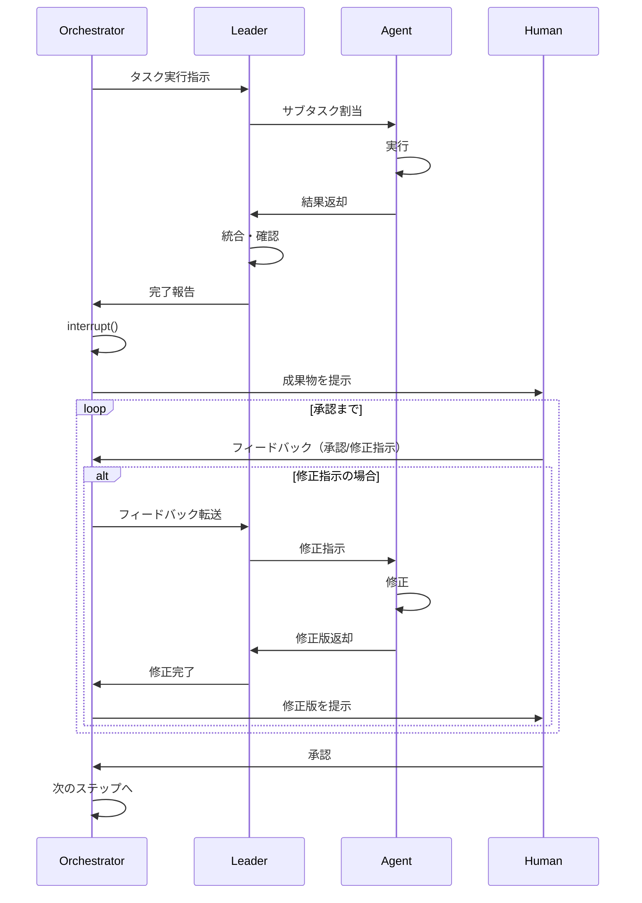
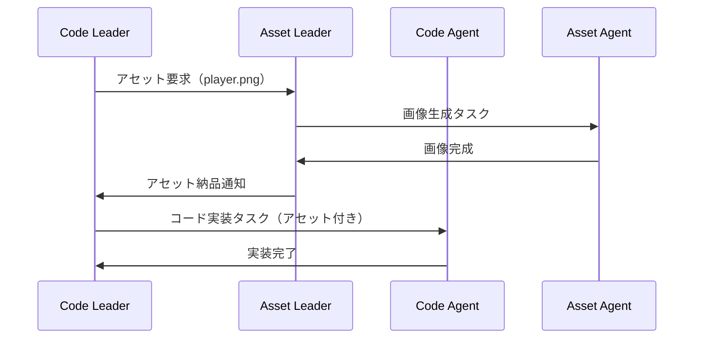

# LangGraph ゲーム開発システム - Agentシステム設計

## 用語定義

| 用語 | 定義 |
|------|------|
| **Agent** | LangGraph上の1ノード。単一タスクを実行するLLMベースの処理単位 |
| **Leader** | 配下のAgentを統括し、タスク分配・進捗管理を行う上位Agent |
| **Orchestrator** | 全体を統括し、フェーズ間の遷移・Human連携を管理する最上位Agent |
| **Checkpoint** | Human承認を待つ中断ポイント。`interrupt()`で実装 |
| **State** | グラフ全体で共有されるデータ。各Agentが読み書き |
| **イテレーション** | 1つの機能単位を企画→実装→テストまで完結させるサイクル |

---

## システム概要

```
[Orchestrator]
      |
      v

Phase1: 企画
[Concept] -> [Design] -> [Scenario] -> [Character] -> [World] -> [TaskSplit]
    ↓↑          ↓↑          ↓↑            ↓↑           ↓↑           ↓↑
[～～～～～～～～～～ 人間による承認とフィードバック ～～～～～～～～～～]
                                                                     |
                                                                     v
                                                              Phase1 完了
                                                                     |
                                                                     v

Phase2: 開発
[CodeLeader] -> [AssetLeader] -> [CodeAgents] -> [AssetAgents] -> [Integrator]
     ↓↑              ↓↑              ↓↑              ↓↑              ↓↑
[～～～～～～～～～～ 人間による承認とフィードバック ～～～～～～～～～～]
                                                                     |
                                                                     v
                                                              Phase2 完了
                                                                     |
                                                                     v

Phase3: 品質
[Test] -> [Review]
  ↓↑         ↓↑
[～～ 人間による承認とフィードバック ～～]
               |
               v
         Phase3 完了
               |
       +-------+-------+
       |               |
       v               v
  [Release]     [Phase2へ戻る]
   (承認)          (修正)
```

Human介入は全13箇所。各ポイントで「承認」「修正指示」「却下」を選択可。

---

## Agent一覧

### Phase1: 企画（6 Agent）

| Agent | 役割 | 詳細 |
|-------|------|------|
| Concept | 企画 | [agents/phase1_concept.md](./agents/phase1_concept.md) |
| Design | 設計 | [agents/phase1_design.md](./agents/phase1_design.md) |
| Scenario | シナリオ | [agents/phase1_scenario.md](./agents/phase1_scenario.md) |
| Character | キャラクター | [agents/phase1_character.md](./agents/phase1_character.md) |
| World | 世界観 | [agents/phase1_world.md](./agents/phase1_world.md) |
| TaskSplit | タスク分解 | [agents/phase1_task_split.md](./agents/phase1_task_split.md) |

### Phase2: 開発（2 Leader + 複数Agent）

| Agent | 種別 | 詳細 |
|-------|------|------|
| CodeLeader | Leader | [agents/phase2_code_leader.md](./agents/phase2_code_leader.md) |
| AssetLeader | Leader | [agents/phase2_asset_leader.md](./agents/phase2_asset_leader.md) |
| CodeAgents | Agent群 | GameLoop, State, UI等（動的に生成） |
| AssetAgents | Agent群 | Image, Audio等（動的に生成） |

### Phase3: 品質（3 Agent）

| Agent | 役割 | 詳細 |
|-------|------|------|
| Integrator | 統合 | [agents/phase3_integrator.md](./agents/phase3_integrator.md) |
| Tester | テスト | [agents/phase3_tester.md](./agents/phase3_tester.md) |
| Reviewer | レビュー | [agents/phase3_reviewer.md](./agents/phase3_reviewer.md) |

---

## Orchestrator

### 責務

1. **状態管理**
   - 現在のフェーズ（企画/開発/品質）
   - 現在のイテレーション番号
   - 完了タスク、保留タスク

2. **ルーティング**
   - フェーズ1・3: 順次実行
   - フェーズ2: Leader経由で並列実行
   - Humanフィードバックに応じた条件分岐

3. **イテレーション管理**
   - イテレーション目標の設定
   - イテレーション完了判定
   - 次イテレーションへの遷移

4. **Human連携**
   - 各承認ポイントで`interrupt()`
   - 状態を永続化（数ヶ月後でも再開可能）
   - フィードバックを適切なAgentにルーティング

5. **エラー処理**
   - LLM呼び出し失敗時のリトライ
   - 繰り返し失敗時のHumanエスカレーション
   - 必要に応じてチェックポイントへロールバック

---

## Human連携フロー



---

## 状態スキーマ

```python
from typing import TypedDict, Literal, Optional

class Task(TypedDict):
    id: str
    name: str
    status: Literal["pending", "in_progress", "completed", "blocked"]
    assigned_to: Optional[str]
    depends_on: list[str]
    required_assets: list[str]

class Iteration(TypedDict):
    number: int
    goal: str
    code_tasks: list[Task]
    asset_tasks: list[Task]
    status: Literal["planning", "development", "quality", "completed"]

class GameDevState(TypedDict):
    # スキーマバージョン
    _schema_version: str

    # 現在位置
    current_phase: Literal["planning", "development", "quality"]
    current_iteration: int

    # 企画出力
    concept: Optional[dict]
    design: Optional[dict]
    scenario: Optional[dict]
    characters: Optional[list[dict]]
    world: Optional[dict]

    # イテレーション管理
    iterations: list[Iteration]

    # 開発出力
    code_outputs: dict[str, str]      # task_id -> code
    asset_outputs: dict[str, str]     # task_id -> asset_path

    # 依存関係
    asset_code_dependencies: list[dict]

    # 品質出力
    test_results: Optional[dict]
    review_comments: Optional[list[str]]

    # Human連携
    pending_approval: Optional[str]
    human_feedback: Optional[str]

    # メタデータ
    error_log: list[str]
```

---

## Asset-Code間の依存関係

### 依存関係の状態管理

```python
class AssetCodeDependency(TypedDict):
    code_task_id: str
    required_assets: list[str]
    status: Literal["waiting", "ready", "integrated"]

# 例
dependencies = [
    {
        "code_task_id": "code_002",  # PlayerController
        "required_assets": ["asset_001"],  # player.png
        "status": "waiting"  # アセット待ち
    },
    {
        "code_task_id": "code_005",  # AudioManager
        "required_assets": ["asset_004", "asset_005"],  # BGM, SE
        "status": "ready"  # アセット揃った
    }
]
```

### 開発フロー


