# LangGraph ゲーム開発システム - アーキテクチャ

このドキュメントはLangGraph ゲーム開発システムのアーキテクチャを定義します。
システム構成、Agent一覧、フロー、状態管理を含みます。

開発規約については [DEVELOPMENT_RULES.md](./DEVELOPMENT_RULES.md) を参照してください。

---

## 用語定義

| 用語 | 定義 |
|------|------|
| **Agent** | LangGraph上の1ノード。単一タスクを実行するLLMベースの処理単位 |
| **Leader** | 配下のAgentを統括し、タスク分配・進捗管理を行う上位Agent |
| **Orchestrator** | 全体を統括し、フェーズ間の遷移・Human連携を管理する最上位Agent |
| **Checkpoint** | Human承認を待つ中断ポイント。`interrupt()`で実装 |
| **State** | グラフ全体で共有されるデータ。各Agentが読み書き |
| **イテレーション** | 1つの機能単位を企画→実装→テストまで完結させるサイクル |

---

## システム概要

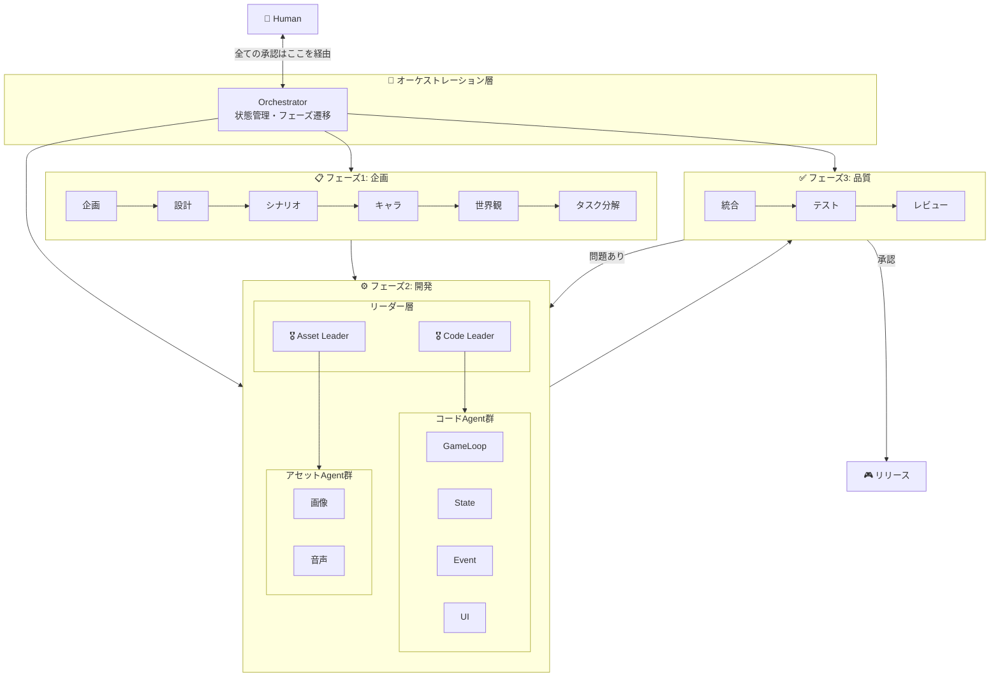

---

## イテレーション方式（アジャイル開発）

**一度に全てを作らない。** 機能単位で段階的に開発します。

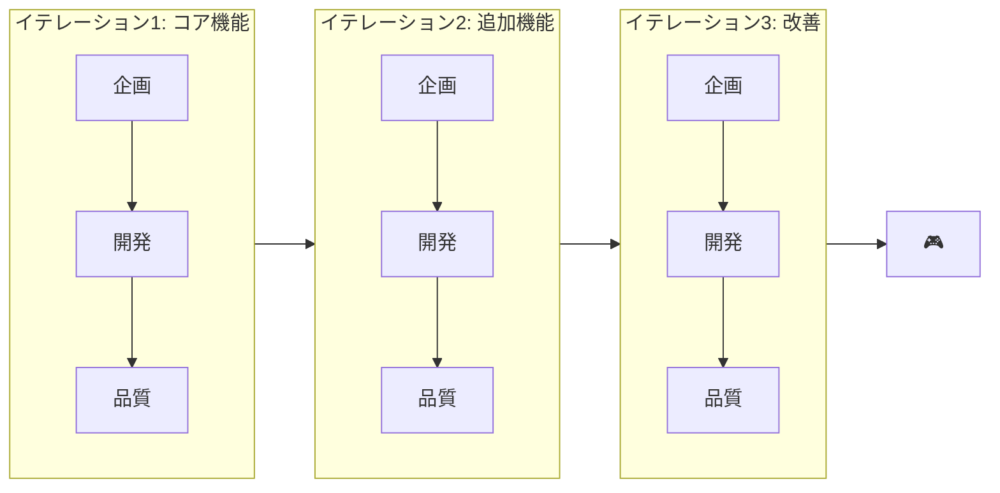

### イテレーション例

| イテレーション | 目標 | 含まれる機能 |
|--------------|------|------------|
| **1: コア** | 最小限動くもの | ゲームループ、基本操作、1ステージ |
| **2: 拡張** | ゲームらしくする | UI、セーブ/ロード、追加ステージ |
| **3: 演出** | 完成度を上げる | BGM/SE、エフェクト、演出 |
| **4: 調整** | リリース準備 | バランス調整、バグ修正、最適化 |

### 各イテレーションの流れ

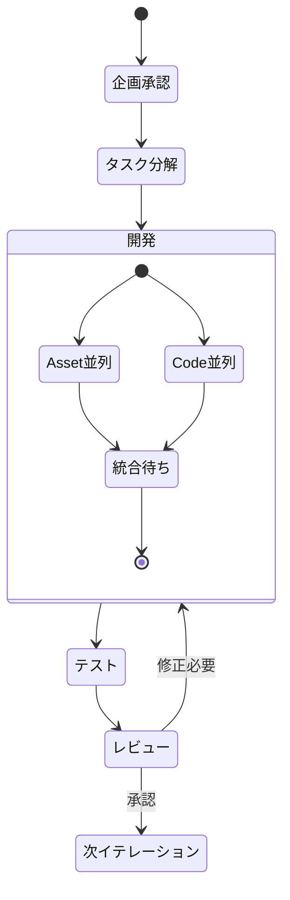

---

## タスク分解の詳細

### TaskSplit Agentの役割

TaskSplitは企画・設計を**具体的な開発タスク**に分解します。

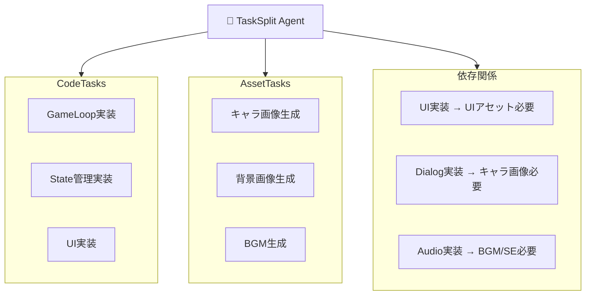

### タスク分解の出力形式

```json
{
  "iteration": 1,
  "iteration_goal": "コアゲームループの実装",

  "code_tasks": [
    {
      "id": "code_001",
      "name": "GameLoop実装",
      "description": "メインループとフレーム管理",
      "priority": 1,
      "depends_on": [],
      "required_assets": []
    },
    {
      "id": "code_002",
      "name": "PlayerController実装",
      "description": "プレイヤー操作の入力処理",
      "priority": 2,
      "depends_on": ["code_001"],
      "required_assets": ["asset_001"]
    }
  ],

  "asset_tasks": [
    {
      "id": "asset_001",
      "name": "プレイヤーキャラ画像",
      "type": "image",
      "description": "プレイヤーのスプライト画像",
      "priority": 1,
      "specs": {
        "format": "PNG",
        "size": "64x64",
        "frames": 8
      }
    }
  ],

  "dependencies": {
    "code_002": ["asset_001"],
    "code_005": ["asset_002", "asset_003"]
  }
}
```

---

## フェーズ2: 開発の詳細構造

### Leader Agentの役割

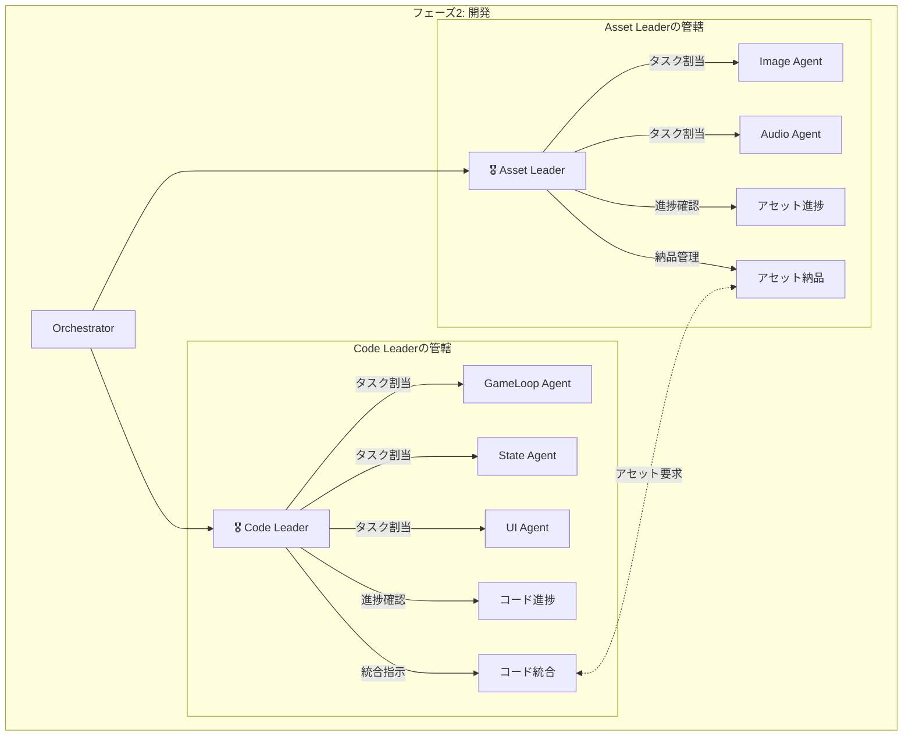

### Code Leader

| 責務 | 詳細 |
|-----|------|
| **タスク管理** | コードタスクをAgentに割り当て |
| **依存関係解決** | 依存順序に従って実行順を決定 |
| **アセット連携** | 必要なアセットをAsset Leaderに要求 |
| **統合** | 各Agentの出力を統合 |
| **品質確認** | コードが動作するか確認 |

### Asset Leader

| 責務 | 詳細 |
|-----|------|
| **タスク管理** | アセットタスクをAgentに割り当て |
| **仕様管理** | アセットの仕様（サイズ、形式等）を管理 |
| **納品管理** | 完成アセットの納品・バージョン管理 |
| **リクエスト対応** | Code Leaderからの要求に対応 |

---

## Asset-Code間の紐づけ

### 依存関係マッピング

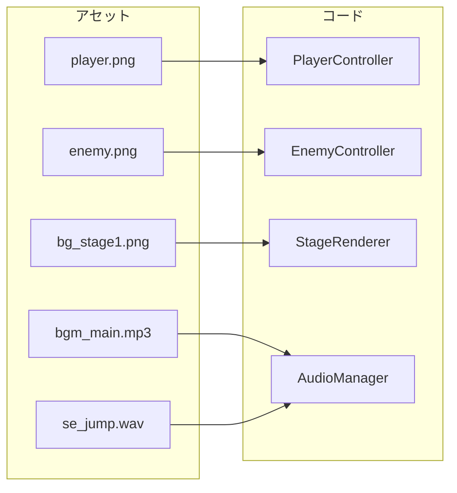

### 依存関係の状態管理

```python
class AssetCodeDependency(TypedDict):
    code_task_id: str
    required_assets: list[str]
    status: Literal["waiting", "ready", "integrated"]

# 例
dependencies = [
    {
        "code_task_id": "code_002",  # PlayerController
        "required_assets": ["asset_001"],  # player.png
        "status": "waiting"  # アセット待ち
    },
    {
        "code_task_id": "code_005",  # AudioManager
        "required_assets": ["asset_004", "asset_005"],  # BGM, SE
        "status": "ready"  # アセット揃った
    }
]
```

### 開発フロー

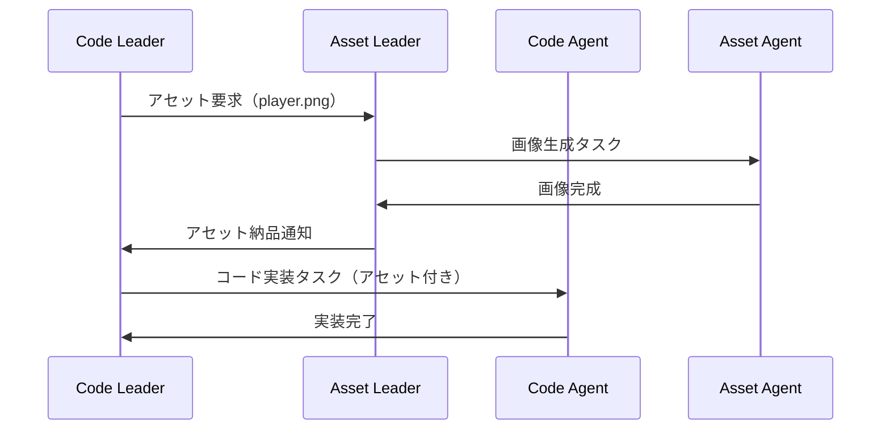

---

## Agent一覧（Human承認ポイント付き）

### 凡例

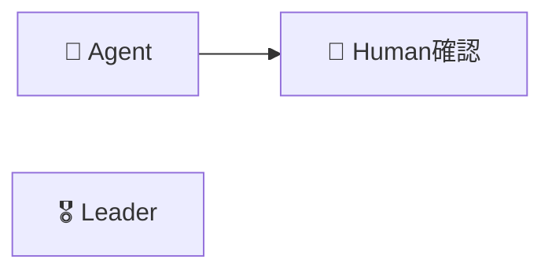

### フェーズ1: 企画（順次実行）

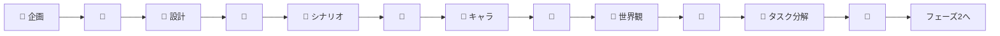

### フェーズ2: 開発（Leader統括 + 並列実行）

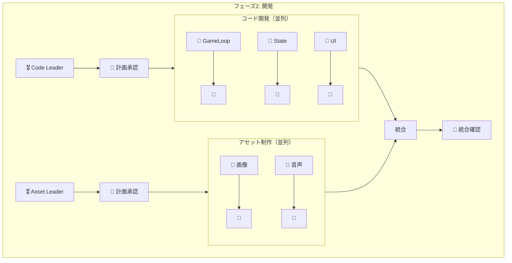

### フェーズ3: 品質（順次実行）

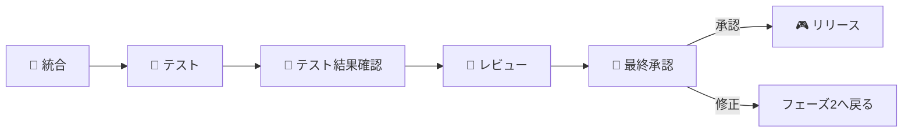

---

## Agent詳細仕様

### フェーズ1: 企画層（6 Agent）

| Agent | 入力 | 出力 | Human確認ポイント |
|-------|-----|------|-----------------|
| **企画** | ユーザーアイデア | ゲームコンセプト文書 | 方向性の承認 |
| **設計** | コンセプト | 技術設計書 | アーキテクチャ承認 |
| **シナリオ** | コンセプト+設計 | ストーリー概要 | ストーリー承認 |
| **キャラクター** | シナリオ | キャラクター仕様 | キャラクター承認 |
| **世界観** | シナリオ | ワールド/レベル設計 | 世界観承認 |
| **タスク分解** | 上記全て | タスク一覧+依存関係 | タスク計画承認 |

### フェーズ2: 開発層

#### Leader Agent（2 Agent）

| Agent | 責務 | Human確認ポイント |
|-------|-----|-----------------|
| **Code Leader** | コードタスク管理・統合・品質確認 | 開発計画承認、統合確認 |
| **Asset Leader** | アセットタスク管理・納品・仕様管理 | 制作計画承認、納品確認 |

#### Code Agent（必要に応じて動的生成）

| Agent | 責務 | 依存アセット |
|-------|-----|------------|
| **GameLoop** | メインループ、フレーム管理 | なし |
| **StateManager** | ゲーム状態、遷移管理 | なし |
| **EventSystem** | イベントの発行/購読 | なし |
| **PlayerController** | プレイヤー操作 | プレイヤー画像 |
| **UIManager** | UI表示、操作 | UI画像 |
| **DialogSystem** | 会話システム | キャラクター画像 |
| **AudioManager** | BGM/SE再生 | BGM、SE |
| **SaveLoadManager** | セーブ/ロード | なし |

#### Asset Agent（必要に応じて動的生成）

| Agent | 責務 | 出力形式 |
|-------|-----|---------|
| **CharacterImage** | キャラクター画像生成 | PNG |
| **BackgroundImage** | 背景画像生成 | PNG/JPG |
| **UIImage** | UI部品画像生成 | PNG/SVG |
| **BGMGenerator** | BGM生成 | MP3/OGG |
| **SEGenerator** | 効果音生成 | WAV/MP3 |

### フェーズ3: 品質層（3 Agent）

| Agent | 責務 | Human確認ポイント |
|-------|-----|-----------------|
| **Integrator** | 全コンポーネント統合 | 自動（確認なし） |
| **Tester** | 自動テスト実行 | テスト結果確認 |
| **Reviewer** | コード品質確認 | 最終リリース承認 |

---

## Orchestrator詳細

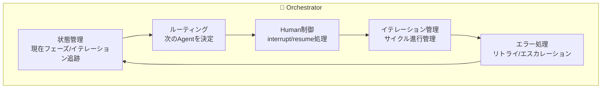

### Orchestratorの責務

1. **状態管理**
   - 現在のフェーズ（企画/開発/品質）
   - 現在のイテレーション番号
   - 完了タスク、保留タスク

2. **ルーティング**
   - フェーズ1・3: 順次実行
   - フェーズ2: Leader経由で並列実行
   - Humanフィードバックに応じた条件分岐

3. **イテレーション管理**
   - イテレーション目標の設定
   - イテレーション完了判定
   - 次イテレーションへの遷移

4. **Human連携**
   - 各承認ポイントで`interrupt()`
   - 状態を永続化（数ヶ月後でも再開可能）
   - フィードバックを適切なAgentにルーティング

5. **エラー処理**
   - LLM呼び出し失敗時のリトライ
   - 繰り返し失敗時のHumanエスカレーション
   - 必要に応じてチェックポイントへロールバック

---

## Human連携フロー

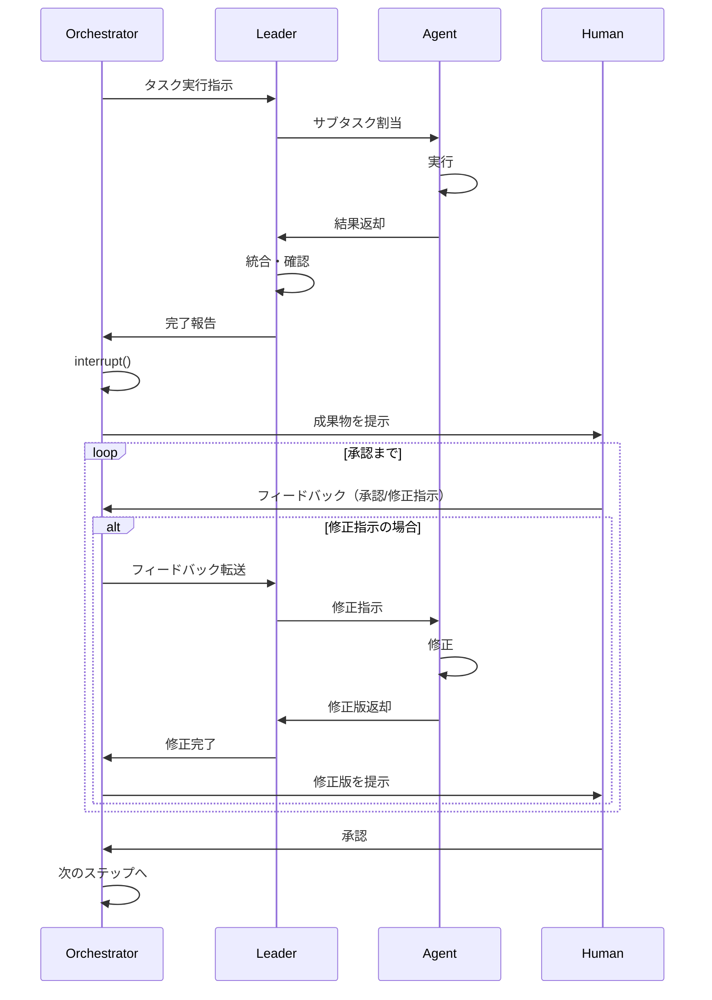

---

## 状態スキーマ

```python
from typing import TypedDict, Literal, Optional

class Task(TypedDict):
    id: str
    name: str
    status: Literal["pending", "in_progress", "completed", "blocked"]
    assigned_to: Optional[str]
    depends_on: list[str]
    required_assets: list[str]

class Iteration(TypedDict):
    number: int
    goal: str
    code_tasks: list[Task]
    asset_tasks: list[Task]
    status: Literal["planning", "development", "quality", "completed"]

class GameDevState(TypedDict):
    # スキーマバージョン
    _schema_version: str

    # 現在位置
    current_phase: Literal["planning", "development", "quality"]
    current_iteration: int

    # 企画出力
    concept: Optional[dict]
    design: Optional[dict]
    scenario: Optional[dict]
    characters: Optional[list[dict]]
    world: Optional[dict]

    # イテレーション管理
    iterations: list[Iteration]

    # 開発出力
    code_outputs: dict[str, str]      # task_id -> code
    asset_outputs: dict[str, str]     # task_id -> asset_path

    # 依存関係
    asset_code_dependencies: list[dict]

    # 品質出力
    test_results: Optional[dict]
    review_comments: Optional[list[str]]

    # Human連携
    pending_approval: Optional[str]
    human_feedback: Optional[str]

    # メタデータ
    error_log: list[str]
```

---

## システム開発フェーズ

> ⚠️ これは**このシステム自体**の開発フェーズです。ゲーム開発のイテレーションとは別です。

### MVP（最小実行可能製品）
- [ ] Orchestrator（基本ルーティング）
- [ ] 企画 + 設計 Agent
- [ ] 単一Coder Agent（統合版）
- [ ] 3箇所のHuman承認

### v1.0
- [ ] 企画層の全Agent（6個）
- [ ] Code Leader + Asset Leader
- [ ] 並列開発の仕組み
- [ ] イテレーション管理

### v2.0
- [ ] アセット生成連携（DALL-E等）
- [ ] ゲームテンプレート対応
- [ ] Human確認用WebUI

---

## 技術スタック

| コンポーネント | 技術 |
|--------------|------|
| **オーケストレーション** | LangGraph |
| **LLM** | Claude / GPT-4 |
| **言語** | Python 3.11+ |
| **状態保存** | SQLite / PostgreSQL |
| **ゲームエンジン** | 未定（Phaser.js / Pygame等） |
| **画像生成** | DALL-E / Stable Diffusion |
| **音声生成** | Suno / ElevenLabs |
