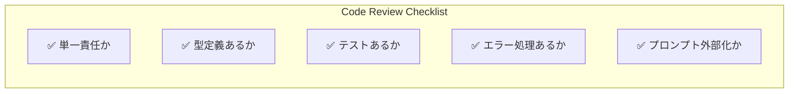
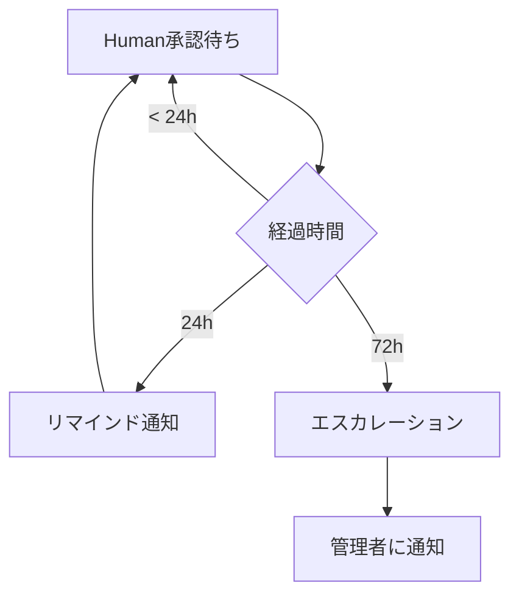
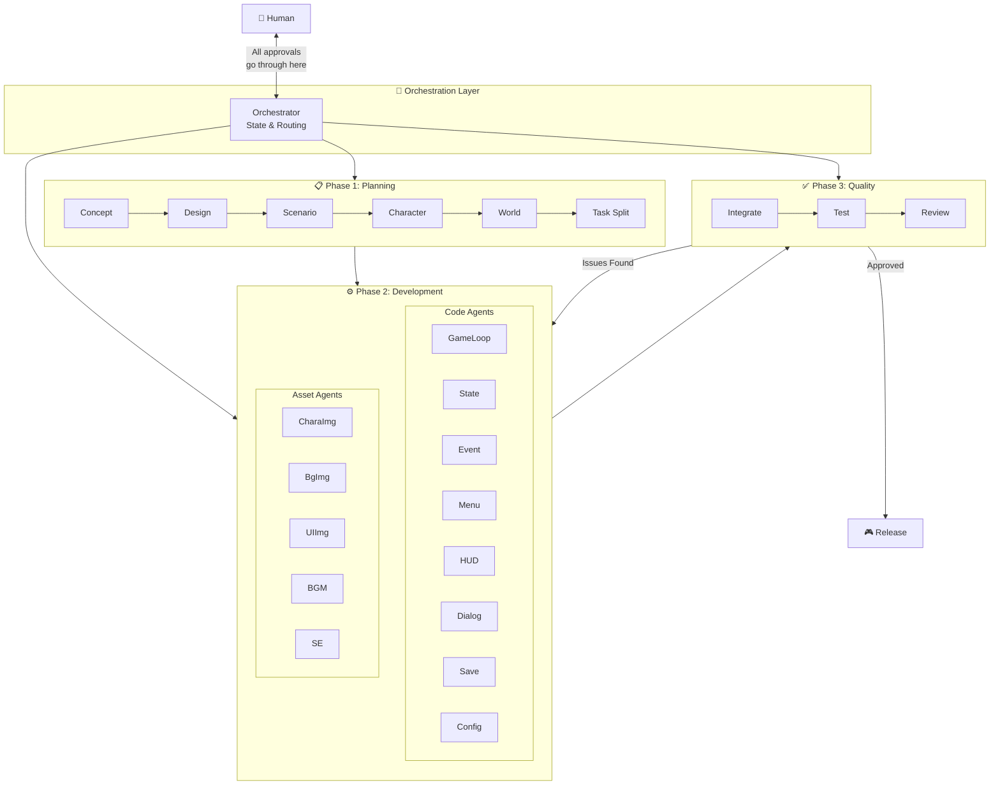
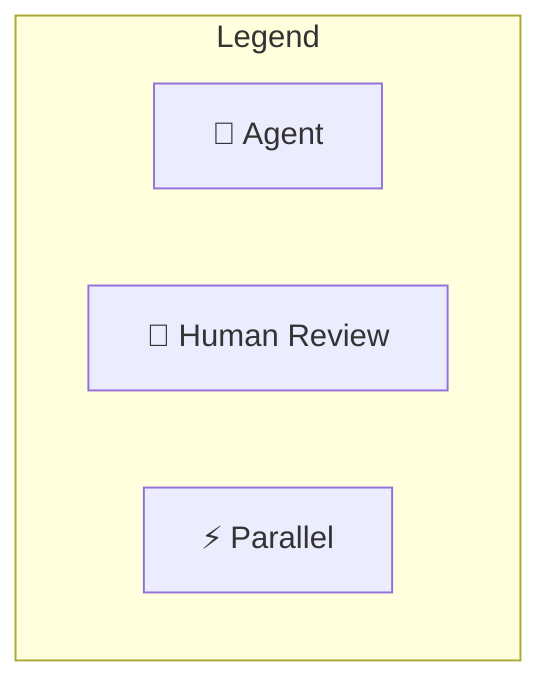
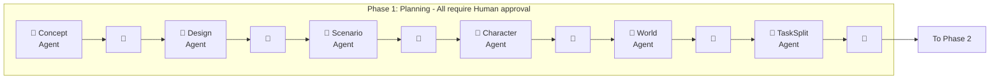
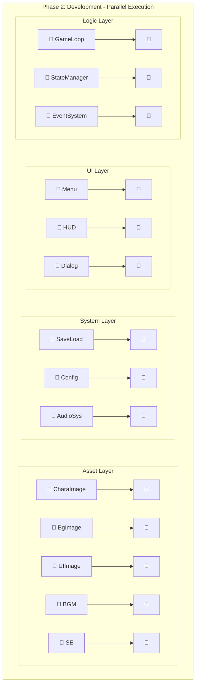
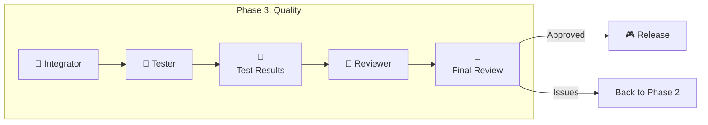
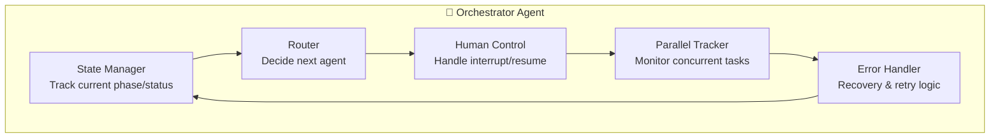
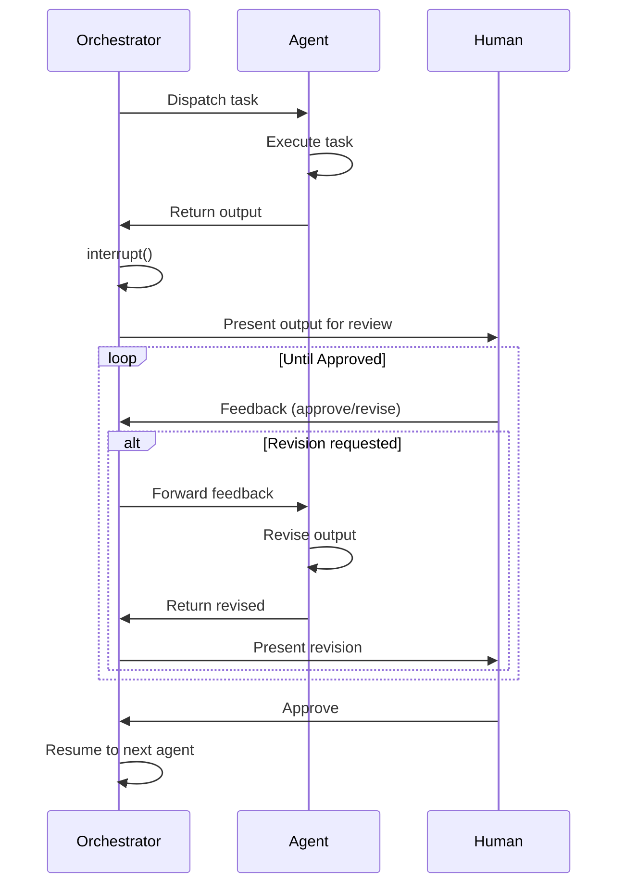

# LangGraph Game Development System

## Terminology

| Term | Definition |
|------|------------|
| **Agent** | LangGraph上の1ノード。単一タスクを実行するLLMベースの処理単位 |
| **Orchestrator** | 全Agentを統括し、状態管理・ルーティングを行う中央Agent |
| **Checkpoint** | Human承認を待つ中断ポイント。`interrupt()`で実装 |
| **State** | グラフ全体で共有されるデータ。各Agentが読み書き |

---

## Design Principles (LangGraph Best Practices)

| Principle | Description |
|-----------|-------------|
| **Single Responsibility** | 1 Agent = 1 Task。複数の責務を持たせない |
| **Fine Granularity** | 小さいAgentほど再利用・テスト・保守が容易 |
| **Human Checkpoint** | 不可逆アクションの**前**に`interrupt()`を配置 |
| **Durable State** | チェックポイントで永続化。数日〜数ヶ月後でも再開可能 |
| **Parallel Execution** | 依存関係のないAgentは並列実行 |

Sources:
- [Building LangGraph](https://blog.langchain.com/building-langgraph/)
- [Human-in-the-Loop Best Practices](https://www.permit.io/blog/human-in-the-loop-for-ai-agents-best-practices-frameworks-use-cases-and-demo)

---

## Development Rules (開発規約)

### 1. Agent設計原則

```
┌─────────────────────────────────────────────────────────────┐
│                      Agent Design Rules                     │
├─────────────────────────────────────────────────────────────┤
│ ✅ DO                          │ ❌ DON'T                   │
├────────────────────────────────┼────────────────────────────┤
│ 1つのAgentに1つの責務          │ 複数タスクを詰め込む        │
│ 入出力を明確に型定義           │ anyや曖昧な型を使う         │
│ 冪等性を保つ(同入力→同出力)   │ 副作用に依存する            │
│ エラーは明示的に返す           │ 例外を握りつぶす            │
│ プロンプトは外部ファイル化     │ コード内にハードコード      │
└────────────────────────────────┴────────────────────────────┘
```

#### Agent定義テンプレート

```python
from typing import TypedDict

class AgentInput(TypedDict):
    """このAgentへの入力"""
    context: str      # 前Agentからの引き継ぎ
    requirements: str # 要求事項

class AgentOutput(TypedDict):
    """このAgentの出力"""
    result: str       # 生成物
    status: str       # "success" | "needs_revision" | "error"
    message: str      # Human向けの説明

def agent_name(state: GameDevState) -> AgentOutput:
    """
    Agent: [Agent名]
    責務: [1行で説明]
    入力: [何を受け取るか]
    出力: [何を返すか]
    """
    # 実装
    pass
```

#### プロンプト設計ガイドライン

```
prompts/
├── planning/
│   ├── concept_agent.md
│   ├── design_agent.md
│   └── ...
├── development/
│   ├── gameloop_agent.md
│   └── ...
└── quality/
    ├── test_agent.md
    └── ...
```

各プロンプトファイルの構造:
```markdown
# [Agent名] Prompt

## Role
あなたは[役割]です。

## Context
{context}

## Task
{task_description}

## Output Format
[期待する出力形式]

## Constraints
- [制約1]
- [制約2]
```

---

### 2. コード規約

#### ファイル構成

```
langgraph/
├── agents/
│   ├── __init__.py
│   ├── planning/
│   │   ├── concept.py
│   │   ├── design.py
│   │   └── ...
│   ├── development/
│   │   ├── logic/
│   │   │   ├── gameloop.py
│   │   │   └── ...
│   │   ├── ui/
│   │   └── assets/
│   └── quality/
│       ├── integrator.py
│       ├── tester.py
│       └── reviewer.py
├── prompts/
│   └── (上記参照)
├── orchestrator.py
├── state.py
├── graph.py
└── main.py
```

#### 命名規則

| 対象 | 規則 | 例 |
|------|------|-----|
| Agent関数 | `snake_case` | `concept_agent()` |
| Agentクラス | `PascalCase` + Agent | `ConceptAgent` |
| State型 | `PascalCase` + State | `GameDevState` |
| プロンプトファイル | `snake_case.md` | `concept_agent.md` |
| 定数 | `UPPER_SNAKE_CASE` | `MAX_RETRIES` |

#### コメント規約

```python
def concept_agent(state: GameDevState) -> dict:
    """
    Concept Agent - ゲームコンセプトを生成

    Args:
        state: 現在のゲーム開発状態

    Returns:
        concept: 生成されたコンセプト文書
        status: 処理結果

    Raises:
        AgentError: LLM呼び出し失敗時
    """
```

---

### 3. 品質・テスト方針

#### テスト必須条件

| レベル | 対象 | 必須テスト |
|--------|------|-----------|
| Unit | 各Agent | 入出力の型チェック、エッジケース |
| Integration | Agent間連携 | State受け渡し、並列実行 |
| E2E | 全フロー | Planning→Dev→Qualityの一連フロー |

#### テストファイル構成

```
tests/
├── unit/
│   ├── test_concept_agent.py
│   ├── test_design_agent.py
│   └── ...
├── integration/
│   ├── test_planning_flow.py
│   └── test_parallel_dev.py
└── e2e/
    └── test_full_game_dev.py
```

#### レビュー基準



#### エラーハンドリング方針

```python
class AgentError(Exception):
    """Agent実行時のエラー"""
    def __init__(self, agent_name: str, message: str, recoverable: bool = True):
        self.agent_name = agent_name
        self.message = message
        self.recoverable = recoverable  # リトライ可能か

# 使用例
def gameloop_agent(state: GameDevState) -> dict:
    try:
        result = call_llm(prompt)
        return {"result": result, "status": "success"}
    except LLMError as e:
        if e.is_rate_limit:
            raise AgentError("GameLoop", "Rate limit hit", recoverable=True)
        raise AgentError("GameLoop", str(e), recoverable=False)
```

リトライ戦略:
| エラー種別 | リトライ | 最大回数 | バックオフ |
|-----------|---------|---------|-----------|
| Rate Limit | ✅ | 5 | Exponential (2^n秒) |
| Timeout | ✅ | 3 | Linear (5秒) |
| Invalid Response | ✅ | 2 | None |
| Auth Error | ❌ | - | - |
| Unknown | ❌ | - | Escalate to Human |

---

### 4. Human介入ルール

#### 承認基準

| Phase | 承認ポイント | 承認基準 |
|-------|------------|---------|
| Planning | 各Agent後 | 方向性が正しいか、要件を満たすか |
| Development | 各Agent後 | コードが動作するか、設計に沿っているか |
| Quality | Test/Review後 | バグがないか、リリース可能か |

#### フィードバック形式

```python
class HumanFeedback(TypedDict):
    decision: Literal["approve", "revise", "reject"]
    comments: str           # 具体的な指摘
    priority: Literal["high", "medium", "low"]  # 修正優先度
    affected_agents: list[str]  # 影響を受けるAgent
```

Humanからのフィードバック例:
```json
{
  "decision": "revise",
  "comments": "キャラクターの性格設定が薄い。もっと具体的なバックストーリーを追加してください。",
  "priority": "high",
  "affected_agents": ["Character", "Scenario"]
}
```

#### タイムアウト処理



| 経過時間 | アクション |
|---------|-----------|
| 24時間 | リマインド通知 |
| 72時間 | エスカレーション（管理者通知） |
| 7日間 | 自動一時停止（状態保存） |

---

## System Overview



---

## Complete Agent List with Human Checkpoints



### Phase 1: Planning (Sequential)



### Phase 2: Development (Parallel)



### Phase 3: Quality (Sequential)



---

## Detailed Agent Specifications

### Phase 1: Planning Layer (6 Agents)

| Agent | Input | Output | Human Review Point |
|-------|-------|--------|-------------------|
| **Concept** | User idea | Game concept doc | Approve direction |
| **Design** | Concept | Technical design | Approve architecture |
| **Scenario** | Concept + Design | Story outline | Approve story |
| **Character** | Scenario | Character specs | Approve characters |
| **World** | Scenario | World/level design | Approve world |
| **TaskSplit** | All above | Task breakdown | Approve task list |

### Phase 2: Development Layer (14 Agents, Parallel)

#### Code Agents (9)

| Agent | Responsibility | Dependencies |
|-------|---------------|--------------|
| **GameLoop** | Main loop, frame timing | Design |
| **StateManager** | Game state, transitions | Design |
| **EventSystem** | Event pub/sub | Design |
| **Menu** | Title, pause, settings UI | Design, UIImage |
| **HUD** | In-game overlay | Design, UIImage |
| **Dialog** | Text/conversation system | Scenario, CharaImage |
| **SaveLoad** | Persistence | StateManager |
| **Config** | Settings management | - |
| **AudioSystem** | BGM/SE playback | BGM, SE assets |

#### Asset Agents (5)

| Agent | Responsibility | Output Format |
|-------|---------------|---------------|
| **CharaImage** | Character sprites/portraits | PNG/SVG |
| **BgImage** | Backgrounds, scenes | PNG/JPG |
| **UIImage** | Buttons, icons, frames | PNG/SVG |
| **BGM** | Background music | MP3/OGG |
| **SE** | Sound effects | WAV/MP3 |

### Phase 3: Quality Layer (3 Agents)

| Agent | Responsibility | Human Review Point |
|-------|---------------|-------------------|
| **Integrator** | Combine all components | Auto (no review) |
| **Tester** | Run automated tests | Review test results |
| **Reviewer** | Code quality check | Final approval |

---

## Orchestrator Detail



### Orchestrator Responsibilities

1. **State Management**
   - Current phase (Planning/Development/Quality)
   - Completed tasks
   - Pending human approvals

2. **Routing Logic**
   - Sequential flow in Phase 1 & 3
   - Parallel dispatch in Phase 2
   - Conditional routing based on human feedback

3. **Human-in-the-Loop Control**
   - `interrupt()` before each checkpoint
   - Store state durably (can resume months later)
   - Route feedback to appropriate agent

4. **Parallel Task Management**
   - Launch independent tasks concurrently
   - Track completion status
   - Aggregate results before Phase 3

5. **Error Recovery**
   - Retry failed LLM calls
   - Escalate to human on repeated failures
   - Rollback to last checkpoint if needed

---

## Human-in-the-Loop Flow



---

## State Schema

```python
from typing import TypedDict, Literal, Optional
from langgraph.graph import StateGraph

class GameDevState(TypedDict):
    # Current phase
    phase: Literal["planning", "development", "quality", "complete"]

    # Planning outputs
    concept: Optional[str]
    design: Optional[str]
    scenario: Optional[str]
    characters: Optional[list[dict]]
    world: Optional[str]
    tasks: Optional[list[dict]]

    # Development outputs
    code_outputs: dict[str, str]  # agent_name -> code
    asset_outputs: dict[str, str]  # agent_name -> asset_path

    # Quality outputs
    test_results: Optional[dict]
    review_comments: Optional[list[str]]

    # Human feedback
    pending_approval: Optional[str]  # agent awaiting approval
    human_feedback: Optional[str]

    # Metadata
    iteration_count: int
    error_log: list[str]
```

---

## Implementation Phases

### MVP (Minimum Viable Product)
- [ ] Orchestrator with basic routing
- [ ] Concept + Design agents
- [ ] Single Coder agent (combined)
- [ ] Human approval at 3 checkpoints

### V1.0
- [ ] Full Planning layer (6 agents)
- [ ] Parallel Development layer
- [ ] Quality layer with automated tests

### V2.0
- [ ] Asset generation integration (DALL-E, etc.)
- [ ] Multi-game template support
- [ ] Web UI for human review

---

## Tech Stack

| Component | Technology |
|-----------|------------|
| **Orchestration** | LangGraph |
| **LLM** | Claude / GPT-4 |
| **Language** | Python 3.11+ |
| **State Storage** | SQLite / PostgreSQL |
| **Game Engine** | TBD (Phaser.js / Pygame) |
| **Asset Gen** | DALL-E / Stable Diffusion |
| **Audio Gen** | Suno / ElevenLabs |
