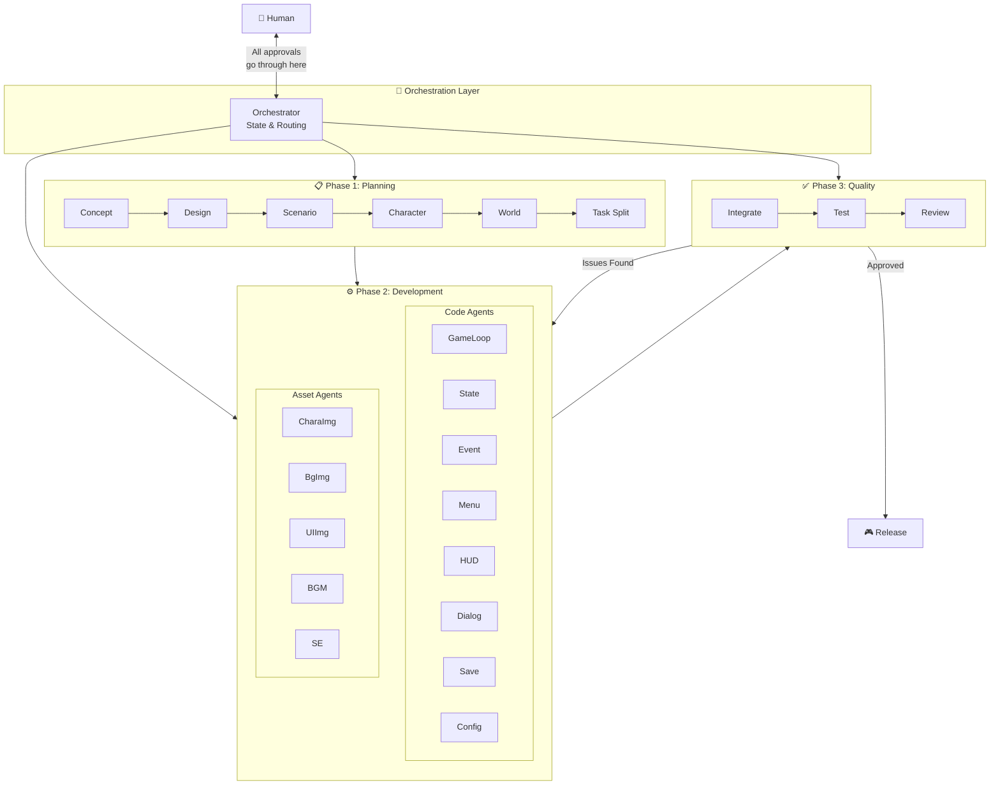
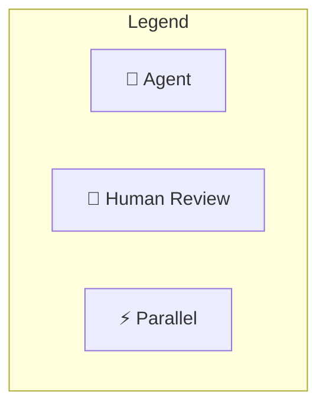
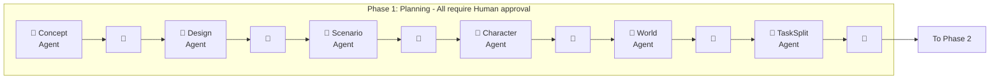
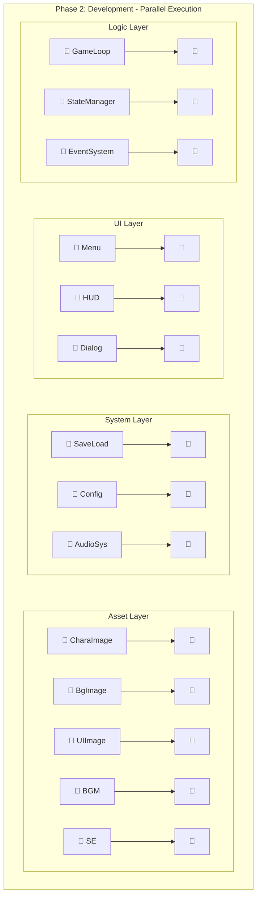
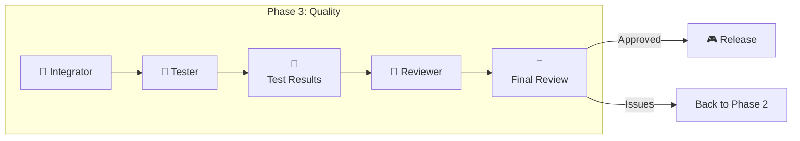
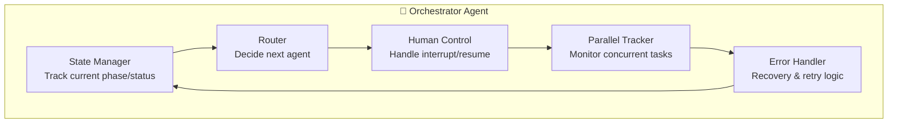
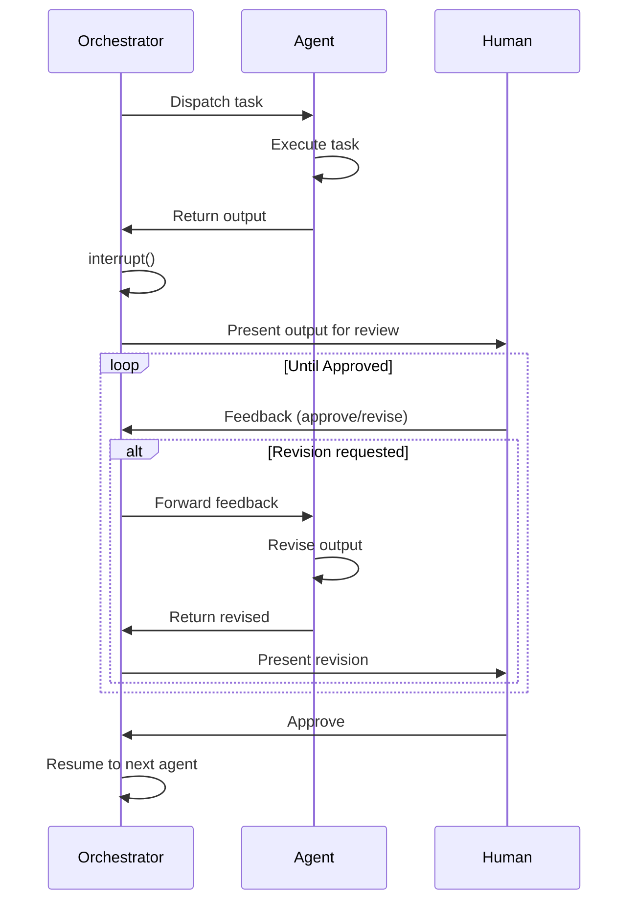

# LangGraph Game Development System - Architecture

このドキュメントはLangGraph Game Development Systemのアーキテクチャを定義します。
システム構成、Agent一覧、フロー、状態管理を含みます。

開発規約については [DEVELOPMENT_RULES.md](./DEVELOPMENT_RULES.md) を参照してください。

---

## Terminology

| Term | Definition |
|------|------------|
| **Agent** | LangGraph上の1ノード。単一タスクを実行するLLMベースの処理単位 |
| **Orchestrator** | 全Agentを統括し、状態管理・ルーティングを行う中央Agent |
| **Checkpoint** | Human承認を待つ中断ポイント。`interrupt()`で実装 |
| **State** | グラフ全体で共有されるデータ。各Agentが読み書き |

---

## System Overview



---

## Complete Agent List with Human Checkpoints



### Phase 1: Planning (Sequential)



### Phase 2: Development (Parallel)



### Phase 3: Quality (Sequential)



---

## Detailed Agent Specifications

### Phase 1: Planning Layer (6 Agents)

| Agent | Input | Output | Human Review Point |
|-------|-------|--------|-------------------|
| **Concept** | User idea | Game concept doc | Approve direction |
| **Design** | Concept | Technical design | Approve architecture |
| **Scenario** | Concept + Design | Story outline | Approve story |
| **Character** | Scenario | Character specs | Approve characters |
| **World** | Scenario | World/level design | Approve world |
| **TaskSplit** | All above | Task breakdown | Approve task list |

### Phase 2: Development Layer (14 Agents, Parallel)

#### Code Agents (9)

| Agent | Responsibility | Dependencies |
|-------|---------------|--------------|
| **GameLoop** | Main loop, frame timing | Design |
| **StateManager** | Game state, transitions | Design |
| **EventSystem** | Event pub/sub | Design |
| **Menu** | Title, pause, settings UI | Design, UIImage |
| **HUD** | In-game overlay | Design, UIImage |
| **Dialog** | Text/conversation system | Scenario, CharaImage |
| **SaveLoad** | Persistence | StateManager |
| **Config** | Settings management | - |
| **AudioSystem** | BGM/SE playback | BGM, SE assets |

#### Asset Agents (5)

| Agent | Responsibility | Output Format |
|-------|---------------|---------------|
| **CharaImage** | Character sprites/portraits | PNG/SVG |
| **BgImage** | Backgrounds, scenes | PNG/JPG |
| **UIImage** | Buttons, icons, frames | PNG/SVG |
| **BGM** | Background music | MP3/OGG |
| **SE** | Sound effects | WAV/MP3 |

### Phase 3: Quality Layer (3 Agents)

| Agent | Responsibility | Human Review Point |
|-------|---------------|-------------------|
| **Integrator** | Combine all components | Auto (no review) |
| **Tester** | Run automated tests | Review test results |
| **Reviewer** | Code quality check | Final approval |

---

## Orchestrator Detail



### Orchestrator Responsibilities

1. **State Management**
   - Current phase (Planning/Development/Quality)
   - Completed tasks
   - Pending human approvals

2. **Routing Logic**
   - Sequential flow in Phase 1 & 3
   - Parallel dispatch in Phase 2
   - Conditional routing based on human feedback

3. **Human-in-the-Loop Control**
   - `interrupt()` before each checkpoint
   - Store state durably (can resume months later)
   - Route feedback to appropriate agent

4. **Parallel Task Management**
   - Launch independent tasks concurrently
   - Track completion status
   - Aggregate results before Phase 3

5. **Error Recovery**
   - Retry failed LLM calls
   - Escalate to human on repeated failures
   - Rollback to last checkpoint if needed

---

## Human-in-the-Loop Flow



---

## State Schema

```python
from typing import TypedDict, Literal, Optional
from langgraph.graph import StateGraph

class GameDevState(TypedDict):
    # Schema version for migration
    _schema_version: str  # "1.0.0"

    # Current phase
    phase: Literal["planning", "development", "quality", "complete"]

    # Planning outputs
    concept: Optional[str]
    design: Optional[str]
    scenario: Optional[str]
    characters: Optional[list[dict]]
    world: Optional[str]
    tasks: Optional[list[dict]]

    # Development outputs
    code_outputs: dict[str, str]  # agent_name -> code
    asset_outputs: dict[str, str]  # agent_name -> asset_path

    # Quality outputs
    test_results: Optional[dict]
    review_comments: Optional[list[str]]

    # Human feedback
    pending_approval: Optional[str]  # agent awaiting approval
    human_feedback: Optional[str]

    # Metadata
    iteration_count: int
    error_log: list[str]
```

---

## Implementation Phases

### MVP (Minimum Viable Product)
- [ ] Orchestrator with basic routing
- [ ] Concept + Design agents
- [ ] Single Coder agent (combined)
- [ ] Human approval at 3 checkpoints

### V1.0
- [ ] Full Planning layer (6 agents)
- [ ] Parallel Development layer
- [ ] Quality layer with automated tests

### V2.0
- [ ] Asset generation integration (DALL-E, etc.)
- [ ] Multi-game template support
- [ ] Web UI for human review

---

## Tech Stack

| Component | Technology |
|-----------|------------|
| **Orchestration** | LangGraph |
| **LLM** | Claude / GPT-4 |
| **Language** | Python 3.11+ |
| **State Storage** | SQLite / PostgreSQL |
| **Game Engine** | TBD (Phaser.js / Pygame) |
| **Asset Gen** | DALL-E / Stable Diffusion |
| **Audio Gen** | Suno / ElevenLabs |
