# LangGraph ゲーム開発システム - アーキテクチャ

このドキュメントはLangGraph ゲーム開発システムのアーキテクチャを定義します。
システム構成、Agent一覧、フロー、状態管理を含みます。

開発規約については [DEVELOPMENT_RULES.md](./DEVELOPMENT_RULES.md) を参照してください。

---

## 用語定義

| 用語 | 定義 |
|------|------|
| **Agent** | LangGraph上の1ノード。単一タスクを実行するLLMベースの処理単位 |
| **Leader** | 配下のAgentを統括し、タスク分配・進捗管理を行う上位Agent |
| **Orchestrator** | 全体を統括し、フェーズ間の遷移・Human連携を管理する最上位Agent |
| **Checkpoint** | Human承認を待つ中断ポイント。`interrupt()`で実装 |
| **State** | グラフ全体で共有されるデータ。各Agentが読み書き |
| **イテレーション** | 1つの機能単位を企画→実装→テストまで完結させるサイクル |

---

## システム概要

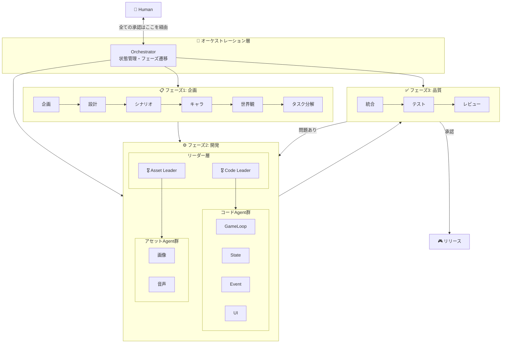

---

## イテレーション方式（アジャイル開発）

**一度に全てを作らない。** 機能単位で段階的に開発します。

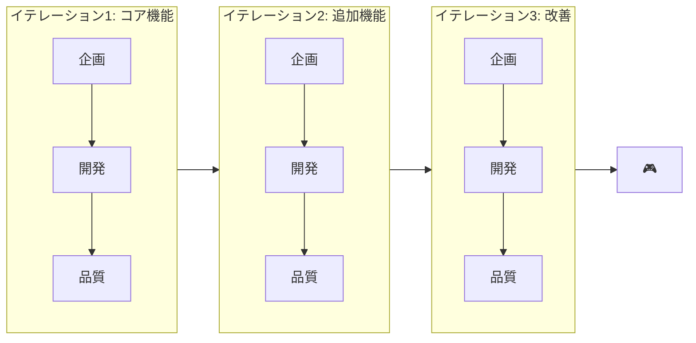

### イテレーション例

| イテレーション | 目標 | 含まれる機能 |
|--------------|------|------------|
| **1: コア** | 最小限動くもの | ゲームループ、基本操作、1ステージ |
| **2: 拡張** | ゲームらしくする | UI、セーブ/ロード、追加ステージ |
| **3: 演出** | 完成度を上げる | BGM/SE、エフェクト、演出 |
| **4: 調整** | リリース準備 | バランス調整、バグ修正、最適化 |

### 各イテレーションの流れ

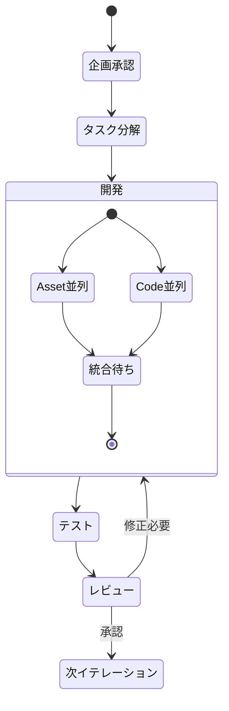

---

## タスク分解の詳細

### TaskSplit Agentの役割

TaskSplitは企画・設計を**具体的な開発タスク**に分解します。

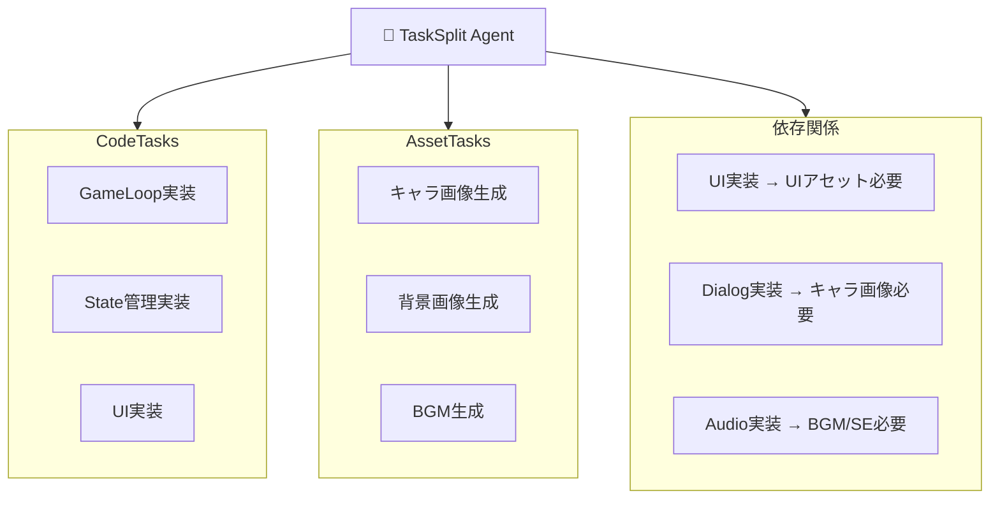

### タスク分解の出力形式

```json
{
  "iteration": 1,
  "iteration_goal": "コアゲームループの実装",

  "code_tasks": [
    {
      "id": "code_001",
      "name": "GameLoop実装",
      "description": "メインループとフレーム管理",
      "priority": 1,
      "depends_on": [],
      "required_assets": []
    },
    {
      "id": "code_002",
      "name": "PlayerController実装",
      "description": "プレイヤー操作の入力処理",
      "priority": 2,
      "depends_on": ["code_001"],
      "required_assets": ["asset_001"]
    }
  ],

  "asset_tasks": [
    {
      "id": "asset_001",
      "name": "プレイヤーキャラ画像",
      "type": "image",
      "description": "プレイヤーのスプライト画像",
      "priority": 1,
      "specs": {
        "format": "PNG",
        "size": "64x64",
        "frames": 8
      }
    }
  ],

  "dependencies": {
    "code_002": ["asset_001"],
    "code_005": ["asset_002", "asset_003"]
  }
}
```

---

## フェーズ2: 開発の詳細構造

### Leader Agentの役割

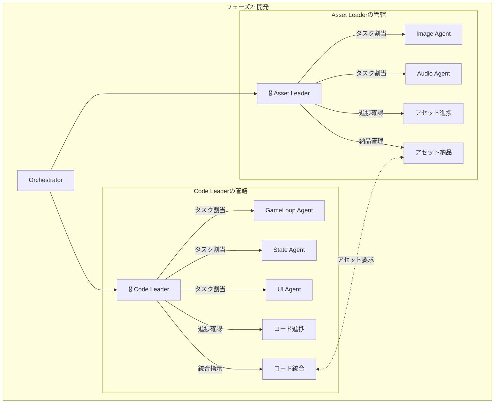

### Code Leader

| 責務 | 詳細 |
|-----|------|
| **タスク管理** | コードタスクをAgentに割り当て |
| **依存関係解決** | 依存順序に従って実行順を決定 |
| **アセット連携** | 必要なアセットをAsset Leaderに要求 |
| **統合** | 各Agentの出力を統合 |
| **品質確認** | コードが動作するか確認 |

### Asset Leader

| 責務 | 詳細 |
|-----|------|
| **タスク管理** | アセットタスクをAgentに割り当て |
| **仕様管理** | アセットの仕様（サイズ、形式等）を管理 |
| **納品管理** | 完成アセットの納品・バージョン管理 |
| **リクエスト対応** | Code Leaderからの要求に対応 |

---

## Asset-Code間の紐づけ

### 依存関係マッピング

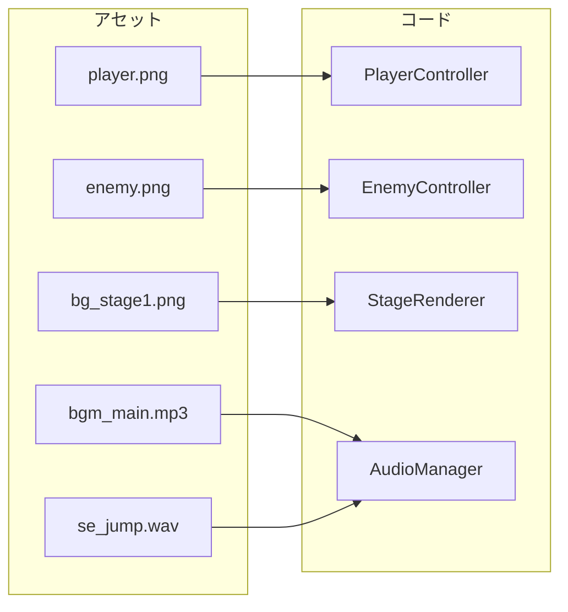

### 依存関係の状態管理

```python
class AssetCodeDependency(TypedDict):
    code_task_id: str
    required_assets: list[str]
    status: Literal["waiting", "ready", "integrated"]

# 例
dependencies = [
    {
        "code_task_id": "code_002",  # PlayerController
        "required_assets": ["asset_001"],  # player.png
        "status": "waiting"  # アセット待ち
    },
    {
        "code_task_id": "code_005",  # AudioManager
        "required_assets": ["asset_004", "asset_005"],  # BGM, SE
        "status": "ready"  # アセット揃った
    }
]
```

### 開発フロー

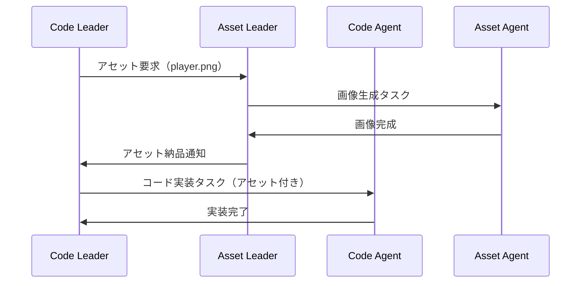

---

## Agent一覧（Human承認ポイント付き）

### 凡例

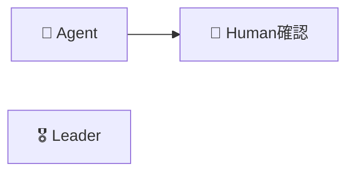

### フェーズ1: 企画（順次実行）

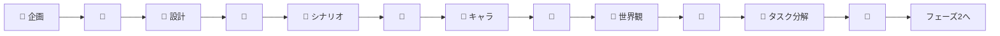

### フェーズ2: 開発（Leader統括 + 並列実行）

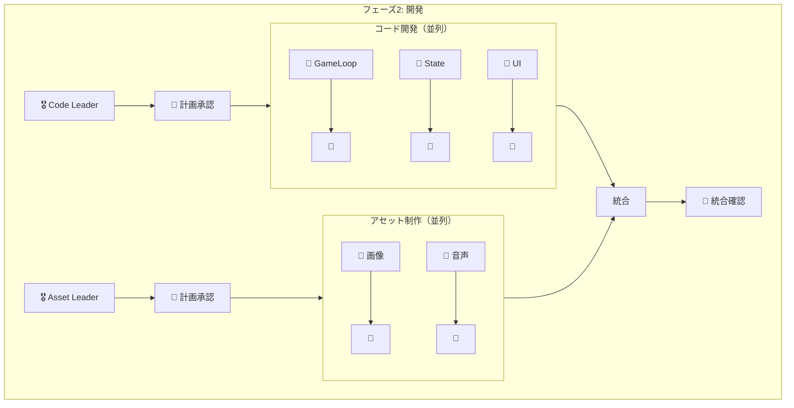

### フェーズ3: 品質（順次実行）

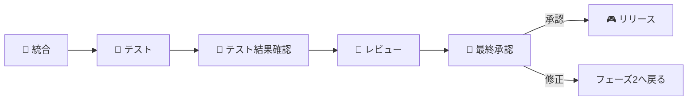

---

## Agent詳細仕様

### 簡易版（概要一覧）

#### フェーズ1: 企画層（6 Agent）

| Agent | 入力 | 出力 | Human確認ポイント |
|-------|-----|------|-----------------|
| **企画** | ユーザーアイデア | ゲームコンセプト文書 | 方向性の承認 |
| **設計** | コンセプト | 技術設計書 | アーキテクチャ承認 |
| **シナリオ** | コンセプト+設計 | ストーリー概要 | ストーリー承認 |
| **キャラクター** | シナリオ | キャラクター仕様 | キャラクター承認 |
| **世界観** | シナリオ | ワールド/レベル設計 | 世界観承認 |
| **タスク分解** | 上記全て | タスク一覧+依存関係 | タスク計画承認 |

#### フェーズ2: 開発層

| Agent | 種別 | 責務 |
|-------|-----|------|
| **Code Leader** | Leader | コードタスク管理・統合・品質確認 |
| **Asset Leader** | Leader | アセットタスク管理・納品・仕様管理 |
| **GameLoop** | Code | メインループ、フレーム管理 |
| **StateManager** | Code | ゲーム状態、遷移管理 |
| **EventSystem** | Code | イベントの発行/購読 |
| **PlayerController** | Code | プレイヤー操作 |
| **UIManager** | Code | UI表示、操作 |
| **DialogSystem** | Code | 会話システム |
| **AudioManager** | Code | BGM/SE再生 |
| **SaveLoadManager** | Code | セーブ/ロード |
| **CharacterImage** | Asset | キャラクター画像生成 |
| **BackgroundImage** | Asset | 背景画像生成 |
| **UIImage** | Asset | UI部品画像生成 |
| **BGMGenerator** | Asset | BGM生成 |
| **SEGenerator** | Asset | 効果音生成 |

#### フェーズ3: 品質層（3 Agent）

| Agent | 責務 | Human確認ポイント |
|-------|-----|-----------------|
| **Integrator** | 全コンポーネント統合 | 自動（確認なし） |
| **Tester** | 自動テスト実行 | テスト結果確認 |
| **Reviewer** | コード品質確認 | 最終リリース承認 |

---

### 詳細版

#### フェーズ1: 企画層

##### 企画 Agent（Concept Agent）

| 項目 | 内容 |
|-----|------|
| **役割** | ユーザーのアイデアをゲームコンセプトに具体化する |
| **入力** | ユーザーのアイデア（自然言語） |
| **出力** | ゲームコンセプト文書（JSON） |
| **Human確認** | ゲームの方向性が正しいか確認 |

**処理フロー:**
1. ユーザーアイデアを分析
2. ゲームジャンル・ターゲット層を特定
3. コアループを設計
4. ユニークポイントを抽出
5. コンセプト文書を生成

**出力例:**
```json
{
  "title": "宇宙探索RPG",
  "genre": "アクションRPG",
  "platform": "PC/Web",
  "target_audience": "20-30代ゲーマー",
  "summary": "未知の惑星を探索し、資源を集めて宇宙船を強化するRPG",
  "core_loop": ["探索", "収集", "強化", "戦闘"],
  "unique_points": ["手続き生成による無限の惑星", "物理ベースの宇宙船操作"],
  "key_features": ["オープンワールド", "クラフトシステム", "マルチプレイ対応"]
}
```

##### 設計 Agent（Design Agent）

| 項目 | 内容 |
|-----|------|
| **役割** | コンセプトを技術的な設計に落とし込む |
| **入力** | ゲームコンセプト文書 |
| **出力** | 技術設計書（JSON） |
| **Human確認** | 技術選定・アーキテクチャが適切か確認 |

**処理フロー:**
1. コンセプトから技術要件を抽出
2. 適切な技術スタックを選定
3. システムアーキテクチャを設計
4. コンポーネント分割を決定
5. 設計書を生成

**出力例:**
```json
{
  "tech_stack": {
    "language": "TypeScript",
    "framework": "Phaser.js",
    "libraries": ["matter.js", "howler.js"]
  },
  "architecture": "コンポーネントベース",
  "components": [
    {"name": "GameCore", "responsibility": "ゲームループ管理"},
    {"name": "PlayerSystem", "responsibility": "プレイヤー操作・状態管理"},
    {"name": "WorldGenerator", "responsibility": "惑星の手続き生成"},
    {"name": "CombatSystem", "responsibility": "戦闘ロジック"},
    {"name": "UIManager", "responsibility": "UI表示・操作"}
  ],
  "data_flow": "イベント駆動型"
}
```

##### シナリオ Agent（Scenario Agent）

| 項目 | 内容 |
|-----|------|
| **役割** | ゲームのストーリー・世界設定を作成 |
| **入力** | コンセプト + 設計 |
| **出力** | シナリオ文書（JSON） |
| **Human確認** | ストーリーの魅力・整合性を確認 |

**出力例:**
```json
{
  "setting": {
    "era": "西暦3000年",
    "location": "銀河辺境",
    "situation": "地球資源枯渇により宇宙開拓時代"
  },
  "main_story": {
    "premise": "失われた古代文明の遺跡を探す探索者の物語",
    "goal": "古代技術を発見し地球を救う",
    "conflict": "宇宙海賊との対立"
  },
  "chapters": [
    {"title": "旅立ち", "summary": "故郷を離れ宇宙へ"},
    {"title": "最初の発見", "summary": "古代遺跡の手がかりを得る"},
    {"title": "対決", "summary": "宇宙海賊との決戦"}
  ]
}
```

##### キャラクター Agent（Character Agent）

| 項目 | 内容 |
|-----|------|
| **役割** | ゲームに登場するキャラクターを設計 |
| **入力** | シナリオ文書 |
| **出力** | キャラクター仕様（JSON） |
| **Human確認** | キャラクターの魅力・バランスを確認 |

**出力例:**
```json
{
  "characters": [
    {
      "id": "player",
      "name": "（プレイヤー命名）",
      "role": "主人公",
      "personality": "好奇心旺盛、正義感が強い",
      "appearance": {
        "age": 25,
        "gender": "選択可能",
        "features": "パイロットスーツ着用"
      },
      "abilities": ["操縦", "射撃", "修理"]
    },
    {
      "id": "rival",
      "name": "レイ",
      "role": "ライバル/後に仲間",
      "personality": "クール、合理的",
      "backstory": "元軍人、過去に家族を失う"
    }
  ]
}
```

##### 世界観 Agent（World Agent）

| 項目 | 内容 |
|-----|------|
| **役割** | ゲーム世界・レベルを設計 |
| **入力** | シナリオ文書 |
| **出力** | 世界観設計書（JSON） |
| **Human確認** | 世界の広がり・一貫性を確認 |

**出力例:**
```json
{
  "worlds": [
    {
      "id": "home_planet",
      "name": "ネオアース",
      "type": "都市惑星",
      "description": "人類の居住地、近代的な都市",
      "features": ["宇宙港", "マーケット", "修理工場"]
    },
    {
      "id": "desert_planet",
      "name": "サンドリア",
      "type": "砂漠惑星",
      "description": "古代遺跡が眠る砂の惑星",
      "hazards": ["砂嵐", "高温"],
      "resources": ["レアメタル", "古代技術"]
    }
  ],
  "level_progression": ["ネオアース → サンドリア → ..."]
}
```

##### タスク分解 Agent（TaskSplit Agent）

| 項目 | 内容 |
|-----|------|
| **役割** | 企画・設計を開発タスクに分解 |
| **入力** | 全企画ドキュメント |
| **出力** | タスク一覧 + 依存関係マップ（JSON） |
| **Human確認** | タスク粒度・優先順位を確認 |

**出力例:**
```json
{
  "iteration": 1,
  "iteration_goal": "コアゲームループ実装",
  "code_tasks": [
    {
      "id": "code_001",
      "name": "GameLoop実装",
      "priority": 1,
      "estimated_complexity": "medium",
      "depends_on": [],
      "required_assets": []
    }
  ],
  "asset_tasks": [
    {
      "id": "asset_001",
      "name": "プレイヤー画像",
      "type": "image",
      "priority": 1,
      "specs": {"format": "PNG", "size": "64x64"}
    }
  ],
  "dependencies": {
    "code_002": ["asset_001"]
  }
}
```

---

#### フェーズ2: 開発層

##### Code Leader Agent

| 項目 | 内容 |
|-----|------|
| **役割** | コード開発全体を統括 |
| **入力** | タスク一覧、アセット納品情報 |
| **出力** | 開発計画、統合コード |
| **Human確認** | 開発計画承認、統合確認 |

**責務詳細:**
1. **計画作成**: タスクの実行順序を決定
2. **割り当て**: 各Code Agentにタスクを配分
3. **依存管理**: アセット待ちタスクの管理
4. **進捗追跡**: 各Agentの完了状況を監視
5. **統合**: 生成されたコードを統合
6. **品質確認**: 統合後の動作確認

**出力例（開発計画）:**
```json
{
  "phase": "development",
  "iteration": 1,
  "plan": [
    {"order": 1, "task_id": "code_001", "agent": "GameLoopAgent", "status": "ready"},
    {"order": 2, "task_id": "code_002", "agent": "PlayerAgent", "status": "waiting_asset", "waiting_for": ["asset_001"]}
  ],
  "asset_requests": [
    {"asset_id": "asset_001", "requested_at": "2024-01-01T10:00:00Z"}
  ]
}
```

##### Asset Leader Agent

| 項目 | 内容 |
|-----|------|
| **役割** | アセット制作全体を統括 |
| **入力** | タスク一覧、Code Leaderからの要求 |
| **出力** | 制作計画、納品アセット一覧 |
| **Human確認** | 制作計画承認、納品確認 |

**責務詳細:**
1. **計画作成**: アセット制作の優先順位決定
2. **仕様管理**: 各アセットの詳細仕様を管理
3. **割り当て**: 各Asset Agentにタスクを配分
4. **品質確認**: 生成されたアセットの品質確認
5. **納品**: Code Leaderへのアセット納品

**出力例（納品リスト）:**
```json
{
  "deliveries": [
    {
      "asset_id": "asset_001",
      "name": "player.png",
      "path": "/assets/characters/player.png",
      "specs": {"width": 64, "height": 64, "format": "PNG"},
      "delivered_at": "2024-01-01T12:00:00Z",
      "status": "delivered"
    }
  ]
}
```

##### GameLoop Agent（Code Agent例）

| 項目 | 内容 |
|-----|------|
| **役割** | ゲームのメインループを実装 |
| **入力** | 設計書、タスク仕様 |
| **出力** | ソースコード |
| **依存アセット** | なし |

**出力例:**
```json
{
  "file_path": "src/core/game_loop.ts",
  "language": "typescript",
  "code": "// ゲームループ実装...",
  "exports": ["GameLoop", "startGame", "stopGame"],
  "tests_required": ["test_game_loop_start", "test_game_loop_stop"]
}
```

##### CharacterImage Agent（Asset Agent例）

| 項目 | 内容 |
|-----|------|
| **役割** | キャラクター画像を生成 |
| **入力** | キャラクター仕様、画像仕様 |
| **出力** | 画像ファイルパス、メタデータ |
| **生成方法** | DALL-E / Stable Diffusion |

**出力例:**
```json
{
  "asset_id": "asset_001",
  "type": "image",
  "file_path": "/assets/characters/player.png",
  "metadata": {
    "width": 64,
    "height": 64,
    "format": "PNG",
    "frames": 8,
    "prompt_used": "pixel art character, space pilot, 64x64"
  }
}
```

---

#### フェーズ3: 品質層

##### Integrator Agent

| 項目 | 内容 |
|-----|------|
| **役割** | 全コンポーネントを統合 |
| **入力** | 全コード出力、全アセット |
| **出力** | 統合済みプロジェクト |
| **Human確認** | なし（自動） |

**処理フロー:**
1. 全コードファイルを収集
2. 依存関係を解決
3. ビルド実行
4. アセットを配置
5. 統合結果を報告

##### Tester Agent

| 項目 | 内容 |
|-----|------|
| **役割** | 自動テストを実行 |
| **入力** | 統合済みプロジェクト |
| **出力** | テスト結果レポート |
| **Human確認** | テスト結果の確認 |

**出力例:**
```json
{
  "summary": {
    "total": 50,
    "passed": 48,
    "failed": 2,
    "skipped": 0
  },
  "failures": [
    {
      "test": "test_player_collision",
      "error": "AssertionError: expected true, got false",
      "file": "tests/player.test.ts",
      "line": 42
    }
  ],
  "coverage": {
    "statements": 85,
    "branches": 78,
    "functions": 90
  }
}
```

##### Reviewer Agent

| 項目 | 内容 |
|-----|------|
| **役割** | コード品質を確認 |
| **入力** | 統合済みプロジェクト、テスト結果 |
| **出力** | レビューレポート |
| **Human確認** | 最終リリース承認 |

**出力例:**
```json
{
  "overall_status": "approval_recommended",
  "score": 85,
  "findings": [
    {
      "severity": "warning",
      "category": "performance",
      "file": "src/world/generator.ts",
      "message": "ループ内で重い処理。最適化を推奨"
    }
  ],
  "checklist": {
    "tests_passing": true,
    "no_critical_bugs": true,
    "code_style_ok": true,
    "documentation_ok": false
  },
  "recommendation": "ドキュメント追加後、リリース可能"
}
```

---

## Orchestrator詳細

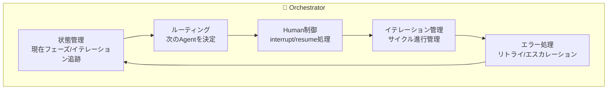

### Orchestratorの責務

1. **状態管理**
   - 現在のフェーズ（企画/開発/品質）
   - 現在のイテレーション番号
   - 完了タスク、保留タスク

2. **ルーティング**
   - フェーズ1・3: 順次実行
   - フェーズ2: Leader経由で並列実行
   - Humanフィードバックに応じた条件分岐

3. **イテレーション管理**
   - イテレーション目標の設定
   - イテレーション完了判定
   - 次イテレーションへの遷移

4. **Human連携**
   - 各承認ポイントで`interrupt()`
   - 状態を永続化（数ヶ月後でも再開可能）
   - フィードバックを適切なAgentにルーティング

5. **エラー処理**
   - LLM呼び出し失敗時のリトライ
   - 繰り返し失敗時のHumanエスカレーション
   - 必要に応じてチェックポイントへロールバック

---

## Human連携フロー

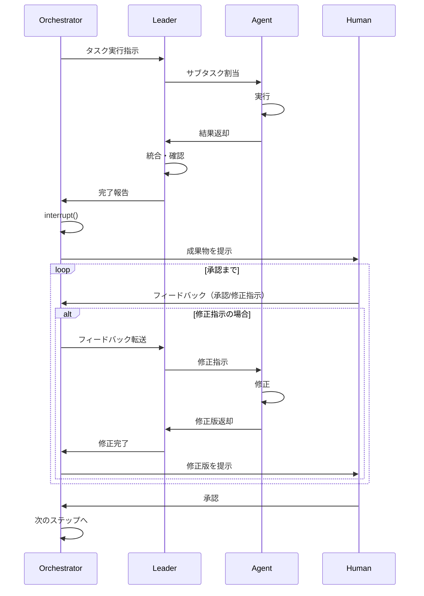

---

## 状態スキーマ

```python
from typing import TypedDict, Literal, Optional

class Task(TypedDict):
    id: str
    name: str
    status: Literal["pending", "in_progress", "completed", "blocked"]
    assigned_to: Optional[str]
    depends_on: list[str]
    required_assets: list[str]

class Iteration(TypedDict):
    number: int
    goal: str
    code_tasks: list[Task]
    asset_tasks: list[Task]
    status: Literal["planning", "development", "quality", "completed"]

class GameDevState(TypedDict):
    # スキーマバージョン
    _schema_version: str

    # 現在位置
    current_phase: Literal["planning", "development", "quality"]
    current_iteration: int

    # 企画出力
    concept: Optional[dict]
    design: Optional[dict]
    scenario: Optional[dict]
    characters: Optional[list[dict]]
    world: Optional[dict]

    # イテレーション管理
    iterations: list[Iteration]

    # 開発出力
    code_outputs: dict[str, str]      # task_id -> code
    asset_outputs: dict[str, str]     # task_id -> asset_path

    # 依存関係
    asset_code_dependencies: list[dict]

    # 品質出力
    test_results: Optional[dict]
    review_comments: Optional[list[str]]

    # Human連携
    pending_approval: Optional[str]
    human_feedback: Optional[str]

    # メタデータ
    error_log: list[str]
```

---

## システム開発フェーズ

> ⚠️ これは**このシステム自体**の開発フェーズです。ゲーム開発のイテレーションとは別です。

### MVP（最小実行可能製品）
- [ ] Orchestrator（基本ルーティング）
- [ ] 企画 + 設計 Agent
- [ ] 単一Coder Agent（統合版）
- [ ] 3箇所のHuman承認

### v1.0
- [ ] 企画層の全Agent（6個）
- [ ] Code Leader + Asset Leader
- [ ] 並列開発の仕組み
- [ ] イテレーション管理

### v2.0
- [ ] アセット生成連携（DALL-E等）
- [ ] ゲームテンプレート対応
- [ ] Human確認用WebUI

---

## 技術スタック

| コンポーネント | 技術 |
|--------------|------|
| **オーケストレーション** | LangGraph |
| **LLM** | Claude / GPT-4 |
| **言語** | Python 3.11+ |
| **状態保存** | SQLite / PostgreSQL |
| **ゲームエンジン** | 未定（Phaser.js / Pygame等） |
| **画像生成** | DALL-E / Stable Diffusion |
| **音声生成** | Suno / ElevenLabs |
