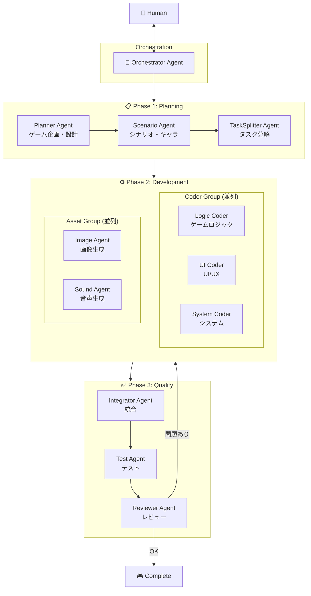
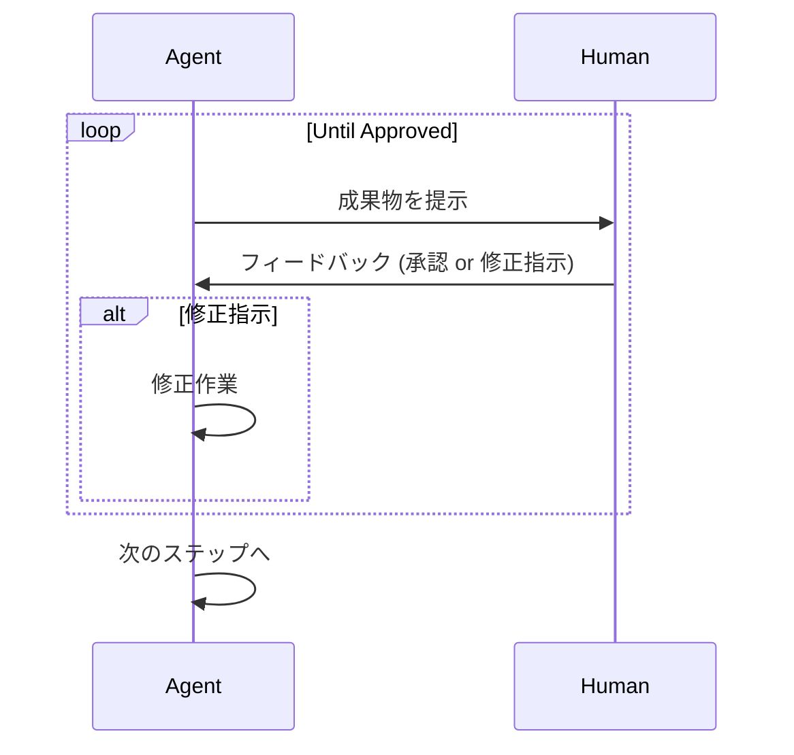
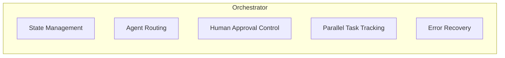

# LangGraph Game Development System

## Overview

## Human-in-the-Loop Flow

## Agent Details

### Phase 1: Planning Layer

| Agent | Role | Output |
|-------|------|--------|
| **Planner** | ゲームコンセプト・基本設計 | 企画書、技術要件 |
| **Scenario** | ストーリー・キャラクター・世界観 | シナリオ、キャラ設定 |
| **TaskSplitter** | 実装タスクへの分解 | タスクリスト（並列実行可否を識別） |

### Phase 2: Development Layer (Parallel Execution)

| Agent | Role |
|-------|------|
| **Logic Coder** | ゲームロジック、状態管理、ゲームループ |
| **UI Coder** | UI/UX、メニュー、HUD、画面遷移 |
| **System Coder** | セーブ/ロード、設定、ファイル管理 |
| **Image Agent** | 画像アセット生成・調達 |
| **Sound Agent** | BGM/SE アセット生成・調達 |

### Phase 3: Quality Layer

| Agent | Role |
|-------|------|
| **Integrator** | 各パーツの統合・結合 |
| **Test** | 自動テスト実行、バグ検出 |
| **Reviewer** | コードレビュー、最終品質確認 |

## Orchestrator Responsibilities

- **State Management**: 現在のPhase/状態を管理
- **Agent Routing**: 次に動くAgentを決定
- **Human Approval Control**: Human承認待ちの制御
- **Parallel Task Tracking**: 並列タスクの進捗追跡
- **Error Recovery**: エラー時のリカバリー判断

## Detailed Flow

```mermaid
stateDiagram-v2
    [*] --> Planning

    state Planning {
        [*] --> Planner
        Planner --> HumanReview1: 企画提出
        HumanReview1 --> Planner: 修正指示
        HumanReview1 --> Scenario: 承認
        Scenario --> HumanReview2: シナリオ提出
        HumanReview2 --> Scenario: 修正指示
        HumanReview2 --> TaskSplit: 承認
        TaskSplit --> HumanReview3: タスク分解案
        HumanReview3 --> TaskSplit: 修正指示
        HumanReview3 --> [*]: 承認
    }

    Planning --> Development

    state Development {
        [*] --> Parallel
        state Parallel {
            LogicCoder
            UICoder
            SystemCoder
            --
            ImageAgent
            SoundAgent
        }
        Parallel --> HumanReviewDev: 成果物提出
        HumanReviewDev --> Parallel: 修正指示
        HumanReviewDev --> [*]: 承認
    }

    Development --> Quality

    state Quality {
        [*] --> Integrate
        Integrate --> Test
        Test --> Review
        Review --> HumanFinal: 最終確認
        HumanFinal --> [*]: 承認
        HumanFinal --> Development: 問題あり
    }

    Quality --> [*]
```

## Tech Stack (Proposed)

- **LangGraph**: Agent orchestration
- **LangChain**: LLM integration
- **Python**: Primary language
- **Game Engine**: TBD (Phaser.js / Pygame / etc.)
