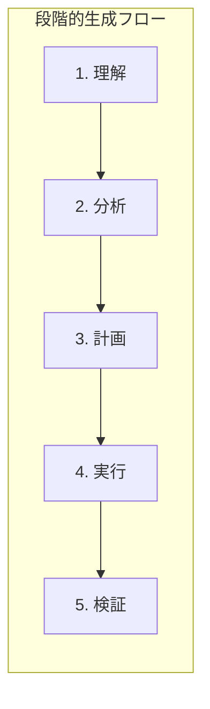
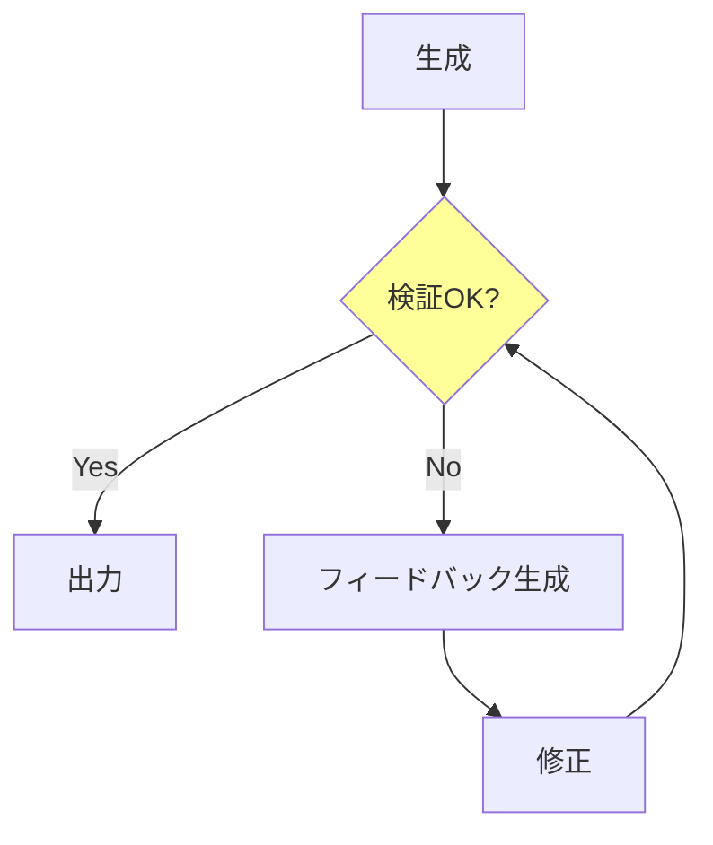
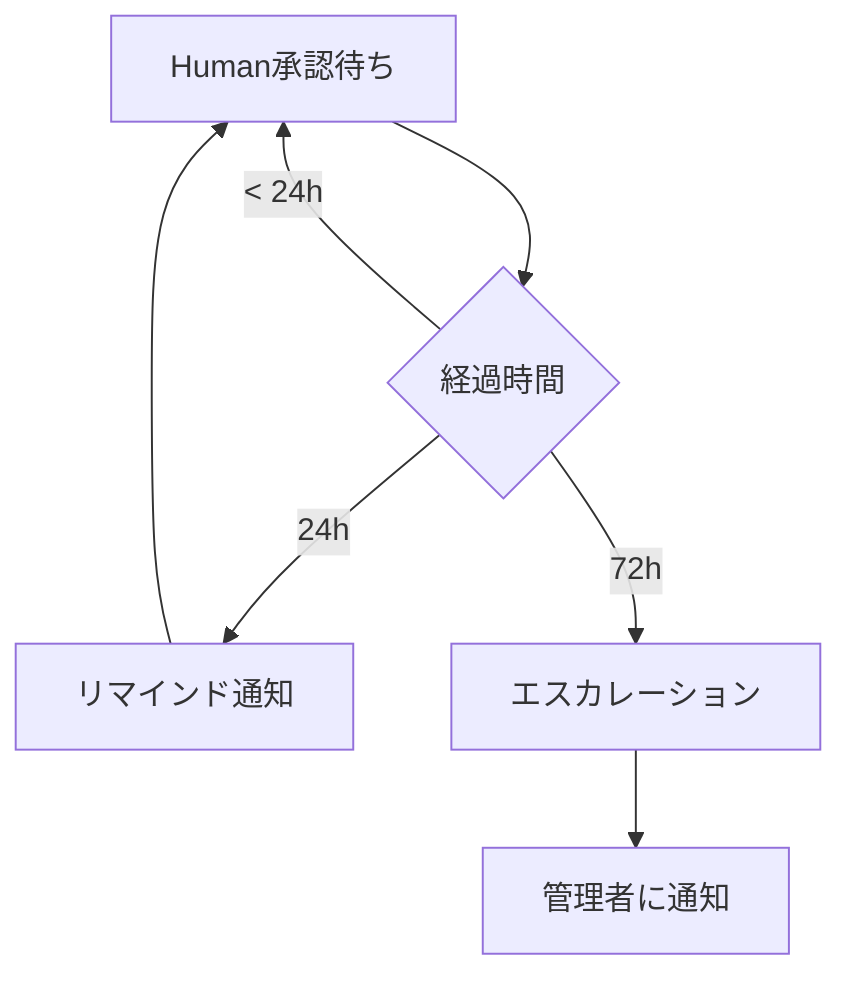
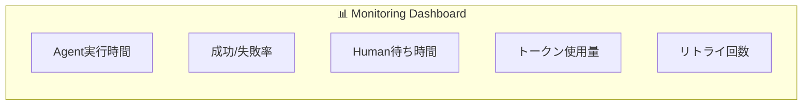

# Development Rules (開発規約)

このドキュメントはLangGraph Game Development Systemの開発規約を定義します。
Agentの設計原則、コード規約、品質基準、運用ルールを含みます。

---

## Design Principles (LangGraph Best Practices)

| Principle | Description |
|-----------|-------------|
| **Single Responsibility** | 1 Agent = 1 Task。複数の責務を持たせない |
| **Fine Granularity** | 小さいAgentほど再利用・テスト・保守が容易 |
| **Human Checkpoint** | 不可逆アクションの**前**に`interrupt()`を配置 |
| **Durable State** | チェックポイントで永続化。数日〜数ヶ月後でも再開可能 |
| **Parallel Execution** | 依存関係のないAgentは並列実行 |

Sources:
- [Building LangGraph](https://blog.langchain.com/building-langgraph/)
- [Human-in-the-Loop Best Practices](https://www.permit.io/blog/human-in-the-loop-for-ai-agents-best-practices-frameworks-use-cases-and-demo)

---

## 1. Agent設計原則

### DO / DON'T

```
┌─────────────────────────────────────────────────────────────┐
│                      Agent Design Rules                     │
├─────────────────────────────────────────────────────────────┤
│ ✅ DO                          │ ❌ DON'T                   │
├────────────────────────────────┼────────────────────────────┤
│ 1つのAgentに1つの責務          │ 複数タスクを詰め込む        │
│ 入出力を明確に型定義           │ anyや曖昧な型を使う         │
│ 冪等性を保つ(同入力→同出力)   │ 副作用に依存する            │
│ エラーは明示的に返す           │ 例外を握りつぶす            │
│ プロンプトは外部ファイル化     │ コード内にハードコード      │
└────────────────────────────────┴────────────────────────────┘
```

### Agent定義テンプレート

```python
from typing import TypedDict

class AgentInput(TypedDict):
    """このAgentへの入力"""
    context: str      # 前Agentからの引き継ぎ
    requirements: str # 要求事項

class AgentOutput(TypedDict):
    """このAgentの出力"""
    result: str       # 生成物
    status: str       # "success" | "needs_revision" | "error"
    message: str      # Human向けの説明

def agent_name(state: GameDevState) -> AgentOutput:
    """
    Agent: [Agent名]
    責務: [1行で説明]
    入力: [何を受け取るか]
    出力: [何を返すか]
    """
    # 実装
    pass
```

### Agent間通信フォーマット

Agent間のデータ受け渡しは**JSON形式**で統一します。

```python
from pydantic import BaseModel
from typing import Literal

class AgentMessage(BaseModel):
    """Agent間通信の標準フォーマット"""
    agent_name: str                    # 送信元Agent
    status: Literal["success", "needs_revision", "error"]
    data: dict                         # 生成物（JSON形式）
    metadata: dict                     # 付加情報

# 使用例
message = AgentMessage(
    agent_name="ConceptAgent",
    status="success",
    data={
        "title": "Space Explorer",
        "genre": "Action RPG",
        "summary": "宇宙を探索するアクションRPG",
        "core_loop": ["探索", "戦闘", "成長"],
        "key_features": ["手続き生成", "マルチプレイ"]
    },
    metadata={
        "tokens_used": 1500,
        "duration_ms": 2300,
        "model": "claude-3-opus"
    }
)
```

#### Agent出力スキーマ例

**ConceptAgent:**
```json
{
  "title": "string",
  "genre": "string",
  "platform": "string",
  "summary": "string",
  "core_loop": ["string"],
  "unique_points": ["string"],
  "key_features": ["string"]
}
```

**DesignAgent:**
```json
{
  "architecture": "string",
  "tech_stack": {
    "language": "string",
    "framework": "string",
    "libraries": ["string"]
  },
  "components": [
    {
      "name": "string",
      "responsibility": "string",
      "dependencies": ["string"]
    }
  ],
  "data_flow": "string"
}
```

**CoderAgent:**
```json
{
  "file_path": "string",
  "code": "string",
  "language": "string",
  "imports": ["string"],
  "exports": ["string"],
  "tests_required": ["string"]
}
```

### プロンプト設計ガイドライン

#### ディレクトリ構成

```
prompts/
├── planning/
│   ├── concept_agent.md
│   ├── design_agent.md
│   └── ...
├── development/
│   ├── gameloop_agent.md
│   └── ...
└── quality/
    ├── test_agent.md
    └── ...
```

#### プロンプトファイルの構造（段階的生成対応）

LLMに高品質な出力を得るため、**段階的思考（Chain of Thought）** を組み込みます。



#### 基本テンプレート

```markdown
# [Agent名] Prompt

## Role
あなたは[役割]です。[専門性や経験の説明]

## Context
{context}

## Task
{task_description}

---

## 思考プロセス（必ずこの順序で進めてください）

### Step 1: 理解（Understanding）
まず、与えられた情報を整理してください：
- 入力として何が与えられているか
- 何を達成する必要があるか
- 制約条件は何か

### Step 2: 分析（Analysis）
次に、タスクを分析してください：
- 考慮すべき要素は何か
- 潜在的な問題点や課題は何か
- 類似の事例や参考になるパターンはあるか

### Step 3: 計画（Planning）
実行計画を立ててください：
- どのような手順で進めるか
- 各手順で何を生成するか
- 依存関係や順序はあるか

### Step 4: 実行（Execution）
計画に従って出力を生成してください：
[具体的な生成指示]

### Step 5: 検証（Verification）
生成した内容を自己レビューしてください：
- 要件を満たしているか
- 矛盾や抜け漏れはないか
- 品質基準を満たしているか

---

## Output Format
[期待する出力形式]

## Constraints
- [制約1]
- [制約2]

## Quality Checklist
出力前に以下を確認してください：
- [ ] 全ての要件を満たしている
- [ ] 論理的な一貫性がある
- [ ] 指定されたフォーマットに従っている
```

#### Agent別テンプレート例

**Concept Agent（企画）の場合：**

```markdown
# Concept Agent Prompt

## Role
あなたはゲーム企画の専門家です。10年以上の経験を持ち、
多様なジャンルのゲームコンセプトを立案してきました。

## Context
ユーザーのアイデア: {user_idea}
ターゲット層: {target_audience}
プラットフォーム: {platform}

## Task
ユーザーのアイデアを基に、ゲームコンセプト文書を作成してください。

---

## 思考プロセス

### Step 1: 理解
ユーザーのアイデアを分解してください：
- コアとなるゲーム体験は何か
- ユーザーが求めている感情・体験は何か
- 明示されていない暗黙の要件は何か

### Step 2: 分析
以下を分析してください：
- 類似ゲームの成功/失敗要因
- ターゲット層の嗜好
- 技術的な実現可能性

### Step 3: 計画
コンセプト文書の構成を決定してください：
1. ゲーム概要（1-2文）
2. コアループ
3. ユニークセリングポイント
4. ターゲット体験
5. 主要機能リスト

### Step 4: 実行
各セクションを順番に記述してください。
各セクションは具体的かつ簡潔に。

### Step 5: 検証
以下を確認してください：
- ユーザーの元アイデアを尊重しているか
- 実現可能な範囲に収まっているか
- 独自性があるか

---

## Output Format
```yaml
title: [ゲームタイトル案]
genre: [ジャンル]
platform: [プラットフォーム]
summary: |
  [1-2文のゲーム概要]
core_loop:
  - [ループ要素1]
  - [ループ要素2]
unique_points:
  - [USP1]
  - [USP2]
target_experience: |
  [プレイヤーが得る体験の説明]
key_features:
  - [機能1]
  - [機能2]
```

## Constraints
- 実装困難な機能は含めない
- 1つのコアループに集中する
- 技術的な詳細には踏み込まない
```

**Coder Agent（実装）の場合：**

```markdown
# [ComponentName] Coder Agent Prompt

## Role
あなたは[言語/フレームワーク]の専門エンジニアです。
クリーンコード、テスタビリティ、保守性を重視します。

## Context
設計文書: {design_doc}
既存コード: {existing_code}
依存関係: {dependencies}

## Task
{component_name}を実装してください。

---

## 思考プロセス

### Step 1: 理解
設計文書から以下を把握してください：
- このコンポーネントの責務
- 入力と出力
- 他コンポーネントとのインターフェース

### Step 2: 分析
実装方針を検討してください：
- 使用するデザインパターン
- エラーハンドリング方針
- パフォーマンス考慮点

### Step 3: 計画
実装の順序を決定してください：
1. 型定義/インターフェース
2. コア実装
3. エラーハンドリング
4. ヘルパー関数

### Step 4: 実行
コードを記述してください。
各関数は単一責任を持つこと。

### Step 5: 検証
コードを自己レビューしてください：
- 型安全性
- エッジケース処理
- コメントの適切さ

---

## Output Format
```python
# [ファイル名].py

"""
[モジュールの説明]
"""

from typing import ...

# 型定義
...

# メイン実装
...

# ヘルパー関数
...
```

## Constraints
- 外部ライブラリは指定されたもののみ使用
- 1関数50行以内
- docstringは必須

## Quality Checklist
- [ ] 型ヒントが全ての関数にある
- [ ] エラーケースを処理している
- [ ] 設計文書の仕様を満たしている
```

#### 段階的生成の実装パターン

```python
from langchain.prompts import PromptTemplate

# マルチステップ実行
def run_agent_with_stages(state: GameDevState, prompt_template: str) -> dict:
    """段階的にLLMを実行"""

    stages = [
        ("understanding", "Step 1の出力を生成"),
        ("analysis", "Step 2の出力を生成"),
        ("planning", "Step 3の出力を生成"),
        ("execution", "Step 4の出力を生成"),
        ("verification", "Step 5の出力を生成"),
    ]

    intermediate_outputs = {}

    for stage_name, stage_instruction in stages:
        # 前のステージの出力をコンテキストに追加
        stage_prompt = prompt_template.format(
            **state,
            previous_outputs=intermediate_outputs,
            current_stage=stage_instruction
        )

        result = llm.invoke(stage_prompt)
        intermediate_outputs[stage_name] = result

        # 中間検証（オプション）
        if stage_name == "planning":
            validate_plan(result)

    return {
        "result": intermediate_outputs["execution"],
        "verification": intermediate_outputs["verification"],
        "trace": intermediate_outputs  # デバッグ用
    }
```

#### 自己修正ループ



```python
MAX_REVISIONS = 3

def generate_with_self_correction(prompt: str, validator: Callable) -> str:
    """自己修正ループ付き生成"""

    for attempt in range(MAX_REVISIONS):
        result = llm.invoke(prompt)

        # 検証
        is_valid, feedback = validator(result)

        if is_valid:
            return result

        # フィードバックを含めて再生成
        prompt = f"""
        前回の出力:
        {result}

        問題点:
        {feedback}

        上記の問題を修正して、再度生成してください。
        """

    raise AgentError("Max revisions exceeded", recoverable=False)
```

---

## 2. コード規約

### ファイル構成

```
langgraph/
├── agents/
│   ├── __init__.py
│   ├── planning/
│   │   ├── concept.py
│   │   ├── design.py
│   │   └── ...
│   ├── development/
│   │   ├── logic/
│   │   │   ├── gameloop.py
│   │   │   └── ...
│   │   ├── ui/
│   │   └── assets/
│   └── quality/
│       ├── integrator.py
│       ├── tester.py
│       └── reviewer.py
├── prompts/
│   └── (上記参照)
├── orchestrator.py
├── state.py
├── graph.py
└── main.py
```

### 命名規則

| 対象 | 規則 | 例 |
|------|------|-----|
| Agent関数 | `snake_case` | `concept_agent()` |
| Agentクラス | `PascalCase` + Agent | `ConceptAgent` |
| State型 | `PascalCase` + State | `GameDevState` |
| プロンプトファイル | `snake_case.md` | `concept_agent.md` |
| 定数 | `UPPER_SNAKE_CASE` | `MAX_RETRIES` |

### コメント規約

```python
def concept_agent(state: GameDevState) -> dict:
    """
    Concept Agent - ゲームコンセプトを生成

    Args:
        state: 現在のゲーム開発状態

    Returns:
        concept: 生成されたコンセプト文書
        status: 処理結果

    Raises:
        AgentError: LLM呼び出し失敗時
    """
```

---

## 3. 品質・テスト方針

### テスト必須条件

| レベル | 対象 | 必須テスト |
|--------|------|-----------|
| Unit | 各Agent | 入出力の型チェック、エッジケース |
| Integration | Agent間連携 | State受け渡し、並列実行 |
| E2E | 全フロー | Planning→Dev→Qualityの一連フロー |

### テストファイル構成

```
tests/
├── unit/
│   ├── test_concept_agent.py
│   ├── test_design_agent.py
│   └── ...
├── integration/
│   ├── test_planning_flow.py
│   └── test_parallel_dev.py
└── e2e/
    └── test_full_game_dev.py
```

### レビュー基準

| チェック項目 | 確認内容 |
|-------------|---------|
| 単一責任 | Agentが1つの責務のみを持っているか |
| 型定義 | 入出力に型ヒントがあるか |
| テスト | ユニットテストが存在するか |
| エラー処理 | 例外が適切に処理されているか |
| プロンプト外部化 | プロンプトがmdファイルに分離されているか |

### エラーハンドリング方針

```python
class AgentError(Exception):
    """Agent実行時のエラー"""
    def __init__(self, agent_name: str, message: str, recoverable: bool = True):
        self.agent_name = agent_name
        self.message = message
        self.recoverable = recoverable  # リトライ可能か

# 使用例
def gameloop_agent(state: GameDevState) -> dict:
    try:
        result = call_llm(prompt)
        return {"result": result, "status": "success"}
    except LLMError as e:
        if e.is_rate_limit:
            raise AgentError("GameLoop", "Rate limit hit", recoverable=True)
        raise AgentError("GameLoop", str(e), recoverable=False)
```

### リトライ戦略

リトライ設定は `config.yaml` で管理します（Config管理セクション参照）。

---

## 4. Human介入ルール

### 承認基準

| Phase | 承認ポイント | 承認基準 |
|-------|------------|---------|
| Planning | 各Agent後 | 方向性が正しいか、要件を満たすか |
| Development | 各Agent後 | コードが動作するか、設計に沿っているか |
| Quality | Test/Review後 | バグがないか、リリース可能か |

### フィードバック形式

```python
class HumanFeedback(TypedDict):
    decision: Literal["approve", "revise", "reject"]
    comments: str           # 具体的な指摘
    priority: Literal["high", "medium", "low"]  # 修正優先度
    affected_agents: list[str]  # 影響を受けるAgent
```

フィードバック例:
```json
{
  "decision": "revise",
  "comments": "キャラクターの性格設定が薄い。もっと具体的なバックストーリーを追加してください。",
  "priority": "high",
  "affected_agents": ["Character", "Scenario"]
}
```

### タイムアウト処理



| 経過時間 | アクション |
|---------|-----------|
| 24時間 | リマインド通知 |
| 72時間 | エスカレーション（管理者通知） |
| 7日間 | 自動一時停止（状態保存） |

---

## 5. ログ/監視方針

### ログレベル定義

| Level | 用途 | 例 |
|-------|------|-----|
| **DEBUG** | 開発時の詳細情報 | プロンプト全文、LLMレスポンス全文 |
| **INFO** | 正常な処理フロー | Agent開始/終了、Human承認完了 |
| **WARNING** | 注意が必要な状況 | リトライ発生、タイムアウト接近 |
| **ERROR** | 処理失敗（リカバリ可能） | LLM呼び出し失敗、バリデーションエラー |
| **CRITICAL** | 致命的エラー（要介入） | 認証失敗、State破損 |

### ログ出力内容

```python
import structlog

logger = structlog.get_logger()

# Agent実行ログ
logger.info(
    "agent_executed",
    agent_name="ConceptAgent",
    phase="planning",
    duration_ms=1523,
    input_tokens=450,
    output_tokens=1200,
    status="success"
)

# Human介入ログ
logger.info(
    "human_feedback_received",
    agent_name="ConceptAgent",
    decision="revise",
    wait_duration_hours=2.5
)

# エラーログ
logger.error(
    "agent_failed",
    agent_name="GameLoopAgent",
    error_type="LLMTimeout",
    retry_count=3,
    recoverable=True
)
```

### 監視ダッシュボード項目



| メトリクス | 説明 | アラート閾値 |
|-----------|------|-------------|
| `agent_duration_p95` | Agent実行時間 (95%ile) | > 30秒 |
| `agent_success_rate` | 成功率 | < 95% |
| `human_wait_time_avg` | Human承認待ち平均時間 | > 24時間 |
| `token_usage_daily` | 1日あたりトークン使用量 | > 100万 |
| `retry_rate` | リトライ発生率 | > 10% |

### アラート設定

```yaml
alerts:
  - name: high_failure_rate
    condition: agent_success_rate < 0.95
    duration: 5m
    severity: warning
    notify: [slack, email]

  - name: agent_timeout
    condition: agent_duration_p95 > 60s
    duration: 10m
    severity: critical
    notify: [slack, pagerduty]

  - name: human_bottleneck
    condition: human_wait_time_avg > 48h
    duration: 1h
    severity: warning
    notify: [slack]
```

---

## 6. バージョニング戦略

### セマンティックバージョニング

```
MAJOR.MINOR.PATCH
  │     │     └── バグ修正（後方互換）
  │     └──────── 機能追加（後方互換）
  └────────────── 破壊的変更（互換性なし）
```

| 変更種別 | バージョン | 例 |
|---------|-----------|-----|
| バグ修正 | PATCH | 1.0.0 → 1.0.1 |
| 新Agent追加 | MINOR | 1.0.1 → 1.1.0 |
| State schema変更 | MAJOR | 1.1.0 → 2.0.0 |
| プロンプト改善 | PATCH | 変更なし（コンテンツは別管理） |

### コンポーネント別バージョン管理

```
langgraph-gamedev/
├── VERSION                    # 全体バージョン: 1.2.3
├── agents/
│   ├── planning/
│   │   └── VERSION           # planning agents: 1.1.0
│   ├── development/
│   │   └── VERSION           # dev agents: 1.0.5
│   └── quality/
│       └── VERSION           # quality agents: 1.0.2
├── prompts/
│   └── VERSION               # prompts: 2.3.1
└── state/
    └── VERSION               # state schema: 2.0.0
```

### State Schemaのバージョン管理

```python
class GameDevState(TypedDict):
    # Schema version for migration
    _schema_version: str  # "2.0.0"

    # ... other fields
```

マイグレーション戦略:
```python
def migrate_state(old_state: dict) -> GameDevState:
    """古いバージョンのStateを最新に変換"""
    version = old_state.get("_schema_version", "1.0.0")

    if version == "1.0.0":
        # v1 → v2: characters フィールド追加
        old_state["characters"] = []
        old_state["_schema_version"] = "2.0.0"

    return old_state
```

---

## 7. Config管理

全ての設定値は `config.yaml` で一元管理します。

### 設定ファイル構造

```yaml
# config.yaml

# LLM設定
llm:
  provider: "anthropic"          # anthropic | openai
  model: "claude-3-opus"
  temperature: 0.7
  max_tokens: 4096

# リトライ設定
retry:
  rate_limit:
    enabled: true
    max_attempts: 5
    backoff: "exponential"       # exponential | linear | none
    base_delay_sec: 2
  timeout:
    enabled: true
    max_attempts: 3
    backoff: "linear"
    base_delay_sec: 5
  invalid_response:
    enabled: true
    max_attempts: 2
    backoff: "none"
  auth_error:
    enabled: false               # リトライしない
  unknown:
    enabled: false
    escalate_to_human: true

# Human介入設定
human:
  timeout:
    reminder_hours: 24
    escalation_hours: 72
    auto_pause_days: 7
  notification:
    channels: ["slack", "email"]

# 監視設定
monitoring:
  log_level: "INFO"              # DEBUG | INFO | WARNING | ERROR
  metrics:
    enabled: true
    export_interval_sec: 60
  alerts:
    agent_duration_threshold_sec: 30
    success_rate_threshold: 0.95
    token_usage_daily_limit: 1000000

# 並列実行設定
parallel:
  max_concurrent_agents: 5
  timeout_per_agent_sec: 300

# State永続化設定
persistence:
  backend: "sqlite"              # sqlite | postgresql
  checkpoint_interval_sec: 60
```

### 設定の読み込み

```python
from pydantic import BaseSettings
from typing import Literal
import yaml

class RetryConfig(BaseSettings):
    enabled: bool = True
    max_attempts: int = 3
    backoff: Literal["exponential", "linear", "none"] = "exponential"
    base_delay_sec: int = 2

class Config(BaseSettings):
    llm_provider: str
    llm_model: str
    retry_rate_limit: RetryConfig
    retry_timeout: RetryConfig
    # ... etc

    @classmethod
    def from_yaml(cls, path: str = "config.yaml") -> "Config":
        with open(path) as f:
            data = yaml.safe_load(f)
        return cls(**data)

# 使用
config = Config.from_yaml()
```

### 環境別設定

```
config/
├── config.yaml          # デフォルト設定
├── config.dev.yaml      # 開発環境用
├── config.prod.yaml     # 本番環境用
└── config.test.yaml     # テスト環境用
```

環境変数 `ENV` で切り替え:
```python
import os

env = os.getenv("ENV", "dev")
config = Config.from_yaml(f"config/config.{env}.yaml")
```
