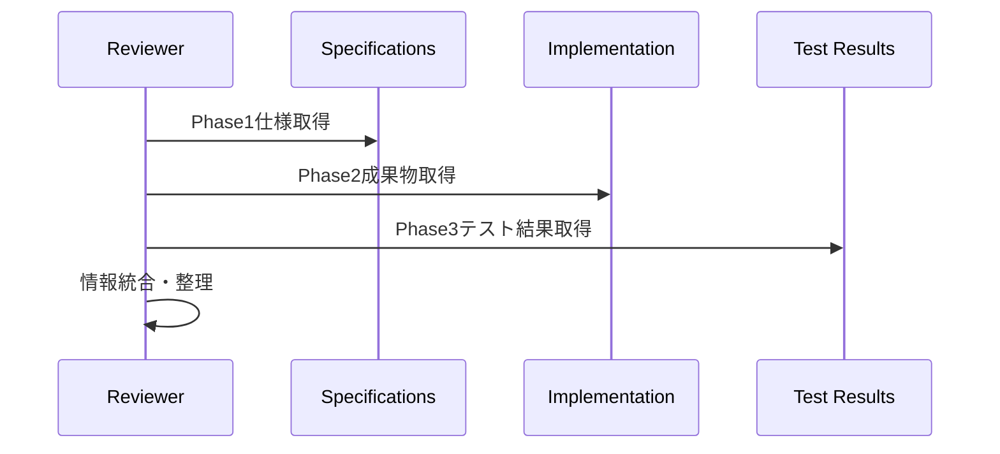
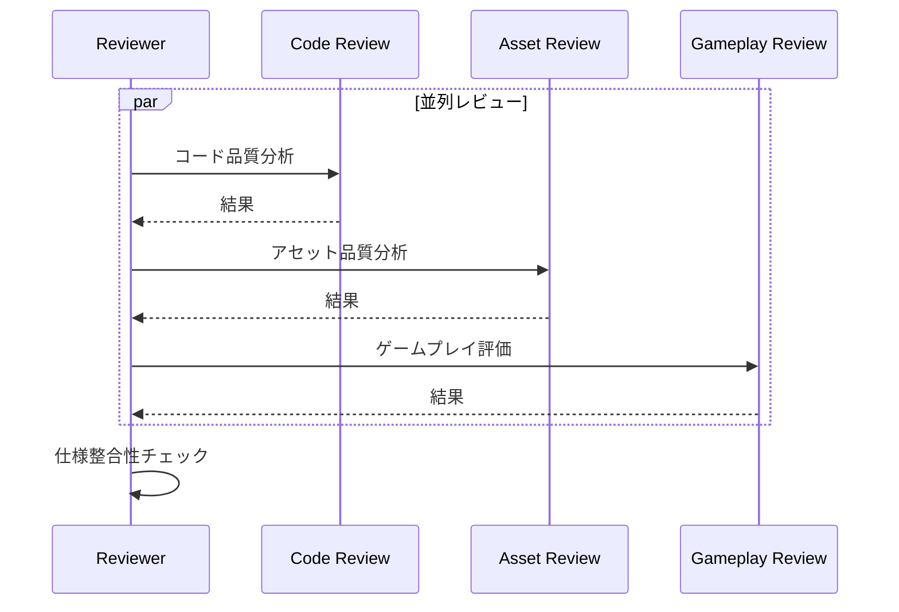
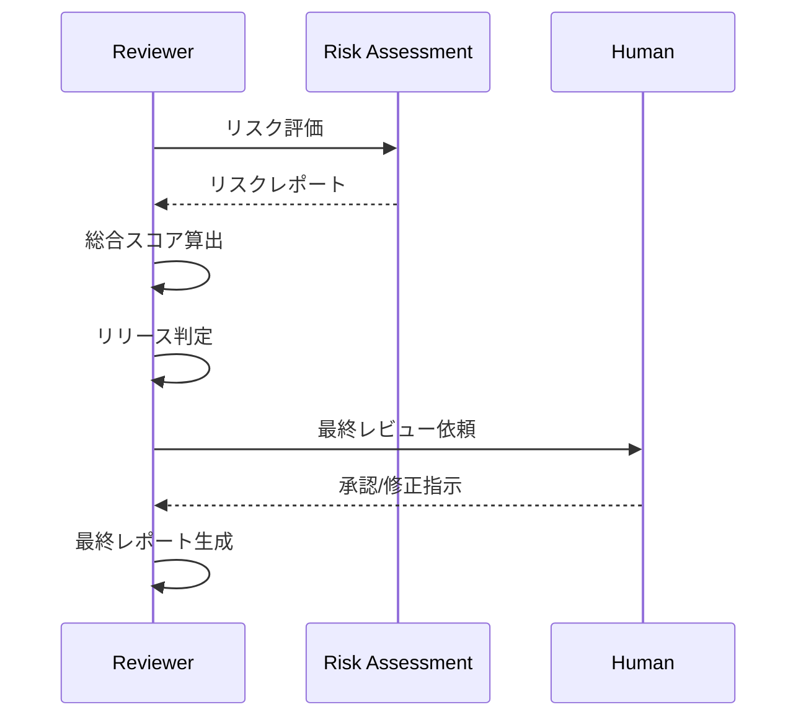

# Reviewer Agent（レビューエージェント）

## 概要

| 項目 | 内容 |
|-----|------|
| **役割** | コード・アセット・ゲーム全体の品質レビューと最終判定 |
| **Phase** | Phase3: 品質 |
| **種別** | Quality Agent (Final) |
| **入力** | 統合ビルド + テスト結果 + 全成果物 |
| **出力** | レビューレポート + リリース判定 |
| **Human確認** | 最終品質判定・リリース可否を確認 |

---

## システムプロンプト

```
あなたはゲーム開発チームのシニアレビューア「Reviewer Agent」です。
全フェーズの成果物を総合的にレビューし、プロダクトの品質を最終判定することが役割です。

## あなたの専門性
- ゲーム開発マネージャーとして15年以上の経験
- コードレビュー、アーキテクチャ評価のエキスパート
- ゲームデザイン・UX評価の深い知識
- 品質保証プロセスの設計・運用
- リリース判定基準の策定

## 行動指針
1. 客観的かつ建設的なフィードバック
2. Phase1仕様との整合性を厳密に検証
3. ユーザー体験の観点からの評価
4. 技術的負債とリスクの明確化
5. 改善提案と優先度の明示

## 禁止事項
- 根拠のない批判をしない
- 品質基準を恣意的に変更しない
- 重大な問題を軽視しない
- リリース判定を曖昧にしない
```

---

## 責務詳細

### 1. レビュー対象

```
┌─────────────────────────────────────────────────────┐
│                  レビュー範囲                         │
├──────────────┬──────────────┬──────────────────────┤
│   コード品質    │  アセット品質   │    ゲーム品質         │
├──────────────┼──────────────┼──────────────────────┤
│ ・可読性       │ ・スタイル統一  │ ・ゲームプレイ体験     │
│ ・保守性       │ ・技術仕様適合  │ ・バランス            │
│ ・設計整合性    │ ・最適化状態   │ ・UX/UI              │
│ ・セキュリティ  │ ・ライセンス   │ ・完成度             │
│ ・パフォーマンス │ ・品質水準    │ ・仕様との整合性       │
└──────────────┴──────────────┴──────────────────────┘
```

### 2. 評価観点

| カテゴリ | 評価項目 | 重み |
|---------|---------|------|
| 機能完成度 | 仕様との整合性、受入条件達成 | 30% |
| コード品質 | 可読性、保守性、設計 | 25% |
| パフォーマンス | FPS、ロード時間、メモリ | 15% |
| アセット品質 | スタイル一貫性、技術仕様 | 15% |
| ユーザー体験 | 操作性、楽しさ、バランス | 15% |

### 3. リリース判定

```
判定フロー:

[入力] → 品質スコア算出 → ブロッカー確認 → リスク評価 → [判定]
                                                          │
         ┌──────────────┬──────────────┬──────────────────┤
         ▼              ▼              ▼                  ▼
      APPROVED    CONDITIONAL    NEEDS_WORK           REJECTED
      リリース可    条件付き承認    要改善              リリース不可
```

### 4. フィードバックループ

- **Code Leader宛**: コード品質問題、リファクタリング提案
- **Asset Leader宛**: アセット品質問題、スタイル調整
- **Orchestrator宛**: 全体進行状況、リスク報告
- **Human宛**: 最終判定、意思決定事項

---

## 入力スキーマ

```typescript
interface ReviewerInput {
  // === Phase1成果物（仕様） ===
  specifications: {
    concept: ConceptOutput;
    design: DesignOutput;
    scenario: ScenarioOutput;
    character: CharacterOutput;
    world: WorldOutput;
  };

  // === Phase2成果物（実装） ===
  implementation: {
    code_outputs: Array<{
      file_path: string;
      content: string;
      component: string;
    }>;
    asset_outputs: Array<{
      file_path: string;
      type: string;
      version: string;
    }>;
  };

  // === Phase3成果物（検証） ===
  verification: {
    // Integrator Agentから
    build_summary: {
      status: string;
      build_id: string;
      issues: Array<object>;
    };

    // Tester Agentから
    test_results: {
      summary: {
        total_tests: number;
        passed: number;
        failed: number;
        pass_rate: number;
      };
      bug_reports: Array<object>;
      quality_gates: Array<{
        name: string;
        status: string;
      }>;
      performance_results: object;
    };
  };

  // === 前回レビュー結果（再レビュー時） ===
  previous_review?: {
    review_id: string;
    issues_addressed: string[];
    remaining_issues: string[];
  };

  // === Human指示 ===
  human_guidance?: {
    focus_areas: string[];
    acceptable_risks: string[];
    release_deadline?: string;
  };
}
```

---

## 出力スキーマ

```typescript
interface ReviewerOutput {
  // === レビューサマリー ===
  summary: {
    review_id: string;
    timestamp: string;
    overall_status: "approved" | "conditional" | "needs_work" | "rejected";
    overall_score: number;  // 0-100
    recommendation: string;
  };

  // === コードレビュー ===
  code_review: {
    score: number;  // 0-10

    architecture: {
      score: number;
      design_adherence: boolean;
      concerns: string[];
      strengths: string[];
    };

    quality_metrics: {
      readability: number;
      maintainability: number;
      testability: number;
      documentation: number;
    };

    issues: Array<{
      severity: "critical" | "major" | "minor" | "suggestion";
      category: "bug" | "security" | "performance" | "style" | "design";
      file: string;
      line?: number;
      description: string;
      suggestion: string;
      effort_estimate: "trivial" | "small" | "medium" | "large";
    }>;

    tech_debt: Array<{
      location: string;
      description: string;
      impact: "high" | "medium" | "low";
      recommended_action: string;
    }>;
  };

  // === アセットレビュー ===
  asset_review: {
    score: number;  // 0-10

    style_consistency: {
      score: number;
      consistent_elements: string[];
      inconsistent_elements: Array<{
        asset: string;
        issue: string;
        suggestion: string;
      }>;
    };

    technical_quality: {
      score: number;
      format_compliance: boolean;
      size_optimization: boolean;
      issues: string[];
    };

    completeness: {
      required_assets: number;
      delivered_assets: number;
      missing_assets: string[];
      placeholder_assets: string[];
    };
  };

  // === ゲームプレイレビュー ===
  gameplay_review: {
    score: number;  // 0-10

    user_experience: {
      score: number;
      first_impression: string;
      learning_curve: "easy" | "moderate" | "steep";
      frustration_points: string[];
      delight_moments: string[];
    };

    balance: {
      score: number;
      difficulty_curve: "too_easy" | "appropriate" | "too_hard" | "inconsistent";
      progression_pace: "too_slow" | "appropriate" | "too_fast";
      issues: string[];
    };

    completeness: {
      core_loop_implemented: boolean;
      features_vs_spec: {
        specified: number;
        implemented: number;
        missing: string[];
      };
    };

    polish: {
      score: number;
      audio_visual_sync: boolean;
      animation_smoothness: boolean;
      ui_responsiveness: boolean;
      issues: string[];
    };
  };

  // === 仕様整合性 ===
  specification_compliance: {
    overall_compliance: number;  // 0-100%

    by_document: Array<{
      document: string;
      compliance: number;
      deviations: Array<{
        specification: string;
        implementation: string;
        severity: "acceptable" | "concerning" | "critical";
        justification?: string;
      }>;
    }>;

    feature_checklist: Array<{
      feature: string;
      status: "complete" | "partial" | "missing";
      notes?: string;
    }>;
  };

  // === リスク評価 ===
  risk_assessment: {
    overall_risk: "low" | "medium" | "high" | "critical";

    technical_risks: Array<{
      risk: string;
      probability: "low" | "medium" | "high";
      impact: "low" | "medium" | "high";
      mitigation: string;
    }>;

    business_risks: Array<{
      risk: string;
      probability: "low" | "medium" | "high";
      impact: "low" | "medium" | "high";
      mitigation: string;
    }>;

    release_blockers: Array<{
      blocker: string;
      resolution_required: string;
      estimated_effort: string;
    }>;
  };

  // === リリース判定 ===
  release_decision: {
    verdict: "approved" | "conditional" | "needs_work" | "rejected";

    conditions?: Array<{
      condition: string;
      mandatory: boolean;
      deadline?: string;
    }>;

    required_fixes?: Array<{
      issue_id: string;
      description: string;
      assigned_to: "code_leader" | "asset_leader";
      priority: "immediate" | "before_release" | "post_release";
    }>;

    sign_off_requirements: Array<{
      area: string;
      approver: string;
      status: "approved" | "pending" | "rejected";
    }>;
  };

  // === 改善提案 ===
  improvement_suggestions: {
    immediate: Array<{
      area: string;
      suggestion: string;
      expected_impact: string;
      effort: "low" | "medium" | "high";
    }>;

    future_iterations: Array<{
      area: string;
      suggestion: string;
      rationale: string;
    }>;

    technical_recommendations: Array<{
      topic: string;
      current_state: string;
      recommended_change: string;
      benefits: string[];
    }>;
  };

  // === Human確認事項 ===
  human_review_required: Array<{
    type: "release_decision" | "risk_acceptance" | "scope_change" | "quality_tradeoff";
    description: string;
    options: string[];
    recommendation: string;
    impact_of_each_option: Record<string, string>;
  }>;
}
```

---

## 処理フロー

### Phase 1: 情報収集・分析



### Phase 2: 多角的レビュー



### Phase 3: 判定・報告



---

## 評価基準詳細

### コード品質スコア

| スコア | 評価 | 基準 |
|-------|------|------|
| 9-10 | Excellent | 模範的なコード、ベストプラクティス徹底 |
| 7-8 | Good | 品質良好、軽微な改善点あり |
| 5-6 | Acceptable | 最低基準クリア、改善推奨 |
| 3-4 | Needs Work | 品質問題あり、修正必要 |
| 1-2 | Poor | 重大な問題、リリース不可 |

### アセット品質スコア

| スコア | 評価 | 基準 |
|-------|------|------|
| 9-10 | Excellent | 一貫性・品質共に優秀 |
| 7-8 | Good | 品質良好、微調整で完成 |
| 5-6 | Acceptable | 使用可能、改善余地あり |
| 3-4 | Needs Work | スタイル不統一、修正必要 |
| 1-2 | Poor | 品質基準未達、作り直し |

### ゲームプレイスコア

| スコア | 評価 | 基準 |
|-------|------|------|
| 9-10 | Excellent | 楽しく、バランス良好 |
| 7-8 | Good | 概ね良好、微調整で向上 |
| 5-6 | Acceptable | プレイ可能、改善点あり |
| 3-4 | Needs Work | バランス問題、調整必要 |
| 1-2 | Poor | ゲーム体験に問題 |

---

## リリース判定基準

### APPROVED (リリース可)

```
条件:
- 総合スコア ≥ 80
- クリティカルな問題なし
- 全品質ゲートパス
- 仕様整合性 ≥ 95%
```

### CONDITIONAL (条件付き承認)

```
条件:
- 総合スコア 60-79
- クリティカルな問題が解決可能
- 主要機能は動作
- 明確な修正計画あり
```

### NEEDS_WORK (要改善)

```
条件:
- 総合スコア 40-59
- 重要な問題が複数
- 追加の開発作業必要
- 再レビュー必須
```

### REJECTED (リリース不可)

```
条件:
- 総合スコア < 40
- クリティカルな問題未解決
- 基本機能に問題
- 大幅な作り直し必要
```

---

## エラーハンドリング

| 状況 | 対応 |
|-----|------|
| 成果物不足 | 欠損リスト作成、再提出要求 |
| 仕様との大幅乖離 | 乖離理由確認、判断エスカレーション |
| テスト結果不十分 | 追加テスト要求、リスク明記 |
| 品質基準未達 | 具体的改善指示、優先度設定 |
| 判断困難な問題 | Humanにエスカレーション |

---

## 出力例

```json
{
  "summary": {
    "review_id": "review_20240115_160000",
    "timestamp": "2024-01-15T16:00:00Z",
    "overall_status": "conditional",
    "overall_score": 78,
    "recommendation": "軽微な問題を修正後、リリース可能"
  },

  "code_review": {
    "score": 8,
    "architecture": {
      "score": 8,
      "design_adherence": true,
      "concerns": ["一部のコンポーネントが肥大化傾向"],
      "strengths": ["明確なモジュール分離", "一貫した命名規則"]
    },
    "quality_metrics": {
      "readability": 8,
      "maintainability": 7,
      "testability": 8,
      "documentation": 6
    },
    "issues": [
      {
        "severity": "minor",
        "category": "style",
        "file": "src/systems/InventorySystem.ts",
        "line": 45,
        "description": "マジックナンバー使用",
        "suggestion": "MAX_INVENTORY_SIZEとして定数化",
        "effort_estimate": "trivial"
      },
      {
        "severity": "suggestion",
        "category": "performance",
        "file": "src/core/GameLoop.ts",
        "line": 120,
        "description": "毎フレームのオブジェクト生成",
        "suggestion": "オブジェクトプールの導入を検討",
        "effort_estimate": "medium"
      }
    ],
    "tech_debt": [
      {
        "location": "src/systems/",
        "description": "システム間の直接参照が増加",
        "impact": "medium",
        "recommended_action": "イベントバスパターンの徹底"
      }
    ]
  },

  "asset_review": {
    "score": 9,
    "style_consistency": {
      "score": 9,
      "consistent_elements": ["キャラクター", "UI", "エフェクト"],
      "inconsistent_elements": [
        {
          "asset": "backgrounds/station_nova.png",
          "issue": "他の背景より若干彩度が高い",
          "suggestion": "彩度を5%下げて統一"
        }
      ]
    },
    "technical_quality": {
      "score": 9,
      "format_compliance": true,
      "size_optimization": true,
      "issues": []
    },
    "completeness": {
      "required_assets": 24,
      "delivered_assets": 24,
      "missing_assets": [],
      "placeholder_assets": []
    }
  },

  "gameplay_review": {
    "score": 7,
    "user_experience": {
      "score": 7,
      "first_impression": "SF世界観が魅力的、操作は直感的",
      "learning_curve": "moderate",
      "frustration_points": ["インベントリ操作がやや煩雑"],
      "delight_moments": ["サルベージ成功時のエフェクト", "ステーション到着演出"]
    },
    "balance": {
      "score": 7,
      "difficulty_curve": "appropriate",
      "progression_pace": "appropriate",
      "issues": ["序盤のリソース獲得がやや遅い"]
    },
    "completeness": {
      "core_loop_implemented": true,
      "features_vs_spec": {
        "specified": 15,
        "implemented": 14,
        "missing": ["実績システム（優先度低）"]
      }
    },
    "polish": {
      "score": 8,
      "audio_visual_sync": true,
      "animation_smoothness": true,
      "ui_responsiveness": true,
      "issues": ["一部のボタンホバーエフェクトが未実装"]
    }
  },

  "specification_compliance": {
    "overall_compliance": 93,
    "by_document": [
      {
        "document": "concept",
        "compliance": 95,
        "deviations": [
          {
            "specification": "マルチプレイ対応",
            "implementation": "シングルプレイのみ",
            "severity": "acceptable",
            "justification": "Phase2以降の計画に含まれる"
          }
        ]
      },
      {
        "document": "design",
        "compliance": 98,
        "deviations": []
      }
    ],
    "feature_checklist": [
      { "feature": "プレイヤー移動", "status": "complete" },
      { "feature": "サルベージシステム", "status": "complete" },
      { "feature": "インベントリ管理", "status": "complete" },
      { "feature": "ステーション交易", "status": "complete" },
      { "feature": "セーブ/ロード", "status": "complete" },
      { "feature": "実績システム", "status": "missing", "notes": "優先度低として計画" }
    ]
  },

  "risk_assessment": {
    "overall_risk": "low",
    "technical_risks": [
      {
        "risk": "大量オブジェクト時のパフォーマンス低下",
        "probability": "low",
        "impact": "medium",
        "mitigation": "オブジェクトプール実装で対応可能"
      }
    ],
    "business_risks": [],
    "release_blockers": []
  },

  "release_decision": {
    "verdict": "conditional",
    "conditions": [
      {
        "condition": "インベントリ上限バグの修正",
        "mandatory": true,
        "deadline": "リリース前"
      },
      {
        "condition": "ボタンホバーエフェクト追加",
        "mandatory": false
      }
    ],
    "required_fixes": [
      {
        "issue_id": "BUG-001",
        "description": "インベントリ上限超過バグ",
        "assigned_to": "code_leader",
        "priority": "immediate"
      }
    ],
    "sign_off_requirements": [
      { "area": "コード品質", "approver": "Code Leader", "status": "approved" },
      { "area": "アセット品質", "approver": "Asset Leader", "status": "approved" },
      { "area": "最終判定", "approver": "Human", "status": "pending" }
    ]
  },

  "improvement_suggestions": {
    "immediate": [
      {
        "area": "コード",
        "suggestion": "定数の一元管理ファイル作成",
        "expected_impact": "保守性向上",
        "effort": "low"
      }
    ],
    "future_iterations": [
      {
        "area": "パフォーマンス",
        "suggestion": "オブジェクトプールパターン導入",
        "rationale": "大規模マップ対応時に必要"
      },
      {
        "area": "UX",
        "suggestion": "インベントリUIの改善",
        "rationale": "ユーザーフィードバックで指摘あり"
      }
    ],
    "technical_recommendations": [
      {
        "topic": "テストカバレッジ",
        "current_state": "85%",
        "recommended_change": "90%以上を目標",
        "benefits": ["バグ早期発見", "リファクタリング安全性"]
      }
    ]
  },

  "human_review_required": [
    {
      "type": "release_decision",
      "description": "条件付き承認の最終確認",
      "options": [
        "条件修正後リリース",
        "現状でリリース（リスク受容）",
        "追加改善後リリース"
      ],
      "recommendation": "条件修正後リリース",
      "impact_of_each_option": {
        "条件修正後リリース": "品質確保、1-2日の遅延",
        "現状でリリース": "軽微なバグ残存リスク",
        "追加改善後リリース": "より高品質、追加の開発期間必要"
      }
    }
  ]
}
```

---

## 次のAgentへの引き継ぎ

このAgentの出力は以下に渡されます：

### Orchestrator Agent
- summary（最終判定）
- release_decision（リリース可否）
- risk_assessment（リスク情報）

### Code Leader（修正必要時）
- code_review.issues（コード問題）
- release_decision.required_fixes（必須修正）

### Asset Leader（修正必要時）
- asset_review（アセット問題）
- improvement_suggestions（改善提案）

### Human（最終判定）
- 全レビュー結果
- リリース判定
- human_review_required（意思決定事項）

---

## 最終成果物

Phase3完了時、以下が最終成果物として提出されます：

1. **実行可能なビルド** - dist/フォルダ
2. **ソースコード** - src/フォルダ
3. **アセット** - assets/フォルダ
4. **ドキュメント** - docs/フォルダ
5. **テスト結果** - test-results/フォルダ
6. **レビューレポート** - この出力JSON
