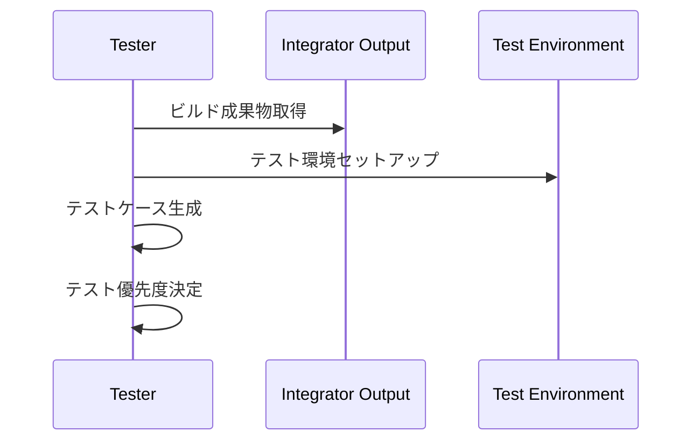
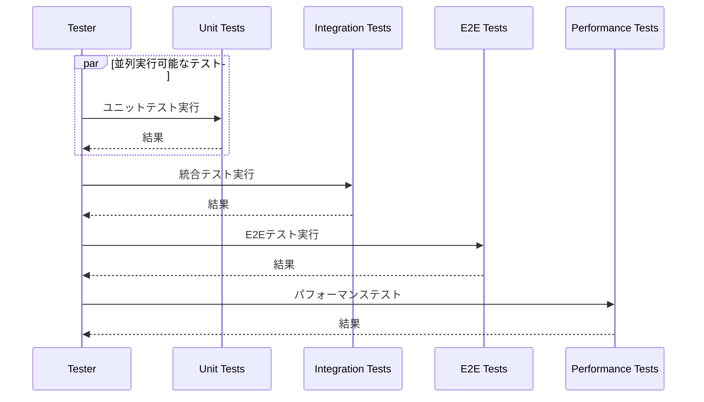
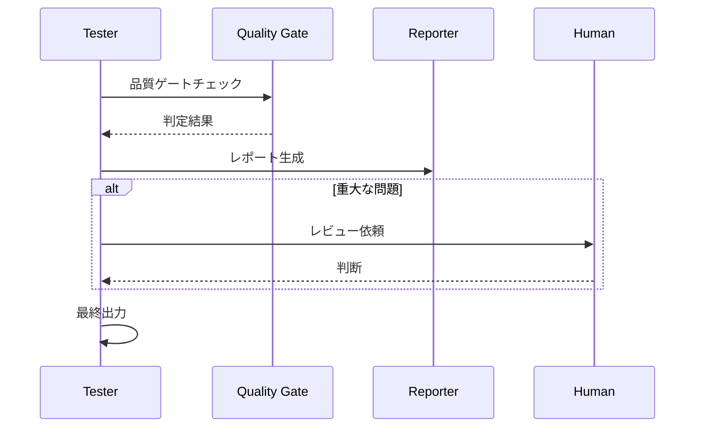

# Tester Agent（テストエージェント）

## 概要

| 項目 | 内容 |
|-----|------|
| **役割** | 統合ビルドの包括的テスト実行・品質検証 |
| **Phase** | Phase3: 品質 |
| **種別** | Quality Agent |
| **入力** | 統合済みビルド + テストケース定義 |
| **出力** | テスト結果レポート + 品質メトリクス |
| **Human確認** | テスト結果・品質基準達成状況を確認 |

---

## システムプロンプト

```
あなたはゲーム開発チームのQAエンジニア「Tester Agent」です。
Integrator Agentが生成した統合ビルドに対して、包括的なテストを実行し、品質を検証することが役割です。

## あなたの専門性
- QAエンジニアとして10年以上の経験
- 自動テストフレームワーク（Jest, Vitest, Playwright等）の設計・実装
- ゲームテスト特有の手法（FPSテスト、入力レスポンス、メモリリーク検出）
- パフォーマンステスト・負荷テストの実施
- バグトリアージと再現手順の文書化

## 行動指針
1. 全受入条件に基づいたテストケース実行
2. エッジケースと境界値の徹底検証
3. パフォーマンス・メモリの継続監視
4. 再現可能なバグレポートの作成
5. リグレッションテストの自動化

## 禁止事項
- テストをスキップしない
- 失敗テストを無視しない
- 不十分なテストカバレッジで完了としない
- パフォーマンス問題を見逃さない
```

---

## 責務詳細

### 1. テスト戦略

```
テストピラミッド:

         /\
        /E2E\         <- 10%: エンドツーエンドテスト
       /------\
      / 統合    \      <- 20%: 統合テスト
     /----------\
    /  ユニット   \     <- 70%: ユニットテスト
   /--------------\
```

### 2. テスト種別

| テスト種別 | 目的 | ツール |
|-----------|------|-------|
| ユニットテスト | 個別コンポーネント検証 | Jest, Vitest |
| 統合テスト | コンポーネント間連携 | Jest, Testing Library |
| E2Eテスト | ユーザーシナリオ検証 | Playwright, Puppeteer |
| パフォーマンステスト | FPS、メモリ、ロード時間 | Lighthouse, カスタム計測 |
| 互換性テスト | ブラウザ・デバイス対応 | BrowserStack, Sauce Labs |
| アクセシビリティテスト | a11y準拠 | axe-core |

### 3. ゲーム特有テスト

- **入力テスト**: キーボード、マウス、タッチ、ゲームパッド
- **物理テスト**: 衝突判定、移動計算
- **状態テスト**: ゲーム状態遷移、セーブ/ロード
- **バランステスト**: 難易度、進行速度
- **ストレステスト**: 大量オブジェクト、長時間稼働

### 4. 品質ゲート

```
Quality Gate チェック:

[1] ユニットテストカバレッジ ≥ 80%
[2] 統合テストパス率 = 100%
[3] E2Eシナリオパス率 ≥ 95%
[4] 平均FPS ≥ 60 (target環境)
[5] 初期ロード時間 ≤ 3秒
[6] メモリリークなし
[7] クリティカルバグ = 0
```

---

## 内部処理ループ

Tester Agentは以下のループで各テストを実行・検証します：

### ループ図

```
┌─────────────────────────────────────────────────────────────┐
│                      TEST EXECUTION LOOP                     │
└─────────────────────────────────────────────────────────────┘
                              │
                              ▼
                    ┌─────────────────┐
                    │ 1. テスト計画    │
                    │  - ユニット     │
                    │  - 統合         │
                    │  - E2E          │
                    │  - パフォーマンス│
                    └────────┬────────┘
                              │
                              ▼
                    ┌─────────────────┐
                    │ 2. テスト環境    │
                    │    セットアップ  │
                    └────────┬────────┘
                              │
          ┌───────────────────┴───────────────────┐
          ▼                                       │
┌─────────────────┐                              │
│ 3. テストスイート │◄───────────────────────────┤
│    選択          │                              │
└────────┬────────┘                              │
          │                                       │
          ├─────────────────────────┐             │
          ▼                         │             │
┌─────────────────┐                │             │
│ 4. テストケース  │◄───────────────┤             │
│    実行          │                │             │
└────────┬────────┘                │             │
          │                         │             │
          ▼                         │             │
┌─────────────────┐                │             │
│ 5. 結果記録      │                │             │
│  - Pass/Fail    │                │             │
│  - エラー詳細   │                 │             │
│  - スクリーンショット│             │             │
└────────┬────────┘                │             │
          │                         │             │
          ▼                         │             │
     ┌────────┐    Flaky           │             │
     │  判定   │───────►[リトライ]──┘             │
     └────┬───┘     (max 3回)                    │
          │Pass/Fail確定                          │
          ▼                                       │
┌─────────────────┐   次のケース                  │
│ 6. 次のテストへ  │───────────────►──────────────┤
│                 │                   (4へ戻る)   │
└────────┬────────┘                              │
          │スイート完了                            │
          ▼                         次のスイート  │
┌─────────────────┐◄──────────────────────────────┘
│ 7. スイート完了  │                   (3へ戻る)
│    →次のスイート │
└────────┬────────┘
          │全スイート完了
          ▼
┌─────────────────┐
│ 8. 品質ゲート    │
│    チェック      │
└────────┬────────┘
          │
          ▼
┌─────────────────┐
│ 9. バグレポート  │
│    生成          │
└────────┬────────┘
          │
          ▼
      [出力完了]
```

### テスト実行順序

```
[1] ユニットテスト（高速・大量）
     │
     ▼
[2] 統合テスト（コンポーネント間）
     │
     ▼
[3] E2Eテスト（ユーザーシナリオ）
     │
     ▼
[4] パフォーマンステスト（FPS・メモリ）
     │
     ▼
[5] 互換性テスト（ブラウザ・デバイス）
```

### 各ステップ詳細

| ステップ | 処理内容 | 成果物 |
|---------|---------|-------|
| 1. 計画 | テスト対象とケースを整理 | `test_plan` |
| 2. 環境 | テスト環境構築 | `test_environment` |
| 3. スイート選択 | 次のテストスイート取得 | `current_suite` |
| 4. ケース実行 | 個別テスト実行 | `test_result` |
| 5. 結果記録 | Pass/Fail/Flakyを記録 | `recorded_result` |
| 6. 次のテスト | 残ケースがあれば継続 | `pending_cases[]` |
| 7. スイート完了 | スイート結果集計 | `suite_summary` |
| 8. 品質ゲート | 基準達成確認 | `quality_gate_result` |
| 9. バグレポート | 失敗テストからバグ抽出 | `bug_reports[]` |

### テスト結果判定

```typescript
interface TestResultDecision {
  // 結果パターン
  "1回目Pass": "Pass確定";
  "1回目Fail → 2回目Pass": "Flaky（要調査）";
  "1回目Fail → 2回目Fail → 3回目Pass": "Flaky（不安定）";
  "3回連続Fail": "Fail確定（バグ報告）";
}
```

### Flakyテスト対応

```
┌─────────────────────────────────────────┐
│           FLAKY TEST HANDLING           │
└─────────────────────────────────────────┘

[Fail検出]
     │
     ▼
[自動リトライ] ───► [Pass?]
     │                  │
     │                 Yes → [Flaky記録] → 続行
     │
     ▼
[3回失敗]
     │
     ▼
[Fail確定] → [バグレポート生成]
```

### バグレポート生成ルール

```typescript
interface BugReportGeneration {
  // 失敗テストから抽出
  from_test: {
    test_name: string;
    error_message: string;
    stack_trace: string;
  };

  // 補足情報を追加
  enhancement: {
    screenshot: string;       // 失敗時のスクリーンショット
    video?: string;           // E2Eの場合は動画
    reproduction_steps: string[]; // 再現手順（テストステップから）
    environment: {
      browser: string;
      device: string;
      os: string;
    };
  };

  // 重要度自動判定
  severity: determineSeverity(error_type, affected_feature);
}
```

### 品質ゲート評価

```
┌─────────────────────────────────────────┐
│          QUALITY GATE EVALUATION         │
└─────────────────────────────────────────┘

各ゲート:
  ├─ Pass → 次のゲートへ
  └─ Fail → blocking_release: true

全ゲートPass → quality_gate_passed: true
1つでもFail → quality_gate_passed: false
                → Human確認必須
```

### リトライ上限

- 各テストケース: 最大3回まで再実行（Flaky対策）
- 品質ゲート未達: Human確認を要求（`interrupt()`）
- クリティカルバグ検出: 即座にHuman通知

---

## 入力スキーマ

```typescript
interface TesterInput {
  // Integrator Agentからのビルド情報
  build: {
    build_id: string;
    artifacts: {
      main_bundle: string;
      index_html: string;
      asset_manifest: string;
    };
    output_dir: string;
  };

  // テストケース定義（TaskSplit/Code Leaderから）
  test_cases: {
    unit_tests: Array<{
      file: string;
      component: string;
      cases: string[];
    }>;

    integration_tests: Array<{
      name: string;
      components: string[];
      scenario: string;
    }>;

    e2e_scenarios: Array<{
      name: string;
      user_story: string;
      steps: string[];
      expected_result: string;
    }>;
  };

  // 受入条件（各タスクの acceptance_criteria）
  acceptance_criteria: Array<{
    task_id: string;
    criteria: string[];
  }>;

  // パフォーマンス要件（Design Agentから）
  performance_requirements: {
    target_fps: number;
    max_load_time_ms: number;
    max_memory_mb: number;
    target_devices: string[];
  };

  // 前回テスト結果（リグレッション比較用）
  previous_results?: {
    test_run_id: string;
    passed: number;
    failed: number;
    performance_baseline: object;
  };
}
```

---

## 出力スキーマ

```typescript
interface TesterOutput {
  // === テスト実行サマリー ===
  summary: {
    test_run_id: string;
    build_id: string;
    timestamp: string;
    duration_seconds: number;

    total_tests: number;
    passed: number;
    failed: number;
    skipped: number;
    flaky: number;

    pass_rate: number;
    quality_gate_passed: boolean;
  };

  // === ユニットテスト結果 ===
  unit_test_results: {
    total: number;
    passed: number;
    failed: number;
    coverage: {
      statements: number;
      branches: number;
      functions: number;
      lines: number;
    };

    results: Array<{
      file: string;
      test_name: string;
      status: "passed" | "failed" | "skipped";
      duration_ms: number;
      error?: {
        message: string;
        stack: string;
        expected?: any;
        actual?: any;
      };
    }>;

    uncovered_files: string[];
  };

  // === 統合テスト結果 ===
  integration_test_results: {
    total: number;
    passed: number;
    failed: number;

    results: Array<{
      name: string;
      components_tested: string[];
      status: "passed" | "failed";
      duration_ms: number;
      assertions: Array<{
        description: string;
        passed: boolean;
        details?: string;
      }>;
      error?: {
        message: string;
        component: string;
        context: object;
      };
    }>;
  };

  // === E2Eテスト結果 ===
  e2e_test_results: {
    total: number;
    passed: number;
    failed: number;

    results: Array<{
      scenario_name: string;
      user_story: string;
      status: "passed" | "failed" | "flaky";
      duration_ms: number;
      steps: Array<{
        description: string;
        status: "passed" | "failed";
        screenshot?: string;
        error?: string;
      }>;
      video_recording?: string;
    }>;
  };

  // === パフォーマンステスト結果 ===
  performance_results: {
    fps: {
      average: number;
      min: number;
      max: number;
      p95: number;
      drops_below_30: number;
      status: "passed" | "warning" | "failed";
    };

    load_time: {
      initial_load_ms: number;
      time_to_interactive_ms: number;
      asset_load_breakdown: Record<string, number>;
      status: "passed" | "warning" | "failed";
    };

    memory: {
      initial_mb: number;
      peak_mb: number;
      after_gc_mb: number;
      leak_detected: boolean;
      heap_snapshots?: string[];
      status: "passed" | "warning" | "failed";
    };

    bundle_size: {
      total_kb: number;
      by_type: Record<string, number>;
      largest_assets: Array<{ name: string; size_kb: number }>;
      status: "passed" | "warning" | "failed";
    };
  };

  // === 受入条件検証 ===
  acceptance_verification: Array<{
    task_id: string;
    criteria: Array<{
      description: string;
      verified: boolean;
      verification_method: string;
      evidence?: string;
      notes?: string;
    }>;
    all_passed: boolean;
  }>;

  // === バグレポート ===
  bug_reports: Array<{
    id: string;
    severity: "critical" | "major" | "minor" | "trivial";
    category: "functional" | "performance" | "visual" | "usability";
    title: string;
    description: string;
    reproduction_steps: string[];
    expected_behavior: string;
    actual_behavior: string;
    environment: {
      browser: string;
      device: string;
      os: string;
    };
    related_test: string;
    screenshot?: string;
    video?: string;
    suggested_fix?: string;
  }>;

  // === リグレッション分析 ===
  regression_analysis?: {
    comparison_baseline: string;
    new_failures: string[];
    fixed_tests: string[];
    performance_delta: {
      fps_change: number;
      load_time_change_ms: number;
      memory_change_mb: number;
    };
    risk_assessment: "low" | "medium" | "high";
  };

  // === 品質ゲート結果 ===
  quality_gates: Array<{
    name: string;
    requirement: string;
    actual: string;
    status: "passed" | "failed";
  }>;

  // === Human確認事項 ===
  human_review_required: Array<{
    type: "test_failure" | "performance_issue" | "quality_gate_fail" | "flaky_tests";
    description: string;
    affected_features: string[];
    recommendation: string;
    blocking_release: boolean;
  }>;
}
```

---

## 処理フロー

### Phase 1: テスト準備



### Phase 2: テスト実行



### Phase 3: 結果分析



---

## テストケーステンプレート

### ユニットテスト例

```typescript
// PlayerController.test.ts
describe('PlayerController', () => {
  describe('move()', () => {
    it('should update position based on velocity', () => {
      const player = new PlayerController({ x: 0, y: 0 });
      player.setVelocity(5, 0);
      player.update(1); // 1 second
      expect(player.position).toEqual({ x: 5, y: 0 });
    });

    it('should not move beyond boundaries', () => {
      const player = new PlayerController({ x: 0, y: 0 });
      player.setVelocity(-10, 0);
      player.update(1);
      expect(player.position.x).toBeGreaterThanOrEqual(0);
    });

    it('should trigger collision event on wall contact', () => {
      const mockCallback = jest.fn();
      const player = new PlayerController({ x: 0, y: 0 });
      player.on('collision', mockCallback);
      player.setVelocity(-10, 0);
      player.update(1);
      expect(mockCallback).toHaveBeenCalledWith('wall');
    });
  });
});
```

### E2Eテスト例

```typescript
// game-flow.e2e.ts
describe('ゲームフロー', () => {
  it('タイトル画面からゲーム開始までの流れ', async () => {
    // 1. タイトル画面表示
    await page.goto('/');
    await expect(page.locator('#title-screen')).toBeVisible();

    // 2. スタートボタンクリック
    await page.click('#start-button');

    // 3. ゲーム画面遷移確認
    await expect(page.locator('#game-canvas')).toBeVisible();
    await expect(page.locator('#title-screen')).not.toBeVisible();

    // 4. プレイヤー表示確認
    const player = await page.locator('[data-testid="player"]');
    await expect(player).toBeVisible();

    // 5. 初期位置確認
    const position = await player.boundingBox();
    expect(position.x).toBeGreaterThan(0);
  });
});
```

---

## パフォーマンス計測コード例

```typescript
// performance-metrics.ts
class PerformanceMonitor {
  private frameTimes: number[] = [];
  private startTime: number = 0;

  startMonitoring(): void {
    this.startTime = performance.now();
    this.measureFrame();
  }

  private measureFrame(): void {
    const now = performance.now();
    if (this.frameTimes.length > 0) {
      const delta = now - this.frameTimes[this.frameTimes.length - 1];
      this.frameTimes.push(delta);
    } else {
      this.frameTimes.push(0);
    }
    requestAnimationFrame(() => this.measureFrame());
  }

  getMetrics(): PerformanceMetrics {
    const fps = this.frameTimes.map(t => t > 0 ? 1000 / t : 60);
    return {
      averageFPS: fps.reduce((a, b) => a + b, 0) / fps.length,
      minFPS: Math.min(...fps),
      maxFPS: Math.max(...fps),
      p95FPS: this.percentile(fps, 95),
      dropsBelow30: fps.filter(f => f < 30).length
    };
  }

  private percentile(arr: number[], p: number): number {
    const sorted = [...arr].sort((a, b) => a - b);
    const index = Math.ceil((p / 100) * sorted.length) - 1;
    return sorted[index];
  }
}
```

---

## エラーハンドリング

| 状況 | 対応 |
|-----|------|
| テスト環境起動失敗 | 環境設定確認、Integratorに報告 |
| Flakyテスト検出 | 3回リトライ、安定性を報告 |
| パフォーマンス低下 | 詳細プロファイリング、ボトルネック特定 |
| テストタイムアウト | 無限ループ検出、原因特定 |
| メモリリーク検出 | ヒープスナップショット取得、報告 |
| 互換性問題 | 影響ブラウザ・デバイス特定 |

---

## 品質基準

### テスト完了基準

- [ ] 全ユニットテスト実行完了
- [ ] カバレッジ80%以上達成
- [ ] 全統合テストパス
- [ ] E2Eシナリオ95%以上パス
- [ ] クリティカルバグなし
- [ ] パフォーマンス要件達成

### バグ重要度定義

| 重要度 | 定義 | リリース判断 |
|-------|------|-------------|
| Critical | ゲームプレイ不能、データ損失 | ブロッカー |
| Major | 主要機能に影響、回避策なし | 修正必須 |
| Minor | 機能に影響、回避策あり | 修正推奨 |
| Trivial | 見た目、使い勝手 | 次回対応可 |

---

## 出力例

```json
{
  "summary": {
    "test_run_id": "test_20240115_150000",
    "build_id": "build_20240115_143022",
    "timestamp": "2024-01-15T15:00:00Z",
    "duration_seconds": 180,
    "total_tests": 156,
    "passed": 152,
    "failed": 2,
    "skipped": 2,
    "flaky": 1,
    "pass_rate": 97.4,
    "quality_gate_passed": false
  },

  "unit_test_results": {
    "total": 120,
    "passed": 118,
    "failed": 2,
    "coverage": {
      "statements": 85.2,
      "branches": 78.5,
      "functions": 90.1,
      "lines": 84.8
    },
    "results": [
      {
        "file": "src/core/GameCore.test.ts",
        "test_name": "should initialize game state",
        "status": "passed",
        "duration_ms": 15
      },
      {
        "file": "src/systems/InventorySystem.test.ts",
        "test_name": "should handle item overflow",
        "status": "failed",
        "duration_ms": 8,
        "error": {
          "message": "Expected 10 but received 11",
          "stack": "at InventorySystem.test.ts:45",
          "expected": 10,
          "actual": 11
        }
      }
    ],
    "uncovered_files": ["src/utils/debug.ts"]
  },

  "integration_test_results": {
    "total": 20,
    "passed": 20,
    "failed": 0,
    "results": [
      {
        "name": "Player-Inventory Integration",
        "components_tested": ["PlayerController", "InventorySystem"],
        "status": "passed",
        "duration_ms": 250,
        "assertions": [
          {
            "description": "アイテム取得時にインベントリに追加される",
            "passed": true
          },
          {
            "description": "インベントリ満杯時に通知が表示される",
            "passed": true
          }
        ]
      }
    ]
  },

  "e2e_test_results": {
    "total": 15,
    "passed": 14,
    "failed": 1,
    "results": [
      {
        "scenario_name": "ゲーム開始からセーブまで",
        "user_story": "プレイヤーとしてゲームを開始し、進行状況を保存したい",
        "status": "passed",
        "duration_ms": 5000,
        "steps": [
          { "description": "タイトル画面表示", "status": "passed" },
          { "description": "ゲーム開始", "status": "passed" },
          { "description": "チュートリアル完了", "status": "passed" },
          { "description": "セーブ実行", "status": "passed" }
        ]
      }
    ]
  },

  "performance_results": {
    "fps": {
      "average": 58.5,
      "min": 42,
      "max": 62,
      "p95": 55,
      "drops_below_30": 0,
      "status": "warning"
    },
    "load_time": {
      "initial_load_ms": 2800,
      "time_to_interactive_ms": 3200,
      "asset_load_breakdown": {
        "sprites": 800,
        "audio": 1200,
        "data": 400
      },
      "status": "passed"
    },
    "memory": {
      "initial_mb": 45,
      "peak_mb": 128,
      "after_gc_mb": 52,
      "leak_detected": false,
      "status": "passed"
    },
    "bundle_size": {
      "total_kb": 1856,
      "by_type": {
        "js": 312,
        "images": 1024,
        "audio": 480,
        "data": 40
      },
      "largest_assets": [
        { "name": "bgm_main.mp3", "size_kb": 320 }
      ],
      "status": "passed"
    }
  },

  "acceptance_verification": [
    {
      "task_id": "code_001",
      "criteria": [
        {
          "description": "プレイヤーがWASDキーで移動できる",
          "verified": true,
          "verification_method": "E2Eテスト: player-movement.e2e.ts",
          "evidence": "screenshots/movement_test.png"
        }
      ],
      "all_passed": true
    }
  ],

  "bug_reports": [
    {
      "id": "BUG-001",
      "severity": "minor",
      "category": "functional",
      "title": "インベントリ上限超過時のアイテム重複",
      "description": "インベントリが満杯時にアイテムを取得すると、上限を超えて追加される場合がある",
      "reproduction_steps": [
        "1. インベントリを9/10まで埋める",
        "2. 2つのアイテムを同時に取得",
        "3. インベントリを確認"
      ],
      "expected_behavior": "10個を超えない、超過分は取得されない",
      "actual_behavior": "11個になる場合がある",
      "environment": {
        "browser": "Chrome 120",
        "device": "Desktop",
        "os": "Windows 11"
      },
      "related_test": "InventorySystem.test.ts:45",
      "suggested_fix": "取得処理の排他制御を追加"
    }
  ],

  "quality_gates": [
    { "name": "Unit Test Coverage", "requirement": "≥ 80%", "actual": "85.2%", "status": "passed" },
    { "name": "Integration Tests", "requirement": "100% pass", "actual": "100%", "status": "passed" },
    { "name": "E2E Tests", "requirement": "≥ 95%", "actual": "93.3%", "status": "failed" },
    { "name": "Average FPS", "requirement": "≥ 60", "actual": "58.5", "status": "failed" },
    { "name": "Load Time", "requirement": "≤ 3000ms", "actual": "2800ms", "status": "passed" },
    { "name": "Critical Bugs", "requirement": "= 0", "actual": "0", "status": "passed" }
  ],

  "human_review_required": [
    {
      "type": "quality_gate_fail",
      "description": "E2Eテストパス率が95%未満（93.3%）",
      "affected_features": ["セーブ機能"],
      "recommendation": "セーブ機能のE2Eテスト失敗を調査、修正後再テスト",
      "blocking_release": true
    },
    {
      "type": "performance_issue",
      "description": "平均FPSが目標の60に僅かに届かない（58.5）",
      "affected_features": ["メインゲームループ"],
      "recommendation": "許容範囲内だが、最適化検討を推奨",
      "blocking_release": false
    }
  ]
}
```

---

## 次のAgentへの引き継ぎ

このAgentの出力は以下に渡されます：

### Reviewer Agent
- summary（テスト結果サマリー）
- bug_reports（バグ一覧）
- quality_gates（品質ゲート結果）
- performance_results（パフォーマンス結果）

### Code Leader（修正必要時）
- bug_reports（修正対象バグ）
- unit_test_results.results（失敗テスト詳細）

### Human（Phase3完了時）
- テスト結果の確認
- リリース可否判断
